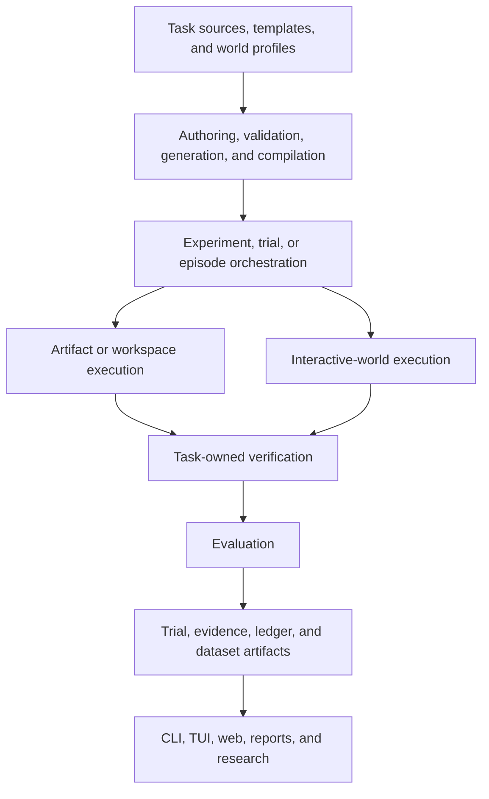

# Repository Architecture Study

| Field | Value |
| --- | --- |
| Class | Plan |
| Status | Historical |

This file records the source layout before the repository architecture
cutover. Use [Architecture](../ARCHITECTURE.md) for the current owners and
[the implementation plan](repository-architecture-implementation.md) for the
accepted migration.

## Purpose

This study maps AEC-Bench as it exists before a package reorganisation.

It records:

- repository surfaces;
- product concepts;
- current execution flows;
- Python package ownership;
- real dependency direction;
- names that have more than one meaning; and
- the design questions that need a separate decision.

It does not approve a package move, a new base class, or a general world
framework.

The audit used the current `main` working tree based on commit
`f771467b7ed7a964e6e249d23fae8700cae2f7a8`. The tree also contained
uncommitted Prime-refinement, pump-journey, documentation, and RS2 profile
work. The map therefore describes the live development state, not a clean
release snapshot.

## Main result

AEC-Bench has a sound logical architecture. Its main concepts already have
different jobs:

```text
task semantics
    objective, inputs, allowed work, completion, verification

world semantics
    state, observations, actions, time, controls, replay

execution
    adapter, provider, runtime, harness

evidence
    verifier result, evaluation, trial record, ledger

higher-order work
    review, remediation, evolution, treatment comparison
```

The main problem is physical ownership. Rapid growth has placed several of
these jobs inside broad packages. The middle of the library is now a connected
group instead of a clear one-way package hierarchy.

## Repository surfaces

The repository root and the installed Python package have different jobs.

| Surface | Current owner |
| --- | --- |
| [`src/aec_bench/`](../../src/aec_bench/) | Installed Python library, runtime, CLI, and presentation code |
| [`tasks/`](../../tasks/) | Runnable artifact-task packages and task-owned assets |
| [`seeds/`](../../seeds/) | Expert-authored source material for new tasks and templates |
| [`agents/`](../../agents/) | Repository-owned Harbor agent entry point |
| [`scripts/`](../../scripts/) | Maintained repository commands that are not installed CLI commands |
| [`tests/`](../../tests/) | Permanent behavior and boundary proof |
| [`docs/`](../) | Current authorities, protocols, guides, plans, and selected history |
| `research/`, `artefacts/`, `jobs/`, and local output roots | Ignored research or run evidence; not product dependencies |

The wheel contains `src/aec_bench`. Runnable task packages and the Harbor
entry point are repository surfaces, not ordinary wheel modules.

## Product map

The current product has two execution families. They meet at orchestration,
verification, evaluation, and evidence. They do not need the same low-level
runtime.



The current [architecture](../ARCHITECTURE.md#product-flow) is the authority
for this product flow.

## Installed library map

### Foundations and authoring

| Package | Current responsibility | Main relationship |
| --- | --- | --- |
| [`contracts`](../../src/aec_bench/contracts/) | Values at persisted, external, untrusted, or cross-process boundaries | Foundation used by most areas; it imports no other AEC-Bench package |
| [`tasks`](../../src/aec_bench/tasks/) | Load, validate, select, resolve, and govern runnable artifact tasks | Converts repository task bytes into `TaskDefinition` and resolved paths |
| [`templates`](../../src/aec_bench/templates/) | Load built-in parameterised artifact-task sources and report-composition templates | Supplies source recipes to generation and some adapter workflows |
| [`generation`](../../src/aec_bench/generation/) | Sample parameters and materialise runnable artifact-task directories | Converts one loaded template into task files, tools, and verifier assets |
| [`dataset`](../../src/aec_bench/dataset/) | Create immutable benchmark snapshots and portable archives | Freezes validated task bytes for repeatable experiments |
| `task_world_templates` | Owned concrete world behavior, lifecycle packages, and some shared world runtime | Mixed package; see the detailed map below |

The main artifact-authoring chain is:

```text
template source
    -> LoadedTemplate
    -> sampled parameters and ground truth
    -> generated task directory
    -> TaskDefinition validation
    -> runnable task or dataset snapshot
```

Repository tasks do not all come from the current generator. The loader treats
the task directory as the runnable authority.

### Execution and integration

| Package | Current responsibility | Main relationship |
| --- | --- | --- |
| [`adapters`](../../src/aec_bench/adapters/) | Run one model execution strategy and return `AdapterResult` | Contains direct, tool-loop, RLM, lambda-RLM, and Prime JSON adaptation |
| [`agents`](../../src/aec_bench/agents/) | Utilities used by the external Harbor agent | Builds provider environment, tool, result, and compaction support |
| [`providers`](../../src/aec_bench/providers/) | Vendor-specific compute and API transport | Includes Morph and provider-backed model services |
| [`harness`](../../src/aec_bench/harness/) | Stage, dispatch, collect, verify, import, and record executions | Contains ordinary execution plus proposal and pump-specific compositions |
| [`trajectory`](../../src/aec_bench/trajectory/) | Write ordered execution evidence | Small standard-library boundary used by execution owners |
| [`prime_agent`](../../src/aec_bench/prime_agent/) | Run the upstream Prime Agent executable by JSON or ACP | Also contains the concrete pump session and journey today |
| [`prime_lab`](../../src/aec_bench/prime_lab/) | Export tasks to Prime Lab and import hosted samples | Distinct from direct Prime Agent process execution |

`AdapterRequest` and `AdapterResult` form the ordinary adapter boundary.
Adapters decide how a model works inside one request. They do not own task
meaning, verifier policy, or trial persistence.

### Evidence and evaluation

| Package | Current responsibility | Main relationship |
| --- | --- | --- |
| [`evaluation`](../../src/aec_bench/evaluation/) | Score, classify, and summarise accepted run evidence | Consumes trial, verifier, rubric, and trajectory evidence |
| [`ledger`](../../src/aec_bench/ledger/) | Persist and query trial records and immutable evidence | Owns storage mechanics, not score policy |
| [`feedback`](../../src/aec_bench/feedback/) | Expert review, calibration, assignment, and adjudication | Produces attributable human evidence and evaluation handoff |
| [`communication`](../../src/aec_bench/communication/) | Metrics, leaderboards, HTML, and report data | Presents canonical records and evaluation results |

The intended evidence chain is:

```text
execution evidence
    -> task-owned verifier evidence
    -> EvaluationResult
    -> TrialRecord
    -> ledger and artifact references
    -> reports and interfaces
```

### Higher-order work

| Package | Current responsibility | Difference from adjacent areas |
| --- | --- | --- |
| [`synthesis`](../../src/aec_bench/synthesis/) | Combine several candidate outputs into one output | One bounded output-composition capability |
| [`remediation`](../../src/aec_bench/remediation/) | Repair one failed output from verifier findings | Post-run local repair of an artifact |
| [`evolution`](../../src/aec_bench/evolution/) | Search, mutate, select, archive, and compare agent or task candidates | Automated improvement experiments across runs |
| `meta_harness` | Governed proposed harness programs, evidence lifecycles, comparisons, monitors, and qualification | Large umbrella for several higher-order workflows and some shared runtime |
| [`task_ecology`](../../src/aec_bench/experimentation/task_ecology/) | Maintained helpers for the current task-ecology study | Specific research support called by repository scripts |

These packages are related, but they are not interchangeable:

- remediation changes one output after verifier feedback;
- synthesis combines candidate outputs;
- evolution searches a candidate population;
- feedback records human judgement; and
- the meta-harness controls and compares higher-order changes.

### Delivery surfaces

| Package | Current responsibility |
| --- | --- |
| [`cli`](../../src/aec_bench/cli/) | Installed automation and composition surface |
| [`tui`](../../src/aec_bench/tui/) | Terminal browsing, trace inspection, and review |
| [`web`](../../src/aec_bench/web/) | FastAPI and Svelte presentation |
| [`init`](../../src/aec_bench/init/) | Project scaffolding and skill installation |
| [`images`](../../src/aec_bench/images/) | Container-image and Dockerfile generation, not visual image processing |

The CLI is the broad application root. Some command modules also contain
substantial orchestration. For example, `run-local` stages the workspace, runs
the adapter, runs the verifier, copies artifacts, and imports the result. This
is more than the thin delivery role stated by the package header.

## Current `task_world_templates` map

This package does not contain four versions of one abstraction.

| Part | Current role | Time model | Ownership finding |
| --- | --- | --- | --- |
| `continual` | Episode shell, decision freshness, limits, registration, durability, branch ports, and optional rollout | Repeated decisions | Shared runtime, not a task template |
| `hydraulics` | Deterministic hydraulic source, calculation, package, operations, and verifier | One bounded calculation run | Domain capability or deterministic mini-world |
| `lifecycles` | Finite evidence tasks with ordered releases, operations, submissions, and checkpoints | Ordered checkpoints | Concrete lifecycle tasks that depended on runtime in `meta_harness` |
| [`stewardship`](../../src/aec_bench/worlds/stewardship/) | Persistent operational task worlds; currently the wastewater pump station | Long-running causal state | Concrete world owner |
| [`compiled.py`](../../src/aec_bench/lifecycles/compiled.py) | Compile and hash-bind one evidence-lifecycle package | Build time | Lifecycle-specific compiler owner |
| [`catalogue.py`](../../src/aec_bench/worlds/catalogue.py) | Register concrete continual-world definitions | Composition time | Correct external composition root |

The two registered definitions are the pump-station stewardship world and the
SSC-03 hydraulic interaction lifecycle. They share registration and some
continual values. They do not yet share one Prime actor host, continuation
policy, completion rule, verifier, or evaluation.

## Current execution flows

### Local artifact task

```text
task directory
    -> local workspace staging
    -> selected adapter
    -> output and trajectory
    -> task verifier
    -> optional reviewer
    -> local import
    -> TrialRecord and ledger
```

Prime JSON mode joins this flow through
[`adapters/prime_agent.py`](../../src/aec_bench/adapters/prime_agent.py). It
does not create a second artifact-task pipeline.

### Harbor artifact task

```text
ExperimentManifest
    -> task selection and deterministic trial plan
    -> Harbor task export and dispatch
    -> agents/entrypoint_agent.py
    -> selected adapter in the sandbox
    -> task verifier
    -> Harbor result import
    -> EvaluationResult, TrialRecord, and ledger
```

The root [`agents/entrypoint_agent.py`](../../agents/entrypoint_agent.py) is a
composition root. It handles ordinary adapters, evidence lifecycles, proposal
sessions, and the current pump-world Harbor integration.

The public `aec-bench run` command means Harbor artifact execution today. It
is not a general selector for local, lifecycle, or interactive-world runs.
Prime Agent JSON mode is available through `run-local`; it is not in the
current Harbor execution-driver set.

### Registered interactive world

```text
task-owned world build + content-pinned profile
    -> continual catalogue resolution
    -> task-specific episode host
    -> actor observe/invoke boundary
    -> task-owned transitions and repository
    -> separate host controls where applicable
    -> replay and task-owned verification
    -> task-owned evaluation
    -> trial evidence
```

The shared continual code advances decisions. It does not interpret pump or
hydraulic state.

Registration does not imply one uniform actor runtime. The pump world uses
`ContinualWorldActorRequest` and `PumpStationEpisodeHost`. The registered
SSC-03 definition wraps the evidence-lifecycle checkpoint runner and its
bounded hydraulic operations.

### Prime ACP pump journey

```text
Prime ACP process
    -> scoped actor proxy
    -> pump episode host
    -> pump repository

normal Prime end_turn
    -> deterministic pump host-continuation policy
    -> new public snapshot
    -> fresh Prime ACP process
```

The Prime process and pump world preserve separate evidence. The world
repository remains the causal and replay authority.

### Prime Lab

```text
public task or lifecycle package
    -> Prime Lab export
    -> external Prime or Verifiers evaluation
    -> untrusted sample import
    -> current EvaluationResult and TrialRecord
```

This path is an external package and hosted-evaluation integration. It is not
the same as `prime_agent` JSON or ACP execution.

### Current evidence convergence

The current execution paths do not all finish at the same durable boundary.

| Execution path | Creates the canonical `TrialRecord` today? |
| --- | --- |
| Artifact `run` through Harbor | Yes |
| Artifact `run-local` | Yes |
| Pump world through its Harbor import | Yes |
| Prime Lab sample import | Yes |
| Evidence-lifecycle ablation finalisation | Yes |
| Ordinary evidence-lifecycle local run | No; it writes lifecycle and experiment artifacts |
| Prime ACP pump journey | No; it writes journey and task-evaluation evidence |
| Prime refinement qualification | No; it writes a qualification report with no promotion decision |

This does not mean every exploratory workflow must become a benchmark trial.
It means that only paths which reach the canonical record can support the same
published benchmark claim without an additional finalisation step.

## Calculations, tasks, and worlds

The current repository has several kinds of calculation:

1. A template `engine.py` calculates ground truth while an artifact task is
   generated.
2. A generated task can give the actor a calculator script as a tool.
3. The hydraulic package is a deterministic domain capability used by a finite
   lifecycle task.
4. The pump world keeps engineering physics inside its task-owned transitions.

These have different authorities and different evidence rules. A universal
`Calculation` base class would hide these differences.

The useful composition model is not always:

```text
calculation inside task inside world
```

It is closer to:

```text
task
    defines objective, actor-visible material, output, and verification

execution binding
    workspace OR interactive world

domain capability
    optional calculation, lookup, simulator, or tool used by the task or world

world
    owns causal state, actions, time, controls, and replay
```

An artifact task can have no interactive world. A world can support more than
one objective or profile. A calculation can generate task truth, act as an
actor tool, or implement world physics. Composition should therefore follow
authority and use, not forced nesting or inheritance.

## Real dependency direction

The foundation and outer delivery areas are clear:

```text
contracts
    stable lower boundary

CLI, TUI, web
    outer composition and presentation
```

The middle is currently one strongly connected package group:

```text
adapters
evolution
harness
meta_harness
prime_agent
providers
task_world_templates
```

Some function-local imports also connect `communication` to this group. This
does not prove a failing Python import cycle. It proves that the top-level
package names do not define a one-way architecture today.

The strongest reciprocal relationships are:

```text
harness <-> meta_harness
harness <-> providers
adapters <-> prime_agent
task_world_templates <-> meta_harness
```

Examples include:

- lifecycle tasks and hydraulic operations import lifecycle runtime from
  `meta_harness`;
- proposal-session execution is split between `harness` and `meta_harness`;
- Harbor dispatch imports Morph-specific values while Morph code imports
  harness runtime values;
- the Prime adapter imports Prime batch execution while Prime event parsing
  imports adapter transcript values; and
- Prime and meta-harness modules import the concrete pump world for current
  compositions.

The current package-ownership test protects the most important provider
boundary. It does not enforce a complete package dependency graph.

The scan also found two direct package-initialisation loops:

- eager `synthesis` exports route through `engine` and `tool_loop` back to the
  package namespace; and
- eager `hydraulics` exports route through package and verifier modules back
  to the package namespace.

Neither loop is known to fail at runtime. Both make import order harder to
understand. The `synthesis` loop also loads `pydantic_ai` eagerly even though
the package describes itself as adapter-neutral. This optional-runtime edge is
outside the current package-ownership test.

The pump world also calls the external continual catalogue through
function-local imports during world-run work. The shared continual core stays
neutral, but the concrete implementation calls back into the composition root
that registers it.

There is also no universal `run` function below the CLI. The repository has
separate artifact-local, artifact-Harbor, evidence-lifecycle, pump-Harbor,
Prime-ACP, refinement, and Prime-Lab execution paths. They share selected
contracts and evidence owners. They do not share one complete runner.

## Terms with more than one meaning

| Term | Current meanings |
| --- | --- |
| `task` | Runnable artifact package, generated task instance, or an objective applied to an interactive world |
| `template` | Artifact-task generation source or code under the mixed `task_world_templates` package |
| `world` | Causal interactive environment, bounded hydraulic mini-world, or static artifact-review profile |
| `lifecycle` | Task publication status, finite evidence workflow, or generic execution lifecycle |
| `agent` | Model execution strategy, external Harbor entry point, Prime Agent process, or a node in a higher-order program |
| `experiment` | Normal benchmark manifest, maintained research helper, or meta-harness treatment comparison |
| `Prime` | Direct upstream Prime Agent execution or Prime Lab package, training, and hosted evaluation |

The most serious collision at the time of this study was the type now named
[`TaskReviewProfile`](../../src/aec_bench/contracts/task_review.py). It describes
a static logic and reviewer-evidence profile for an artifact workspace. It is
not the interactive causal world defined through
[`continual_world.py`](../../src/aec_bench/contracts/continual_world.py),
[`world_interface.py`](../../src/aec_bench/contracts/world_interface.py), and
`task_world_templates`.

## Boundaries that are already sound

Do not replace these only for symmetry:

- contracts form a real low-level boundary library;
- task and world semantics do not import provider SDKs;
- the shared continual core does not import a concrete world;
- artifact and interactive execution remain separate low-level flows;
- task-owned verification stays outside adapters and providers;
- the ledger owns storage rather than score policy; and
- presentation consumes established results.

Multiple composition roots are also valid. A library can have a CLI root, a
Harbor process root, a local-adapter root, a world catalogue, and a provider
broker root. The issue is only when registered implementations import back
into the root that registers them.

## Review areas

The map identifies six design areas. These are not approved changes.

### 1. Vocabulary

Give one main meaning to `task`, `world`, `lifecycle`, `agent`, and `Prime` in
the public architecture. Rename code only when the new name removes a real
collision.

### 2. Task-world ownership

Decide whether the shared `continual` runtime remains under
`task_world_templates`. Decide whether lifecycle runtime and lifecycle task
definitions should share one owner instead of importing each other through
`meta_harness`.

### 3. Harness and provider composition

Separate provider-neutral execution from Morph-specific composition. A
provider adapter can depend on a small harness port, or a harness integration
can depend on a provider implementation. Both directions at the package level
make ownership unclear.

### 4. Prime composition

Keep Prime batch, ACP, event parsing, and process evidence with the Prime
integration. Review the current pump-specific session, journey, and evidence
modules as harness composition. Do not generalise the journey until a second
real Prime world proves the same lifecycle.

### 5. Meta-harness scope

Classify each meta-harness family as one of:

- higher-order experiment coordination;
- reusable execution runtime;
- lifecycle host;
- proposal-program domain;
- monitor or governance domain; or
- research-only support.

Code with a lower-level production caller cannot be described only as a
top-level research coordinator.

### 6. CLI ownership

Move orchestration out of a command module only when the same operation needs
another caller or when the command owns a tested domain workflow. Do not add a
service layer only to make every command short.

## Possible composition model

The next design pass can test this small conceptual model:

```text
Benchmark case
    objective and actor-visible material
    completion and verification rules
    exact execution condition

Workspace binding
    staged files and tools
    adapter execution

World binding
    world build and profile
    actor boundary and optional host controls
    task-owned replay and evaluation

Domain capabilities
    calculations, lookups, simulators, or evidence operations
    owned by the task family that defines their meaning
```

This is a vocabulary and ownership hypothesis. It is not a request for a new
`BenchmarkCase`, `WorkspaceBinding`, or `WorldBinding` class.

## Next design sequence

1. Accept or correct this current-state map.
2. Agree on the small public vocabulary.
3. Classify the `meta_harness` families by real owner and current caller.
4. Select the second Prime interactive task.
5. Trace that task through actor, host, persistence, verification, evaluation,
   and Prime composition.
6. Compare the two real Prime integrations.
7. Propose the smallest package moves and one-way seams supported by both
   paths.
8. Add narrow dependency tests only for the accepted boundaries.

## Open questions

1. Should `task world` mean only an interactive causal environment?
2. What should replace the current static artifact-review
   `TaskWorldProfile` name?
3. Is the hydraulic package a domain capability, a mini-world, or both in the
   supported public language?
4. Which evidence-lifecycle modules are task-family behavior, and which are a
   shared host runtime?
5. Which proposal-execution modules belong together, independent of the
   current `harness` and `meta_harness` split?
6. Should RLM and lambda-RLM remain called adapters, or are they agent runtimes
   behind one adapter boundary?
7. Which parts of the Prime pump journey repeat in the second world without a
   task-type branch?

## Current decision boundary

Do not start a broad reorganisation from package names alone.

First agree on vocabulary and owners. Then use the second Prime task to test
the world and journey seams. Move code only when the new owner is clear, all
current callers can move together, and the result removes a real reciprocal
dependency or naming collision.
