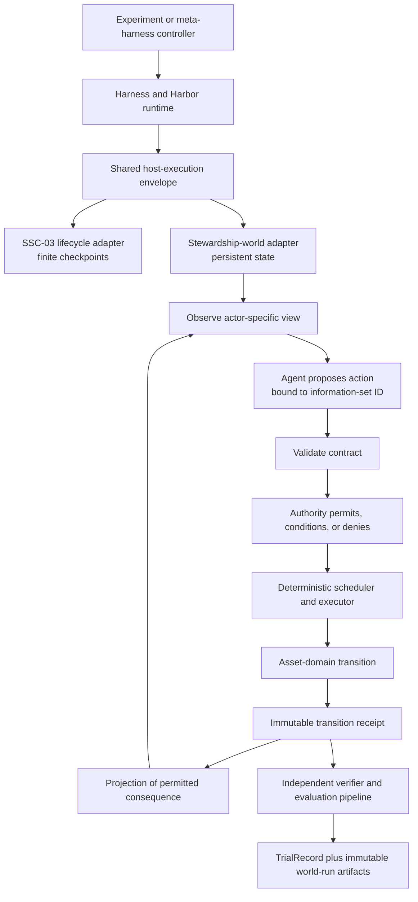

# ABOUTME: Defines the product and research requirements for persistent asset-stewardship task worlds.
# ABOUTME: Grounds a deterministic maintenance-world roadmap in the adaptive meta-harness and SSC-03 substrate.

# Asset Stewardship Worlds — Product Requirements Document

| Field | Value |
| --- | --- |
| Status | Certified reference package and pure physical kernel merged; ASW-0C charter recorded; stewardship state machine is the next production slice |
| Date | 2026-07-29 |
| Revision | `ASW-PRD-G-2026-07-29` |
| Design revision | Semantic decisions change through reviewed document revisions; this PRD does not require a self-referential or hand-authored content hash |
| Target repository | `aec-bench` |
| Current documentation branch | `feat/wastewater-pump-station-research-charter` |
| Live implementation status | Reference package reader and pure physical kernel merged through PR 41; actor authority, obligations, work orders, projections, persistence, host execution, and evaluation remain staged |
| Initial programme boundary | ASW-0 through ASW-4 |
| Implementation status | Asset-local reference-package and physical-kernel production code exists; later stewardship slices remain incomplete |
| Working programme name | Asset Stewardship Worlds |
| First study | Obligation continuity under time and handover |

## Executive decision

Introduce an asset-specific persistent stewardship-world engine behind a small shared host-execution envelope.

Reuse the adaptive meta-harness and common execution infrastructure for agent/model execution, content addressing, experiment identity, Harbor dispatch, immutable evidence, and `TrialRecord` persistence. Reuse lifecycle transaction, recovery, and evaluation patterns without extending their checkpoint-specific models into stewardship state. Do not reinterpret SSC-03's `COMPLETE` status as continuing physical-world state.

The live implementation audit confirms an asymmetric starting point. The repository is close to being able to execute, retain, verify, and compare bounded world sessions, but it has no executable stewardship kernel. The core engineering work is therefore a sibling world-semantic vertical slice, not another adapter stack, Harbor stack, artifact store, or meta-harness.

Adaptive repair, motif learning, promotion, and the existing four-cell harness/program candidate search are outside the ASW-0 through ASW-4 critical path. The first stewardship study freezes the model, adapter, and harness and varies only the declared continuity treatment.

The first reference world is `AU-NSW-LH-SYN-SPS-v1`: a fictional duplex submersible wastewater pumping station in a Lower Hunter, New South Wales operating context. Its initial component boundary is the two pump units in a fixed duty/standby arrangement; wet-well, power, access, spares, and discharge conditions enter only as explicitly modelled environment or resource constraints. Freeze only the architectural invariants and shared envelope first. Prove those choices through one deterministic vertical slice and a falsification suite before extracting broader maintenance abstractions.

This is an original standards-grounded synthetic benchmark archetype. It is not an identified or reconstructed station, a compliance design, an operational recommendation, a representation of any utility's actual asset, an observed failure-rate model, or a digital twin. ASW-0 must certify the bounded synthetic claim through the V0–V3 validity ladder in section 12.3; empirical or SME calibration at V4 is optional and cannot be implied by lower-level evidence.

During ASW-0 through ASW-4, the reference implementation remains task-world-owned under `task_world_templates/stewardship/`. It does not create a new top-level `worlds` domain. Only types that cross a demonstrated repository boundary enter `aec_bench.contracts`; asset state, clocks, physics, action semantics, scheduler rules, and study-specific schemas remain local to their owning package. Shared extraction is a later promotion decision, not a starting assumption.

In short:

> **Sibling persistent-world engine, shared experiment and agent runtime.**

## 1. Purpose

AEC-Bench can already represent long-horizon review work in which evidence arrives over time, actions are durably recorded, source revisions invalidate selected calculations, and a verifier checks the resulting lineage. SSC-03 demonstrates those capabilities in a finite lifecycle.

Maintenance introduces a different research object. The asset, its exposure, its restrictions, its obligations, and the consequences of prior choices must continue beyond:

- one review checkpoint;
- one work order;
- one agent conversation;
- one handover;
- one evaluation window; and
- one administrative closeout.

The product outcome is a benchmark environment in which an agent acts as an asset steward rather than a task completer. The environment must make it possible to study whether the agent:

- preserves obligations across time and handover;
- distinguishes physical truth from observations and institutional claims;
- acts on the information available at decision time;
- manages restrictions, resources, and delayed work;
- revises decisions when evidence or exposure changes;
- leaves the asset in a defensible condition beyond the visible scoring horizon; and
- gains anything from a durable learner only after external continuity carriers have been controlled.

## 2. Evidence and claim boundary

### 2.1 Implemented substrate

The following capabilities already exist and are inputs to this PRD:

- SSC-03 has host-controlled evidence release, immutable submissions, bounded operations, source-state fingerprints, selective recomputation, and independent verification, as recorded in the [ASW-0A source inventory](asw-0a-baseline-and-authority.md#source-inventory).
- The adaptive meta-harness has content-addressed harness and program artifacts, task/world package snapshots, causal lineage, Harbor execution, immutable receipts, controlled experiments, and `TrialRecord` import, as recorded in the [ASW-0A source inventory](asw-0a-baseline-and-authority.md#source-inventory).
- The repository requires replayable experimental truth, strict boundary contracts, explicit outcome-relevant state, task-adapter independence, evaluation pipelines, and public/holdout separation. See [Architecture Invariants](../../docs/INVARIANTS.md).
- ASW-0A selects the clean derivative at PR 24 merge `fdc6215c39add79d4a5549a1bfc058d9baac1b54`, tree `730594c69662369eea08f3e96274dc59778bca38`, and excludes the dirty root checkout, the untracked source-branch worktree, and other stale worktrees from implementation authority. It also removes the unreferenced, non-authoritative `docs/ssc03-model-selected-intervention.md` survivor so the repository's existing documentation-ownership boundary is satisfied. The baseline, removal, and all excluded surfaces are recorded in the [ASW-0A source inventory](asw-0a-baseline-and-authority.md#source-inventory).

### 2.2 Decisions established by this PRD

This PRD establishes the intended architecture, scope, sequence, requirements, falsification gates, and permitted research claims.

It does establish that the first reference profile is the fictional `AU-NSW-LH-SYN-SPS-v1` duplex submersible wastewater pumping station and that implementation may begin only after that synthetic profile reaches V3.

It does not establish that:

- the proposed protocol is implemented;
- any degradation model is empirically calibrated or valid outside its certified synthetic envelope;
- the reference world represents an actual Lower Hunter asset, utility design, operating instruction, observed failure population, or digital twin;
- any agent can perform the proposed stewardship task;
- structured handover causes better performance;
- a model has learned across trajectories; or
- continual learning has occurred.

### 2.3 Provisional elements

The following remain provisional until ASW-0 or ASW-1 resolves them:

- the exact synthetic parameter envelope within the committed reference profile;
- degradation and intervention equations;
- exact agent action catalogue;
- authority roles and conditional approval policy;
- trigger-expression syntax;
- evaluation-window length;
- terminal-liability weights;
- public comparison conditions and repetition budget;
- exact Python contract names;
- which conceptual types, if any, earn promotion into the repository-wide `contracts` domain; and
- whether any shared stewardship runtime is justified after the asset-local vertical slice.

The [ASW-0C research charter](asw-0c-research-charter.md) resolves the first
action and authority catalogue, continuity treatments, first-study endpoint and
estimand, logical budgets, trigger policy, event ordering, terminal-liability
vector, and conclusion rule. Exact production type names remain owned by their
implementation slices.

### 2.3.1 Design revision during environment development

In this PRD, **freeze** means that a semantic choice is explicit and versioned.
It does not mean that the developing environment cannot change.

Before outcome-bearing execution, a reviewed revision may change the charter,
policy, schedule, or implementation. The change must state what changed and why.
Once confirmatory outcomes begin, a semantic change creates a new study
generation, and results from the two designs are not pooled.

The PRD and charter do not require hand-authored hashes. Later materialisation
and run evidence record the realised revisions and artifacts needed for replay.
Identity is evidence of which design ran; it is not authority to approve that
design.

### 2.4 Evidence, rights, and derivation classes

Every claim-critical input receives one evidence class:

| Class | Meaning | Permitted use |
| --- | --- | --- |
| N — Normative | Legislation, regulator material, standards, or utility technical requirements | Defines terminology, constraints, or declared regional practice; does not by itself establish empirical asset behaviour |
| P — Physical/mechanistic | Primary engineering literature, equations, or documented physical principles | Supports mechanism form, units, trends, and bounded plausibility |
| E — Executable | Validated or independently reproducible software behaviour and published verification cases | Generates or checks declared calculations within a pinned engine/configuration envelope |
| S — Synthetic | Original assumptions, parameter selections, histories, events, and scenario constructions | Defines the benchmark world only; must be labelled and sensitivity-tested |
| C — Calibration | Field observations, manufacturer data, or qualified expert rulings tied to a defined population | Optional V4 calibration; cannot be inferred from N, P, E, or S evidence |

Every source also receives one rights class:

| Class | Runtime and repository treatment |
| --- | --- |
| Redistributable | May be stored and redistributed subject to its recorded licence |
| Derived-only | Only an original, traceable transformation may be promoted; raw source material remains outside the package |
| Cite-only | Record the citation and claim mapping; do not copy source content into runtime or distributable artifacts |
| Excluded | Do not use for generation, certification, runtime, evaluation, or reporting |

Every promoted value must trace through a derivation record from source or declared synthetic assumption to transformation, units, output field, and verification case. A citation is not a derivation, and content-addressing does not confer redistribution rights.

## 3. Research objective

### 3.1 Primary question

> Can an agent preserve and discharge time- and exposure-triggered maintenance obligations across work-order closure and agent handover, and does supplying the declared structured handover projection change the paired risk of obligation-continuity failure relative to the current actor-view projection alone?

### 3.2 First falsifiable hypothesis

A fresh agent supplied with a structured stewardship handover projection will preserve active restrictions and discharge due obligations more reliably than a fresh agent supplied only with the current actor-view projection, under matched asset histories, event schedules, action budgets, and model conditions.

For this hypothesis, an obligation-continuity failure is a trajectory-level event in which a carried obligation or restriction is omitted at handover, improperly closed or cancelled, or allowed to become overdue without a valid action or documented infeasibility. The primary estimand is the paired difference in obligation-continuity failure rate between matched structured-handover and current-actor-view trajectories.

ASW-0 must preregister the minimum meaningful effect, repetition count, uncertainty method, and treatment of incomplete or ineligible pairs. ASW-4 supports the directional hypothesis only if the preregistered interval lies on the structured-handover-favouring side of no effect and the point estimate meets the minimum meaningful effect. It refutes the directional hypothesis if the corresponding threshold is met in the opposite direction; otherwise the result is inconclusive. No secondary outcome may replace the primary endpoint after execution.

This is a provisional hypothesis. It becomes a supported, refuted, or inconclusive result only after the preregistered ASW-4 study.

### 3.3 Strongest paired-world test

Construct two histories with the same current scalar health reading but different accessible histories.

World A has:

- a stable trend;
- no active temporary restriction; and
- a valid prior inspection.

World B has:

- a rapidly worsening trend;
- a temporary operating permission close to expiry; and
- an open post-maintenance verification obligation.

The instantaneous reading is the same. The complete accessible information set is not. The reference action must differ for a reason traceable to history.

This test must never hide the relevant history from both agents and then expect different answers. It tests whether available history is materially active, not whether the model can infer invisible state.

The same-reading/different-history construction is a world-validity test, not a continuity treatment. Each accepted history is frozen before treatment assignment and replayed across every eligible continuity carrier. The study must never confound history with carrier by, for example, assigning World A only to structured handover and World B only to current actor view.

## 4. Users and authorities

| Actor | Responsibility | Must not control |
| --- | --- | --- |
| Experiment controller | Selects world package, condition, agent tenure, evaluation window, hidden continuation, and trial identity | Physical transition truth or verifier conclusions |
| Agent under evaluation | Observes an authorised view and proposes typed actions with reasons | Latent state, future events, authority decisions, simulator results, or reward |
| Authority engine | Accepts, conditions, denies, or defers proposed actions under versioned rules | Asset physics or evaluation outcomes |
| Scheduler/executor | Advances simulated time, runs authorised processes, and applies scheduled events | Agent-visible projection policy or reward |
| Asset-domain engine | Computes asset-specific physical transitions and observation processes | Campaign selection, model execution, or institutional truth claims |
| Projector | Produces actor-specific views from authoritative state | Physical mutation or verification |
| Verifier | Recomputes integrity, decision-time validity, physical outcomes, obligations, and terminal liabilities | World mutation or evidence disclosure |
| Independent reference-world certifier | Reproduces generator outputs and checks mechanisms, units, envelopes, invariants, sensitivity, and claim limits through a separately executable path | Generation, runtime mutation, study treatment, or self-approval |
| Optional domain reviewer | May provide V4 calibration evidence or non-binding design critique with declared scope and provenance | Required V0–V3 approval, runtime state, or experimental results after execution |

## 5. Product scope

### 5.1 Initial programme commitment

The initial programme includes only:

1. ASW-0 — synthetic reference-world certification and research charter;
2. ASW-1 — repository boundary and protocol design;
3. ASW-2 — deterministic asset-specific walking skeleton;
4. ASW-3 — falsification and hardening; and
5. ASW-4 — the first stewardship study.

ASW-5 through ASW-10 are conditional research expansions. They are not automatically authorised by completing the engine.

### 5.2 Initial vertical-slice boundary

The first executable world contains:

- one asset;
- at most two components;
- two credible degradation or failure mechanisms;
- calendar time, operating hours, and starts;
- deterministic deterioration;
- a predeclared exogenous-event schedule;
- one sensor or condition trend;
- one inspection process;
- one conditional deferral action;
- one operating restriction;
- one follow-up obligation;
- one spare, access, or lead-time constraint;
- one fixed Pump A/Pump B duty-transfer rule;
- one declared preventive or condition-directed intervention;
- provisional work-order closure;
- one post-maintenance verification obligation;
- one mid-trajectory fresh-agent handover; and
- one controller-owned evaluation window with terminal-liability scoring.

### 5.3 Non-goals for the initial programme

- Extending `EvidenceLifecycleRunState` with maintenance semantics.
- Treating a lifecycle `COMPLETE` status as the end of an asset world.
- Building a second model-execution, Harbor-dispatch, experiment-identity, immutable-ledger, or campaign stack; stewardship still owns its dynamic-state recovery and verifier extensions.
- Designing a complete asset-management or enterprise work-management platform.
- Generalising a degradation, intervention, component, or failure-mode ontology from the single committed reference profile.
- Running actual wall-clock background threads.
- Concurrent model tool calls; concurrency means processes overlap in simulated time.
- Stochastic prognostics or randomly sprinkled failures.
- Eagerly materialising every unchosen counterfactual branch.
- Fleet optimisation, generalized redundancy, or coupled-asset duty transfer; the fixed A/B duty/standby transfer rule required by this one reference profile remains in ASW-2.
- FMECA or maintenance-schedule adaptation.
- Skill, memory, policy, or weight adaptation.
- Adapting proposal-session DAGs, repair loops, motif learning, or four-cell harness/program search to act as the stewardship runtime.
- Calling an asset "solved."
- Scoring only eventual physical outcome.
- Claiming counterfactual causality from a transition receipt.

## 6. Architectural invariants

The repository objective stack remains:

```text
validity > reproducibility > coverage > cost > throughput
```

The stewardship-world implementation adds the following domain invariants.

### ASW-I01 — Harness-owned execution, separate world semantics

The harness owns session execution, Harbor dispatch/import, and trial persistence. The meta-harness may compile and compare approved experiments. The stewardship runtime owns persistent maintenance semantics. Neither runtime moves task-specific logic into adapters, and the stewardship runtime does not import the meta-harness.

### ASW-I02 — Time is simulated state

Calendar time, operating hours, starts, cycles, and expiry counters are typed clocks. Agent turns and host wall-clock time are not substitutes for physical time.

### ASW-I03 — State planes remain distinct

The implementation must distinguish:

1. host-only latent physical truth;
2. observations and agent-visible evidence;
3. durable but fallible institutional claims and decisions; and
4. conversation, agent, procedure, or learner state.

Writing "repair successful" cannot set latent health. A measurement cannot silently become accepted institutional truth. A handover artifact cannot alter the asset.

### ASW-I04 — Commitment precedes consequence

Every agent action binds to its exact base view and the current host-derived information set before authority, execution, later evidence, or outcomes become visible.

### ASW-I05 — All mutation is authorised and typed

Physical or authoritative state changes only through:

```text
agent proposal
  -> contract validation
  -> authority decision
  -> scheduled or immediate execution
  -> domain transition
  -> transition receipt
  -> permitted projection
```

Reports, work orders, summaries, and free text do not directly mutate physical truth or authoritative status.

### ASW-I06 — Administrative closure is not physical termination

Closing a work order can leave open verification, restrictions, run-in monitoring, investigation, recurrence risk, or institutional actions. Evaluation may stop while the world remains resumable.

### ASW-I07 — Every consequential transition is inspectable

The host records the prior state identity, trigger, rule versions, clock deltas, resource changes, obligation changes, post-state identity, and visible projection identity.

### ASW-I08 — Replay inputs are complete

The initial state, action history, rule versions, event schedule, and any later pseudo-random stream are sufficient to reproduce the realised branch. Missing replay inputs make a result ineligible for reporting.

### ASW-I09 — The evaluation boundary is invisible

The controller owns the evaluation window. The agent cannot observe when scoring stops, and the world receives no magical end-of-window event.

### ASW-I10 — Institutional models are not physics

FMECA, maintenance schedules, criticality, and operating rules are versioned institutional state. They may be incomplete or wrong. Latent physical state remains independently defined.

### ASW-I11 — Deterministic first, structured variation seam from day one

Initial dynamics are deterministic. Exogenous events nevertheless declare a source class, affected entities, schedule, visibility, and replay identity so later variation enters through an auditable treatment rather than an ad hoc random call.

### ASW-I12 — Existing lifecycle behaviour remains unchanged

SSC-03 checkpoint progression, operation contracts, verifier gates, and `TrialRecord` behaviour remain regression-protected throughout the initial programme.

### ASW-I13 — Repository placement follows authority

File placement is part of the architecture. Cross-domain envelopes belong in `contracts`; deterministic asset and world semantics belong in `task_world_templates`; provider translation remains in provider or adapter boundaries; execution orchestration belongs in `harness`; post-trial analysis belongs in `evaluation`; experiment-specific planning and reduction stay with the experiment; and CLI modules remain thin. Convenience, reuse aspirations, or the fact that a model is serializable do not change its owner.

### ASW-I14 — Provisional artifacts have no contract authority

PRD pseudotypes, test fixtures, temporary directories, generated reports, pilot manifests, content-addressed run artifacts, and study-local schemas do not become repository contracts merely because another file imports them or because their bytes are immutable. Promotion requires an explicit boundary decision, an identified producer and consumer, canonical serialization and versioning, compatibility and visibility rules, tests at the real boundary, and an accountable owner.

### ASW-I15 — Evidence production, verification, and acceptance remain separate

The stewardship runtime may produce state and receipts; the task-owned verifier determines task validity and reward; evaluation derives post-trial metrics; and a study-level acceptance decision operates over frozen evidence. A runtime log is not an authority ledger, a report cannot approve itself, and no candidate-, agent-, or study-authored artifact can grant itself contract, verifier, or promotion authority.

### ASW-I16 — Generation, certification, runtime, and evaluation remain separable

An engineering engine may support more than one programme role only through declared, independently versioned adapters and artifacts. No implementation path may generate a reference world, certify its own claim-critical outputs, execute the agent's world, and award benchmark success. Certification must reproduce claim-critical outputs through an independently executable path, and benchmark evaluation must remain task-owned even when an external engine supplies reference calculations.

## 7. System architecture



### 7.1 Minimal host-execution seam

The shared seam is deliberately smaller than a common world API. It standardises how the host:

- identifies and validates a content-addressed world package;
- creates or resumes an execution;
- publishes a declared model interaction surface;
- binds session and agent-tenure identity;
- accepts only typed host-mediated commands;
- persists execution evidence;
- invokes an independent verifier; and
- produces artifacts suitable for `TrialRecord` finalisation.

It does not standardise clocks, actions, state, schedulers, obligations, transition semantics, or projections. Those remain stewardship-owned until a later promotion review finds a second demonstrated consumer or an unavoidable stable host boundary.

SSC-03 may continue to interpret its interaction as finite checkpoints. The stewardship engine interprets its interaction as views, proposed actions, scheduled processes, events, and resumable state.

The closest production-shaped implementation precedent is the host-owned session in `src/aec_bench/meta_harness/evidence_lifecycle_local.py`: it exposes native bounded tools, retains host context, records evidence, and keeps verification outside the model. The stewardship bridge should reuse that ownership pattern. `proposal_session` and `proposal_scheduler` remain finite candidate-production machinery and must not acquire maintenance-world semantics.

### 7.2 Stewardship interaction surface

The maintenance-specific surface must support the semantics of:

```text
observe(actor)
propose_action(action, based_on_information_set)
advance_to_next_decision_point()
snapshot()
resume(snapshot)
```

These names remain conceptual in ASW-1. That stage records required semantics and candidate names without creating an importable or persisted contract. Asset-local action and view names enter with ASW-2A2 and ASW-2A3; any shared host request/result names and versions freeze only in ASW-2C when the real producer and consumer exist.

`observe`, `propose_action`, `snapshot`, and `resume` form the candidate stewardship surface, initially asset-local. They are not operations that lifecycle worlds must implement. The proposal retains its base `view_id`, while the host supplies and validates the current `information_set_id`. Time advancement is a stewardship temporal capability so SSC-03 is not forced to pretend that its finite checkpoint engine owns physical clocks.

An empty model response or provider timeout is an execution failure, not a maintenance no-op. Waiting or continuing operation must be an explicit typed proposal so the evaluator can distinguish a stewardship choice from a broken run.

### 7.3 Engineering-engine roles and promotion boundary

Validated engineering software is useful only when its role and authority are explicit:

| Role | Purpose | Authority and boundary |
| --- | --- | --- |
| Offline generator/oracle | Produce candidate physical curves, operating cases, events, and expected results | Research-time only; emits pinned, reviewable artifacts and cannot certify itself |
| Independent certifier | Reproduce claim-critical calculations, invariants, units, and sensitivity results through a separately executable path | May accept or reject a proposed synthetic-world generation; cannot generate runtime truth or award task reward |
| Asset-world runtime | Execute the promoted deterministic state machine used by agents and replay | Consumes only the promoted asset package; cannot read the dossier, source documents, research workspace, or sealed certification material |
| Optional agent-visible engineering tool | Give the agent a declared calculation capability available equally across eligible treatments | Receives only actor-visible inputs and returns only allowlisted outputs; cannot expose latent state, gold actions, sealed cases, future events, or evaluator targets |
| Optional live solver integration | Execute a pinned solver during a later runtime generation when the offline package is insufficient | Out of scope through ASW-4 unless separately authorised with deterministic replay, availability, licensing, failure, cost, and version controls |

Every engine-produced artifact records software and dependency versions, licence, executable hash, configuration, solver settings, input hashes, convergence status, warnings, units, semantic output allowlist, and derivation lineage. Output compatibility is semantic, not merely byte-level.

ASW-0B1 through ASW-0B5 produce research evidence, not a runtime dependency. Promotion into ASW-2 requires a content-addressed manifest that:

- identifies each promoted file and field;
- maps it to evidence, rights, assumptions, transformations, units, and certification cases;
- excludes cite-only and excluded source content, raw solver exports, research scripts, discarded candidates, and sealed verification material;
- names the runtime reader and independent verifier;
- freezes package and schema versions; and
- proves that the runtime succeeds with the research and source directories absent.

If the generator and certifier share a library, equation, or numerical implementation for a claim-critical result, that common dependency is recorded as a limitation and a second analytical, reference-case, or independently implemented check is required. Agreement between two wrappers around the same calculation is not independent certification.

## 8. Stewardship state envelope and domain payload

### 8.1 Asset-local candidate envelope

The first asset-local envelope may contain only concepts exercised by `AU-NSW-LH-SYN-SPS-v1`:

- world and branch identity;
- asset configuration identity;
- typed clock registry;
- resource state;
- authority-policy reference;
- restrictions;
- obligations;
- in-progress processes;
- institutional-record reference;
- event-schedule reference;
- projection-policy reference;
- rule-version references; and
- versioned asset-domain payload.

The reference-profile payload owns:

- component hierarchy;
- health variables;
- degradation mechanisms;
- failure-mode-specific state;
- physical operating equations;
- intervention effects;
- observation-generation rules.

Later asset-domain versions may add repair-quality and recurrence semantics when ASW-7 exercises them.

This is not a repository-wide `contracts` model during ASW-1. ASW-3C may record that part of it has become a promotion candidate across stewardship assets or at a stable harness boundary, but that review does not authorize extraction. Any shared implementation waits until the ASW-4 programme checkpoint and a separate compatibility-gated promotion stage. The envelope must not acquire unused "future-proof" fields. Each field added during ASW-2 must be exercised by the committed reference profile or required for replay, authority, or evaluation.

### 8.2 Identity model

Every run records distinct identities for:

- `reference_profile_id`;
- `reference_world_generation_id`;
- `promotion_manifest_id`;
- `world_instance_id`;
- `world_branch_id`;
- `evaluation_window_id`;
- `agent_tenure_id`;
- `conversation_id`;
- `institution_version_id`;
- `asset_configuration_id`;
- `event_schedule_id`;
- `projection_policy_id`;
- `rule_set_id`.

This makes conditions such as "same certified generation, same asset configuration, fresh agent, same event schedule, updated institution" explicit and prevents a silent generator or package change from entering a paired comparison.

No learner identity is part of ASW-0 through ASW-4. Those studies record `adaptation_mode=none` in their study condition. A learner identity enters only when ASW-10 defines and exercises an actual mutable learner boundary.

### 8.3 Static package identity versus evolving state

The current `WorldSnapshotRef` in `src/aec_bench/contracts/run_bundle.py` identifies a compiled task-world package and topology. It is not an evolving physical-state snapshot.

The stewardship implementation must use a distinct name such as `StewardshipStateSnapshotRef` for resumable dynamic state. The initial programme must not overload the current type or silently change its meaning.

### 8.4 TrialRecord remains the experimental root

`TrialRecord` remains the top-level source of experimental truth. It will reference, rather than inline:

- stewardship execution summary;
- stewardship provenance;
- start and end state snapshots;
- transition ledger;
- event schedule;
- agent-tenure and handover records;
- rule and projection identities;
- verifier output; and
- terminal-liability evaluation.

The likely additive shape is a paired `world_execution` and `world_provenance` record, validated together as lifecycle execution/provenance are paired today. ASW-1 decides the design; ASW-2D promotes the final schema only after the session, importer, immutable artifact inventory, and reloader round trip exist. Mutable aliases and working paths never enter the record. Existing lifecycle and meta-harness fields remain valid and unchanged.

`world_execution` and `world_provenance` extend rather than replace existing trial provenance. Before a complete record is published, finalisation must reconcile the exact world-session request and result, task/world-package and verifier bytes, adapter and realised model identity, prompt and continuity-carrier inputs, complete tool schema, runtime image and realised dependency identity, randomness identity where applicable, and every imported artifact hash against the enclosing `TrialRecord`. Any drift leaves the record partial or ineligible; requested identity must never substitute for unresolved realised identity.

One `TrialRecord` represents one evaluation window, not the lifetime of the asset. Sequential windows chain explicitly: the immutable end snapshot from one window becomes the declared start snapshot of the next. Overlapping windows independently reference declared start and end boundaries on the same continuing branch; they do not pretend to form a sequential snapshot chain.

## 9. World semantics

### 9.1 Typed clocks

Each clock declares:

- stable ID;
- unit;
- scope or entity;
- origin;
- current value;
- advancement condition;
- monotonicity rule; and
- applicable trigger types.

The first slice supports:

- calendar time;
- asset operating hours; and
- asset starts.

The committed reference profile may add one component clock only if its selected mechanism requires it.

Calendar time advances while an asset is isolated. Operating hours do not. Starts may increase with little operating time. These distinctions require direct tests.

### 9.2 Event-driven progression

The world evolves semantically without a maintenance intervention, but implementation uses an explicit deterministic scheduler rather than background threads.

After a committed proposal, the controller advances to the earliest decision-relevant event, such as:

- an inspection completing;
- a spare arriving;
- an access window opening;
- a restriction expiring;
- an obligation becoming due or overdue;
- an external load event;
- an intervention completing, failing, or becoming interrupted;
- evidence becoming available; or
- a genuine physical terminal event.

ASW-2 may overlap only the inspection and intervention processes exercised by the reference scenario. Each supports the minimum start, progress, completion, and declared interruption or failure path required by that trajectory and AC-06. Multiple overlapping work orders, dependency-aware rescheduling or cancellation, and richer process interactions remain ASW-5 scope. All realised transitions are still applied in one deterministic order.

ASW-2 freezes a typed quiescent result for the reference scenario when no future decision-relevant event exists. It does not invent a general post-terminal API. If the selected scenario contains a genuine physical terminal event, ASW-1 must define only the exact terminal behavior exercised by that event; otherwise unknown terminal events fail closed and richer terminal/closeout semantics remain conditional scope.

### 9.3 Exogenous events and future jitter

Each exogenous event declares:

- event type;
- source class: physical, observational, operational, resource, or institutional;
- scheduled time or trigger;
- affected entities;
- visibility before and after application;
- deterministic replay key; and
- payload schema/version.

ASW-2 uses a fixed event schedule. Later treatments change one declared source class at a time.

### 9.4 Action, authority, and execution

An agent proposal includes:

- proposal ID;
- agent-tenure ID;
- action type and schema version;
- parameters validated by the asset-owned discriminated model selected by that action type and version;
- reason;
- exact base `view_id`;
- exact current `information_set_id`;
- proposed duration or stopping condition where relevant; and
- requested authority.

Unknown action types, versions, and fields fail before authority dispatch. `parameters` is never an open dictionary at the host boundary.

The authority result is independently recorded as:

- permitted;
- permitted with conditions;
- denied;
- deferred pending prerequisites; or
- invalid.

Execution is independently recorded as:

- scheduled;
- in progress;
- completed;
- partially completed;
- failed;
- interrupted; or
- cancelled.

The permitted action may differ from the proposal. The executed action may differ from the permission because another event intervenes.

### 9.5 Actor-specific views and information sets

Every observation produces an immutable `view_id` bound to:

- world branch and state snapshot;
- actor and tenure;
- projection policy;
- visible clock values;
- visible evidence and provenance;
- visible institutional records;
- visible restrictions, resources, obligations, and processes;
- source artifact hashes; and
- creation transition.

The host derives the current `information_set_id` from that base view plus two content-addressed manifests: the tenure's append-only actor-visible observation history and the exact current context projection supplied at commitment. The latter includes the declared continuity carrier, conversation prefix, workspace/tool surface, and currently visible material. This parent PRD owns the canonical composition, serializer, hash profile, null behavior, current-context projection, and proposal binding. A later Temporal Evidence Frontier capability may contribute an actor-visible retrieved-event manifest only after its own boundary exists; it does not redefine the parent identity.

The current actor-view projection is deliberately lossy with respect to history, but it is never incomplete with respect to the present. At commitment it must include every active restriction, due or overdue obligation, currently available resource and access constraint, active process, and current institutional status that the actor is authorised to see. The treatment may remove historical explanation; it may not create an artificial safety defect by hiding a current duty.

Views must not leak:

- latent health;
- hidden future events;
- other experimental conditions;
- evaluation-window location;
- verifier logic or gold outcomes; or
- counterfactual replay results.

The verifier uses the action's bound base view and host information set when judging decision-time defensibility. It must not evaluate an earlier action using evidence revealed later.

### 9.6 Obligations

Obligations are durable, authority-bearing records rather than booleans.

The target lifecycle vocabulary is:

```text
proposed
active
due
overdue
fulfilled
breached
waived
suspended
superseded
cancelled
```

ASW-2 exposes only the state transitions exercised by the reference scenario. `waived` and `suspended`, composite dependencies, and other richer exception paths remain unavailable and fail closed until ASW-5 supplies their authority and evidence rules. Reserved vocabulary must not be mistaken for implemented behaviour.

Every ASW-2 obligation carries:

- stable identity;
- originating decision or event;
- responsible role;
- applicable asset/component;
- trigger;
- required action or evidence;
- linked operating restriction;
- closure authority;
- time and evidence basis for each transition;
- current status.

Dependency links, waiver or suspension authority, and supersession lineage are added only when ASW-5 exercises those semantics.

The first slice implements only the trigger forms required by the reference scenario:

- one calendar threshold;
- one exposure threshold; and
- `whichever occurs first` across those two.

No general expression language is introduced until ASW-5 demonstrates a concrete need.

Obligations cannot disappear through:

- prose;
- work-order closure;
- snapshot/resume;
- agent handover;
- evaluation-window transition; or
- a retry.

### 9.7 Work orders, restrictions, and processes

Work orders are administrative containers. Obligations are future duties. Restrictions are current operating constraints. Processes are work unfolding in simulated time.

Those concepts remain separate.

Closing a work order may create or preserve:

- a verification obligation;
- a monitored run-in period;
- an active derating;
- a removed-part investigation;
- a recurrence watch;
- a warranty action; or
- a proposed institutional change.

### 9.8 FMECA and maintenance schedule

The first world contains a fixed, versioned FMECA and maintenance schedule as the normative basis available to the agent.

They are not the simulator.

The engine must be able to represent:

- a correct FMECA entry;
- an incomplete entry;
- a misdiagnosed failure mode;
- an ineffective control; and
- a schedule that does not match latent deterioration.

Changing FMECA or schedule is out of scope until ASW-9.

### 9.9 Transition receipts

Use the term **transition receipt**, not causal receipt.

A transition receipt proves that the host applied declared rules to a declared prior state. It does not prove a counterfactual causal effect.

Every receipt contains:

- receipt schema and transition ID;
- world instance, branch, and sequence;
- pre-state and post-state hashes;
- trigger type and identity;
- agent proposal, base view, and bound information-set identity where applicable;
- authority decision and policy version;
- execution result;
- domain rule versions;
- clock deltas;
- resource deltas;
- applied external events;
- processes started, changed, or completed;
- restrictions created, changed, or lifted;
- obligations created, changed, fulfilled, or breached;
- visible projection hash;
- affected-state paths; and
- fingerprints for declared unaffected state.

Agent action, elapsed exposure, external events, resource constraints, and observation processes remain separately attributable.

### 9.10 Snapshots, resume, and resets

A complete state snapshot preserves:

- all clocks;
- latent domain state;
- event cursor and schedule identity;
- resources;
- processes;
- restrictions;
- obligations;
- institutional records and versions;
- transition sequence;
- view/projection lineage; and
- rule identities.

Reset terminology is dimension-specific:

| Term | Meaning |
| --- | --- |
| Experimental reset | Controller starts from a declared initial state |
| Agent reset | A fresh agent tenure inherits the continuing world |
| Conversation reset | Context is cleared while selected artifacts may persist |
| Institutional reset | A declared institution version replaces another under experiment control |
| Physical intervention | Repair or replacement changes the in-world asset; it is not a reset |
| Evaluation-window transition | Scoring ends while the world remains resumable |
| Physical terminal event | Disposal, decommissioning, or catastrophic loss ends operation but not institutional history |

### 9.11 Counterfactual replay

The engine does not eagerly store every unchosen branch.

It preserves:

- initial snapshot;
- realised action history;
- transition-rule versions;
- exogenous-event schedule;
- projection and authority versions; and
- later, any fixed pseudo-random or common-random-number stream.

Evaluation may reconstruct selected alternatives on demand in a separate private branch. Counterfactual artifacts never become visible to the realised agent.

## 10. Functional requirements

| ID | Requirement | Initial priority |
| --- | --- | --- |
| FR-01 | The common harness must dispatch lifecycle and stewardship as distinct typed execution kinds through a minimal host-execution envelope for package, execution, session, artifact, verifier-handoff, and failure identity; it must not require a shared state machine or world-operation surface. | Must |
| FR-02 | The host must persist reference profile, certified generation, promotion manifest, world, branch, window, tenure, conversation, institution, asset, schedule, projection, and rule identities; ASW-0 through ASW-4 must explicitly record `adaptation_mode=none`. | Must |
| FR-03 | The stewardship engine must maintain typed entity-scoped clocks with conditional advancement. | Must |
| FR-04 | A deterministic scheduler must advance to the next declared decision point and order simultaneous events canonically. | Must |
| FR-05 | The projector must create immutable actor-specific views without latent-state, future-event, holdout, or evaluation-boundary leakage. | Must |
| FR-06 | Every proposal must bind its exact base view and the immutable host information set on which it was based. | Must |
| FR-07 | Typed proposals must pass validation, authority, execution, and recording as distinct stages. | Must |
| FR-08 | An asset-domain engine must apply physical transitions without importing experiment, adapter, or evaluation policy. | Must |
| FR-09 | The environment must distinguish physical truth, measurements, institutional assertions, and agent inferences. | Must |
| FR-10 | Obligations must support durable status transitions, simple clock triggers, restrictions, required evidence, and controlled closure. | Must |
| FR-11 | Work orders, restrictions, and in-progress inspections/interventions must remain separate and survive handover. | Must |
| FR-12 | Snapshot and resume must preserve the complete state and yield deterministic continuation. | Must |
| FR-13 | The controller must vary reset dimensions independently. | Must |
| FR-14 | Every consequential transition must emit an immutable transition receipt. | Must |
| FR-15 | Given identical declared identities, initial state, actions, rules, and event schedule, canonical transition and state artifacts must be byte-equivalent after explicitly non-semantic transport metadata is excluded. | Must |
| FR-16 | A fresh agent must receive an explicitly bounded handover artifact while the world itself remains unchanged. | Must |
| FR-17 | The first asset package must include a manifest-approved fixed, versioned FMECA, maintenance schedule, limits, authority rules, evidence/assumption lineage, and explicit synthetic claim boundary. | Must |
| FR-18 | Evaluation must report decision-time validity, outcome, obligation integrity, resource use, evidence integrity, handover continuity, and terminal stewardship separately. | Must |
| FR-19 | `TrialRecord` must remain the experimental root and bind immutable world-run artifacts and provenance. | Must |
| FR-20 | The controller must support hidden or overlapping evaluation windows and post-window continuation without exposing the boundary. | Must |
| FR-21 | Counterfactual branches must be replayable on demand without eager materialisation or realised-branch leakage. | Must by ASW-3 |
| FR-22 | Composite triggers, obligation dependencies, waiver and suspension transitions, reservations, and arbitrary additional overlapping processes beyond the fixed ASW-2 inspection/intervention pair must be supported. | Conditional ASW-5 |
| FR-23 | Sensor health, calibration, stale evidence, delayed results, and contradictory records must be supported. | Conditional ASW-6 |
| FR-24 | Imperfect restoration, recurrence, maintenance-induced defects, and rework must be supported. | Conditional ASW-7 |
| FR-25 | Arbitrary coupled assets, generalized transferred duty beyond the fixed A/B profile rule, shared resources, constrained outages, and endogenous backlog must be supported. | Conditional ASW-8 |
| FR-26 | Governed institutional proposals must version and selectively propagate FMECA or schedule changes. | Conditional ASW-9 |
| FR-27 | Durable learner changes must remain independently identifiable from conversation, structured handover, procedure, and institution changes. | Conditional ASW-10 |

ASW-1 defines the rule and a candidate list of transport-only fields excluded from FR-15 byte equivalence. ASW-2B freezes the exact allowlist alongside the canonical serializer, real writer, and reader/reloader. The allowlist cannot expand after a study generation is issued; any later change creates a new serialization and study identity.

## 11. Quality, safety, and compatibility requirements

| ID | Requirement |
| --- | --- |
| QR-01 | All internal semantic boundary models are strict, typed, and reject unknown or malformed fields deterministically. Raw Harbor or external-provider transport may use the repository's lenient-ingestion exception, but it must be normalized immediately into a strict owned contract before authority, persistence, or evaluation. |
| QR-02 | Outcome-relevant state is explicit, content-addressed where persisted, and sufficient for replay. |
| QR-03 | Invalid, stale-view, unauthorised, impossible, or resource-infeasible proposals fail closed without physical mutation. |
| QR-04 | Transition publication is atomic, lock-serialised, crash-recoverable, and exactly once with respect to physical/resource effects. |
| QR-05 | Simulator, authority, projector, and verifier are independently testable and cannot award their own success. |
| QR-06 | Superseded records remain immutable and linked rather than being overwritten. |
| QR-07 | Public packages, projections, errors, receipts, and reports do not disclose private event schedules, latent state, counterfactuals, or verifier targets. |
| QR-08 | The implementation remains provider-neutral and task-adapter independent. |
| QR-09 | Existing SSC-03 and adaptive meta-harness tests remain green without weakening their contracts. |
| QR-10 | Every code-bearing milestone follows TDD and includes unit, integration, and end-to-end coverage through its real production boundary. Installed-CLI evidence becomes cumulative at ASW-2C and local Harbor evidence becomes cumulative at ASW-2D. |
| QR-11 | Test, lint, type-check, and hook output is pristine before a change is considered complete. |
| QR-12 | No mock mode is introduced. Protocol E2E uses an actual deterministic reference controller through the production command surface; provider pilots use real providers when separately authorised. |
| QR-13 | A promoted asset package must load, run, replay, and verify with all research directories, source documents, raw solver outputs, and generator installations absent. |
| QR-14 | Every external-engine artifact must bind software/dependency versions, licence, executable and input hashes, configuration, units, convergence/warnings, and semantic output allowlist. |
| QR-15 | An agent-visible engineering tool must accept only actor-visible inputs and must not disclose latent state, sealed cases, future events, gold actions, or evaluation targets. |

## 12. Synthetic reference-world gate

The selected profile is `AU-NSW-LH-SYN-SPS-v1`, a fictional Lower Hunter duplex submersible wastewater pumping station with Pump A and Pump B in a fixed duty/standby arrangement. ASW-0 certifies an original synthetic family within that profile; it does not reconstruct an actual station.

### 12.1 Gate criteria

Every criterion receives `pass`, `fail`, or `pending demonstration`. AG-01 through AG-13 are hard gates for V3 promotion. A `fail` or `pending demonstration` blocks promotion of the affected world generation and names the failed claim, evidence, assumption, sensitivity, reproduction, or rights check. Missing field observations or SME review is not by itself a failure when the world and claim remain explicitly synthetic; claiming empirical calibration without C-class evidence is.

| Gate | Criterion |
| --- | --- |
| AG-01 | Each claim-critical mechanism form is supported by declared N, P, or E evidence; its synthetic parameter family and operating envelope are explicit; and intended outcomes remain robust under preregistered sensitivity and boundary tests. |
| AG-02 | The first world can be bounded to one asset and at most two components. |
| AG-03 | At least two credible degradation or failure mechanisms are available, with one declared primary mechanism. |
| AG-04 | No-maintenance progression has meaningful physical consequences. |
| AG-05 | Calendar and exposure clocks advance differently. |
| AG-06 | Latent truth and observable evidence can differ. |
| AG-07 | Deferral, restriction, inspection, intervention, and verification are meaningful actions. |
| AG-08 | At least one spare, access, outage, or lead-time constraint matters. |
| AG-09 | Repair does not automatically erase all history. |
| AG-10 | A separately executable certifier reproduces claim-critical reference transitions, units, invariants, and outcome checks without calling the generator's decision path or trusting its assertions. |
| AG-11 | The asset supports a same-reading/different-history paired test. |
| AG-12 | Every input and derived value has source authority, rights class, provenance, hashes or citations, units, transformations, and declared assumptions; no excluded or cite-only content enters a distributable package; V4 SME or field calibration remains optional. |
| AG-13 | The complete first scenario remains small enough for deterministic replay and local end-to-end execution. |

### 12.2 Required synthetic reference-world dossier

The research dossier must contain:

- profile identity, regional context, asset/component boundary, and prohibited claims;
- source register with evidence class, rights class, citation or hash, authority, and claim mapping;
- assumption register distinguishing sourced, derived, and original synthetic values;
- primary and secondary mechanism descriptions;
- deterministic transition equations, transformations, and units;
- explicit synthetic parameter family, operating envelope, and limits;
- observation and inspection model;
- intervention and verification model;
- initial fixed FMECA and schedule;
- action and authority catalogue;
- resource/access constraint;
- reference trajectory;
- generator and engine-role manifests with pinned software, dependencies, licences, configurations, and convergence evidence;
- independent certification cases, invariants, tolerances, and sensitivity results;
- paired-history construction;
- explicit uncertainties, assumption-fragile regions, and claims outside the supported envelope;
- optional expert or empirical calibration evidence, clearly marked V4; and
- a content-addressed research-to-runtime promotion manifest containing only approved redistributable or original derived outputs.

The dossier is design and provenance evidence, not a runtime ABI. The runtime package must remain usable and independently verifiable when the dossier, research workspace, source documents, and generator installation are absent.

### 12.3 Synthetic-world validity ladder

The synthetic-world validity ladder is separate from the programme research-claim ladder in section 19:

| Level | Required evidence | Permitted claim | Still prohibited |
| --- | --- | --- | --- |
| V0 — Reproducible synthetic | Pinned inputs, assumptions, generator, configuration, seed if any, output hashes, and exact replay | The same declared synthetic artifacts can be regenerated | Physical coherence, regional grounding, or benchmark validity |
| V1 — Physically coherent | Units, conservation/monotonicity/range invariants, boundary cases, numerical tolerances, and independent reproduction | The synthetic family is physically and numerically coherent within its declared envelope | Regional practice, empirical calibration, or benchmark construct validity |
| V2 — Standards-grounded archetype | N/P/E claim mapping, regional-context review, source and rights register, mechanism justification, and explicit non-claims | The family is a standards-grounded Lower Hunter synthetic archetype | Representation of a real station, compliance, observed failure rates, or agent benchmark validity |
| V3 — Construct-valid benchmark | AG-01 through AG-13 pass, intervention-dependent outcomes, same-reading/different-history validity, treatment-independent world histories, independent certification, sensitivity robustness, and promotion-manifest review | The promoted generation is suitable for the bounded stewardship benchmark and ASW-2 implementation | Digital-twin, field-calibrated, utility-operational, general pump-reliability, or compliance claims |
| V4 — Optional empirical calibration | Defined-population field data, manufacturer evidence, or qualified expert rulings with rights, uncertainty, and external-validation limits | Only the specific calibrated claim supported by that evidence | Broader representativeness or operational authority not established by the calibration |

ASW-2 requires V3. It does not require V4. A V4 review may narrow, revise, or invalidate a prior synthetic envelope, but its absence does not block a correctly labelled V3 benchmark.

### 12.4 Stop, repair, and pivot rule

Stop the affected generation when a claim-critical result is irreproducible, dimensionally or physically incoherent, unlawfully sourced, outside the declared engine envelope, sensitive enough that the intended action ordering changes under reasonable assumptions, dependent on a hidden common implementation between generator and certifier, or incapable of independent certification. Repair the evidence or narrow the envelope before retrying; select a different mechanism or profile when the benchmark construct cannot survive that narrowing.

Do not stop merely because field histories, manufacturer curves, or SME review are unavailable. Instead, label the relevant values S-class, constrain the permitted claim, widen the sensitivity analysis, and refuse V4 language.

## 13. First study design

### 13.1 Study name

**Obligation continuity under time and handover**

### 13.2 Continuity conditions

The initial candidate conditions are:

1. continuing conversation;
2. fresh agent with structured stewardship handover projection;
3. fresh agent with raw history; and
4. fresh agent with current actor-view projection only.

The final set is preregistered in ASW-0 after cost and information-equivalence review.

The study preregisters three distinct contrasts rather than treating all four conditions as one vague continuity effect:

1. structured handover projection versus current actor-view projection only tests the value of durable historical state being carried across handover;
2. structured handover projection versus raw history tests the value of structured, bounded representation when the underlying historical information is matched; and
3. continuing conversation versus structured handover projection tests whether conversational continuity adds benefit beyond the external stewardship record.

The first contrast does not isolate formatting because its information sets intentionally differ. The second contrast must use a frozen information-equivalence rule and report any unavoidable content or token asymmetry. The primary hypothesis and endpoint apply to the first contrast; the other contrasts are separately named secondary estimands unless ASW-0 explicitly promotes one before execution.

Every continuity carrier is a content-addressed, lossy actor-visible projection. It is not an authoritative dynamic-state snapshot, transition ledger, or reconstruction source, and supplying it cannot mutate world truth.

The current actor-view condition omits prior trajectory detail but contains all actor-visible present duties: active restrictions, due and overdue obligations, current resources and access constraints, active processes, and current institutional status. The structured handover condition adds bounded historical lineage, rationale, and pending-context fields; it does not receive a safer or more complete current state.

### 13.3 Controls

- fixed model and adapter;
- fixed harness and tool surface;
- identical world and event-schedule identities within a paired block;
- each accepted history replayed across every eligible continuity carrier;
- history construction completed before carrier assignment;
- identical action and turn limits;
- declared token/context limits and observed token cost;
- randomized or counterbalanced condition order;
- repeated, disjoint world histories;
- no cross-condition memory beyond the declared carrier;
- untouched evaluation histories; and
- identical terminal-liability rules.

Raw history and structured handover projections may have different token costs. That cost is reported rather than hidden. Any truncation rule is frozen before execution.

### 13.4 Primary outcomes

- obligation fulfilment and breach;
- restriction persistence;
- overdue time/exposure;
- handover omission rate;
- decision-time validity;
- inappropriate closure or cancellation;
- terminal liabilities;
- physical/service outcomes;
- action, turn, token, and estimated cost; and
- unsupported claims or use of stale evidence.

### 13.5 Permitted study conclusion

The strongest permitted conclusion after a valid repeated comparison is:

> Under the preregistered reference world, fixed model condition, budgets, and continuity treatments, the measured treatment changed specified stewardship outcomes by the reported amount.

For structured handover versus current actor view, this is an effect of carrying declared historical state across handover, not a representation-only effect. A representation-structure claim requires the information-equivalent structured-handover-versus-raw-history contrast. The study cannot establish continual learning because model weights or other learner state do not change.

## 14. Evaluation model

### 14.1 Gate order

Evaluation follows a fail-closed order:

1. artifact and replay integrity;
2. output and action-contract validity;
3. authority and execution consistency;
4. decision-time validity;
5. obligation and restriction integrity;
6. physical and service outcomes;
7. resource stewardship;
8. evidence and institutional-record integrity;
9. handover continuity; and
10. terminal stewardship.

An integrity failure blocks utility claims. A lucky outcome cannot rescue an unauthorised or hindsight-dependent action.

### 14.2 Required metric vector

Every scored trajectory reports:

- decision-time validity;
- physical/service outcome;
- maintenance effectiveness;
- obligation integrity;
- restriction integrity;
- evidence integrity;
- resource stewardship;
- handover continuity; and
- terminal stewardship liability.

A later scalar reward may aggregate the vector for benchmark compatibility. Weights and hard gates are asset-specific, transparent, and preregistered. The vector remains authoritative for diagnosis.

### 14.3 Terminal liabilities

The end of an evaluation window must account for:

- residual physical risk;
- consumed component life;
- overdue and near-due obligations;
- active temporary restrictions;
- deferred backlog;
- committed future expenditure;
- unsecured planned work;
- unresolved evidence uncertainty;
- incomplete post-maintenance verification; and
- transferred degradation once coupled assets exist.

Protections against horizon gaming include:

- hidden, preregistered variable window lengths;
- overlapping scored prefixes;
- undisclosed continuation;
- continuation under a fresh agent;
- counting committed future cost and feasibility; and
- preventing administrative closure from cancelling host-computed liability.

## 15. Minimum falsification suite

The persistent-world abstraction does not earn generalisation until every required gate passes.

| ID | Attempted falsification | Required observation |
| --- | --- | --- |
| AC-01 | No-action semantics | Time/exposure changes physical state without a maintenance intervention. |
| AC-02 | Clock independence | Isolation stops operating hours but not calendar time. |
| AC-03 | Obligation conservation | Deferral creates an obligation that becomes due/overdue and cannot disappear through prose, closure, snapshot, or handover. |
| AC-04 | Provisional closure | In the reference scenario, work-order closure leaves the world and its required post-maintenance verification duty active. |
| AC-05 | Authority separation | Proposed or documented work cannot mutate truth unless authorised and executed. |
| AC-06 | Conditional execution | Permission can narrow a proposal, and an intervening event can prevent full execution. |
| AC-07 | Action-time binding | Every committed decision points to the exact base view and host information set available when made. |
| AC-08 | Truth separation | An institutional "repair successful" claim cannot set latent health. |
| AC-09 | History sensitivity | Matched current readings with different accessible histories require different reference actions. |
| AC-10 | Deterministic replay | Identical declared identities, package, state, rules, schedule, and actions produce byte-equivalent canonical transition and state artifacts after declared transport metadata is excluded. |
| AC-11 | Exactly-once recovery | Crashes around prepare/commit/project/ledger publication cannot duplicate physical or resource effects. |
| AC-12 | Projection containment | Future events, latent state, evaluation horizon, and counterfactual branches never leak. |
| AC-13 | Snapshot continuity | Resume preserves every clock, process, restriction, obligation, record, and transition sequence. |
| AC-14 | Handover | A fresh tenure inherits the same world and only the declared continuity carrier. |
| AC-15 | Independent verification | The verifier recomputes from authoritative artifacts and rules rather than trusting stored pass flags. |
| AC-16 | Decision/outcome separation | Defensible adverse decisions and lucky unsafe decisions receive different diagnostic treatment. |
| AC-17 | Window integrity | Moving cost or risk just beyond the hidden window cannot improve terminal stewardship. |
| AC-18 | FMECA/physics separation | The world represents a mismatch without rewriting latent truth or institutional history. |
| AC-19 | Counterfactual containment | Private replay does not contaminate the realised branch or its agent views. |
| AC-20 | Legacy compatibility | Existing SSC-03 lifecycle and adaptive meta-harness tests remain unchanged and green. |
| AC-21 | Research/runtime isolation | The promoted package loads, runs, replays, and verifies with research paths and tools absent; unmanifested, cite-only, raw-solver, or sealed inputs are rejected. |
| AC-22 | Generator/certifier separation | Deliberately perturbed generator outputs fail a separately executable certifier; shared pass flags or shared claim-critical code cannot produce acceptance. |
| AC-23 | Carrier/world orthogonality | Every accepted history runs across eligible carriers, and each carrier exposes the same complete actor-visible current duties while varying only declared continuity content. |
| AC-24 | Synthetic claim binding | Package, run, and report bind the exact profile, generation, promotion manifest, V-level, envelope, engine lineage, and prohibited claims; any drift invalidates the run. |

Every AC-01 through AC-24 criterion blocks ASW-4. Removing or deferring a criterion requires an explicit PRD amendment before implementation; a failed gate cannot be reclassified after observing study results.

## 16. Repository integration map

This map was reconciled against the tracked tree at PR 24 merge `fdc6215c39add79d4a5549a1bfc058d9baac1b54`, tree `730594c69662369eea08f3e96274dc59778bca38`, on 2026-07-27. Exact additive contract names remain an ASW-1 output.

The paths below are implementation precedents present in the merged tracked baseline. Their presence does not make them approved dependencies, public APIs, or repository contracts. ASW-0A is accepted after restoring the existing documentation-ownership boundary; dirty, untracked, ignored, and stale worktree surfaces remain excluded from implementation authority, and candidate reuse still requires the named stage gates and real producer/consumer evidence.

| Existing surface | Treatment | Stewardship use |
| --- | --- | --- |
| `src/aec_bench/contracts/validators.py` and `src/aec_bench/contracts/harness_kernel.py` | Reuse | Strict boundary validation, canonical hashing, and deterministic serialization |
| `src/aec_bench/meta_harness/immutable_artifact_store.py` | Reuse through a harness/composition adapter, not from the world kernel | Confined immutable publication, collision detection, host-private storage, and typed reload are strong precedents; if a primitive is genuinely cross-cutting, extract it once to `ledger` or a harness-owned artifact module under a separate compatibility-preserving change |
| `src/aec_bench/meta_harness/task_snapshot.py` | Reuse outside the world kernel | Exact task/package hashing, symlink rejection, and task-world lineage remain experiment/harness composition concerns |
| `src/aec_bench/task_world_templates/compiled_world.py` | Treat as a lifecycle-specific precedent, not the new base class | Do not extend or extract from it during ASW-0 through ASW-4; define the stewardship seam from actual producer/consumer needs and leave existing lifecycle coupling unchanged |
| `LifecycleWorldAdapter` and `CompiledWorldEnvelope` in `src/aec_bench/task_world_templates/compiled_world.py` | Do not overload | They are lifecycle-specific and bind `lifecycle_id`, lifecycle spec, operation resolver, and smoke environment |
| `EvidenceLifecycleRunState` in `src/aec_bench/meta_harness/evidence_lifecycle_state.py` | Do not reuse as stewardship state | It is checkpoint ordered and completes when all checkpoints submit |
| Lifecycle action transactions and recovery patterns | Reuse patterns | Sequence IDs, pre/post hashes, attempt/session ownership, typed rejection, atomic publication, and reconciliation |
| `src/aec_bench/meta_harness/evidence_lifecycle_local.py` | Reuse as the direct session precedent | Host-owned persistent context, native tool exposure, bounded turns, execution evidence, and independent verification; replace checkpoint semantics with world views and transitions |
| `src/aec_bench/harness/proposal_scheduler.py` and proposal-session contracts | Do not overload | They schedule a finite candidate DAG with proposal-specific handoffs, not simulated time, exogenous events, or persistent asset state |
| `WorldSnapshotRef` in `src/aec_bench/contracts/run_bundle.py` | Preserve meaning | Continue using it for compiled world-package identity; introduce a distinct dynamic state-snapshot reference |
| `RunBundle` in `src/aec_bench/contracts/run_bundle.py`, `ExecutionProgram` in `src/aec_bench/contracts/execution_program.py`, and `src/aec_bench/meta_harness/run_bundle_runtime.py` | Reuse | Bind exact task/world bytes, execute through fixed kernel operations, and attach lineage |
| `ExecutionProgram` DAG | Do not misuse | Schedule finite experiments/evaluation windows; do not represent physical time or a never-ending maintenance loop |
| `src/aec_bench/meta_harness/world_runtime.py` and `src/aec_bench/meta_harness/world_process.py` | Do not reuse for physics | These coordinate prose-to-world-card generation and governance, not an executable physical world |
| `src/aec_bench/contracts/authority.py` | Reuse provenance pattern only | Its actions govern experiment trust/promotion; maintenance command authority requires domain-specific policy |
| Agent adapters and Harbor workflow | Reuse | Execute the same provider-neutral model path; do not build a second adapter stack |
| `src/aec_bench/task_world_templates/harbor_exporting/stable_io.py` | Reuse directly | Stable reads, mutation detection, hashing, and confined evidence capture |
| `src/aec_bench/task_world_templates/harbor_export.py` and lifecycle bridge | Reuse utilities and patterns only | Preserve verifier ownership, manifest, attestation, and public/private surface principles; build a sibling stewardship exporter and bridge |
| `agents/entrypoint_agent.py` and Harbor execution payload | Extend | Keep the provider adapter as `tool_loop`; add an explicit world-session discriminator and payload on the live Entrypoint path |
| `src/aec_bench/harness/harbor_importing/` extension registry | Extend | Add a stewardship execution kind whose importer verifies state, receipts, and typed world record fragments |
| `src/aec_bench/meta_harness/evaluation_execution_artifact_store.py` | Reuse from outer experiment/evaluation composition only | Bind one execution to immutable terminal artifacts and independently reloadable claims without making the stewardship kernel depend on `meta_harness` |
| `TrialRecord` | Extend only at ASW-2D | Add the minimum stewardship execution/provenance references only after the real session producer, Harbor importer, immutable artifacts, and reload path exist |
| `EvaluationResult` and evaluation-outcome gates | Extend only at ASW-2E | Carry the metric vector, validity, terminal liability, and evidence references after the task-owned verifier and imported trial evidence exist; do not make report-only metrics authoritative |
| `src/aec_bench/meta_harness/factorial_plan.py` and `factorial_study.py` | Reuse algorithms, not the contract | Borrow content-addressed plans, counterbalancing, paired blocks, and coverage checks; the fixed H/P cells and scalar analysis do not represent continuity-carrier studies |
| `src/aec_bench/meta_harness/evidence_lifecycle_ablation.py` | Reuse operational patterns | Resume/import orphaned work and retain failed executions rather than silently dropping them |
| Current provider broker and governed-attempt machinery | Outside the initial programme | The broker is LLM/RLM-specific; credential isolation and effect-unknown recovery are precedents only for later optional external capabilities |
| Public/holdout and sealed-provider machinery | Reuse later | Protect private schedules, latent state, target rules, and untouched histories |
| `src/aec_bench/task_world_templates/hydraulics/` pattern | Reuse ownership principle | Keep asset physics in task-world code, not adapters or the meta-harness |

### 16.1 Current implementation distance

The distance is different at each layer:

| Layer | Current position | Programme decision |
| --- | --- | --- |
| Experimental identity and immutable evidence | Present as typed, wired machinery in the live worktree; current green status was not re-established by this audit | Reuse after the baseline is pinned and its declared checks pass |
| Agent execution, bounded tools, Harbor, and import extension seams | Production-shaped and substantially reusable | Add a sibling world-session execution kind and stewardship evidence projection |
| Persistent maintenance semantics | No executable implementation | Build the stewardship kernel, state planes, clocks, scheduler, actions, obligations, and asset package |
| Atomic dynamic-state transition and replay | Strong lifecycle precedents but no domain-neutral world transaction | Extract the transaction pattern into a new world-owned store without importing checkpoint models |
| Stewardship provenance and evaluation | Generic roots exist; typed stewardship path does not | Extend `TrialRecord`, importer, verifier, and metric pipeline additively |
| Confirmatory continuity study | Reusable planning and recovery algorithms exist; current contracts encode other estimands | Build a dedicated stewardship study manifest, runner, reducer, and report |

This is not a percentage-complete system. The outer experimental shell is near enough to reuse; the research object at its centre is new. ASW-0 therefore starts with the baseline and synthetic-profile certification, not with a refactor of adaptive learning machinery.

### 16.2 Likely code ownership

Subject to ASW-1, the default ownership is:

- `src/aec_bench/contracts/` for only the minimum stable envelopes and references that cross an actual domain boundary, such as a world-session request/result discriminator, static package identity, dynamic snapshot reference, immutable artifact reference, and the stewardship fragment attached to `TrialRecord`;
- top-level `tasks/` and `src/aec_bench/tasks/` remain declarative task data and registry/lifecycle logic; executable asset physics is not placed there;
- `src/aec_bench/task_world_templates/stewardship/<reference_asset>/` for the first complete implementation of asset state, clocks, scheduler, events, actions, domain authority, obligations, restrictions, processes, transitions, projections, FMECA/schedule, package materialization, and task verifier;
- a persistence-agnostic asset kernel that returns typed state and transition values; harness/composition code supplies the owned artifact repository and publication transaction rather than the kernel importing `meta_harness`;
- `src/aec_bench/task_world_templates/stewardship/runtime/` only after the ASW-4 programme checkpoint and a separate compatibility-gated promotion stage, if ASW-3C recorded the mechanics as candidates and a second demonstrated consumer or unavoidable stable boundary proves they are genuinely task-world-generic and do not import harness, evaluation, adapter, CLI, or study code;
- `src/aec_bench/harness/world_session.py` for provider-neutral session orchestration over strict boundary types, with no asset physics, task-verifier logic, experimental treatment assignment, or evaluation policy;
- `agents/entrypoint_agent.py` and the Harbor execution payload for selecting that bridge while retaining the provider-neutral `tool_loop` adapter;
- `src/aec_bench/task_world_templates/stewardship/harbor_export.py` for the sibling exporter using existing stable-I/O and verifier-wheel utilities;
- `src/aec_bench/harness/harbor_importing/stewardship.py` for lenient external ingestion followed by strict validation of the stewardship fragment, transition ledger, and provenance;
- `src/aec_bench/evaluation/stewardship.py` for post-import metrics and integrity gates over immutable trial evidence, never world mutation or asset physics;
- a versioned, study-local package under the existing experiment surface for the continuity manifest, plan, reducer, and report; its schemas remain local unless a later independent study proves a wider boundary;
- `src/aec_bench/cli/commands/` for explicit materialise/export, direct start/resume/verify, Harbor dispatch, and stewardship import/reload journeys; and
- mirrored unit/integration tests under `tests/`.

Do not add `src/aec_bench/worlds/` during ASW-0 through ASW-4. It is not an existing architecture domain, and creating it would silently change the repository dependency graph before reuse has been demonstrated. If later evidence supports a new top-level domain, that requires a separate architecture decision, migration plan, dependency check, and legacy compatibility gate.

These names are proposed, not frozen. ASW-1 may combine or rename them to match the smallest coherent implementation, but it must preserve this dependency direction:

```text
contracts
  <- task_world_templates/stewardship/<reference_asset>
contracts + task-world boundary + adapters
  <- harness session, Harbor export, and import
harness outputs + TrialRecord
  <- evaluation
frozen harness/evaluation evidence
  <- versioned experiment runner and reducer
library entrypoints
  <- thin CLI
```

The meta-harness may coordinate approved experiments over the world. It does not own asset physics, world state, the task verifier, or study-specific schemas. `evaluation` consumes imported evidence; it does not call back into the world to reconstruct a more favourable outcome.

The asset package may own task-specific verifier logic and private verification material, but harness code owns invocation and `evaluation` owns post-trial metric materialization. Gold trajectories, hidden schedules, and private verification cases remain physically outside the agent-visible package.

The provider adapter remains `tool_loop`. A separate host-owned discriminator and payload select a sibling execution kind such as `stewardship_world_session` on the Entrypoint path. Harbor import must resolve that explicit execution kind rather than infer stewardship semantics from the provider adapter. It must not serialize a stewardship run as a proposal session or lifecycle trial. ASW-1 records the conceptual discriminator and boundary; ASW-2D freezes its exact field name, schema, compatibility rule, exporter, and importer together.

One Harbor invocation should own one complete evaluation window containing many simulated decisions. Dispatching once per transition would fragment context, lineage, recovery, and cost accounting. `run_batch.v1` may remain the outer fixed-K dispatch shell when its existing bindings can carry the exported stewardship task and import its typed evidence. The persistent agent/world session remains an independent Entrypoint mode inside that job. Add another fixed-kernel operation only if the `RunBundle` operation contract cannot bind the required inputs or returned evidence.

### 16.3 Contract and artifact promotion doctrine

Artifact authority and schema maturity are separate axes:

| Artifact class | Authority |
| --- | --- |
| ASW-0/ASW-1 dossier, engine spikes, rulings, diagrams, and design evidence | Mutable design/provenance evidence; not a runtime ABI |
| Research-to-runtime promotion manifest and promoted asset package | The manifest is provenance authority for one exact approved package generation; the package is runtime input only after strict validation and independent certification |
| Runtime working files and dot/staging directories | Recoverable workspace only; never replay or reporting authority |
| Canonical immutable world-run state, event, action, and transition artifacts | Replay authority after strict publication, cross-binding, and reload validation |
| Derived evaluation and study artifacts | Recomputable claims over frozen canonical evidence; cannot rewrite the underlying task outcome |
| Append-only `TrialRecord` and its immutable references | Experimental index/root after importer reconciliation; mutable aliases and working paths are forbidden |

Only the exact files and fields named by the research-to-runtime promotion manifest are compiled into a task package. Source notes and documents, raw or cite-only material, research scripts, engine installations, discarded candidates, unresolved rulings, private certification cases, and gold trajectories stay outside the agent-visible runtime package. Runtime and verifier tests must pass with those research inputs physically absent.

ASW uses four explicit maturity states:

| State | Allowed location and use | Forbidden promotion |
| --- | --- | --- |
| Conceptual | PRD diagrams, field lists, and pseudotypes only | No importable model, registry entry, CLI name, or persisted schema claim |
| Asset-local | Reference-profile package, tests, and temporary execution roots | No re-export from `contracts/__init__.py`, public registry, `TrialRecord`, or `docs/examples` |
| Boundary candidate | A strict type exercised by one real producer and one real consumer in the same vertical slice | No compatibility promise or reuse claim beyond that named boundary |
| Repository contract | The owning domain has approved versioning, canonical serialization, visibility, compatibility, migration/retirement, and end-to-end tests | No silent field or semantic change; replacements require versioned migration and reload coverage |

The following are contract-bearing surfaces and require the same promotion decision even when they are not Pydantic models:

- `TrialRecord` fields and persisted artifact layouts;
- Entrypoint execution discriminators and payloads;
- Harbor extension keys and importer registrations;
- public registry identifiers;
- CLI commands, flags, and exit/error shapes;
- `contracts/__init__.py` re-exports; and
- runnable `docs/examples` files whose behavior is test-enforced.

Temporary work remains disposable. Planning and smoke materialization use confined temporary directories and do not alter a requested output tree. Files under temporary roots, mutable run directories, staging directories, or research artifact directories may be cited by hash as evidence, but production code must never import them and their layout is not a library API. If a prototype is promoted, its semantics are re-expressed in the approved owned package and tested at the real boundary; the temporary path does not become canonical by path coincidence.

Content addressing proves byte identity, not ownership or authority. An immutable report is still only a report; an operational JSONL log is still not an authority ledger; and a study manifest is not a core platform contract.

Every proposed contract must have a short register entry before implementation:

| Required field | Question |
| --- | --- |
| Boundary | Which two repository domains exchange it? |
| Producer and consumer | Which real code paths create and validate it in the current stage? |
| Authority | Which domain owns its semantics and may version it? |
| Persistence | Is it transient, run-local, ledger-persisted, or public? |
| Visibility | Is it agent-visible, host-private, public, or holdout-sensitive? |
| Compatibility | What historical bytes must still load, and what is the migration or retirement rule? |
| Evidence | Which unit, integration, and end-to-end tests prove the boundary? |
| Promotion state | Conceptual, asset-local, boundary candidate, or repository contract? |

A field without a current producer, consumer, or authority is removed from the stage rather than reserved for possible future use.

### 16.4 Stage-level change controls

Each implementation stage must begin with:

1. an exact clean commit or content-pinned source inventory;
2. an approved file and package allowlist;
3. a boundary/authority delta showing every contract-bearing surface that may change;
4. failing tests for that stage's behavior; and
5. an explicit list of deferred surfaces.

Each stage must end with:

1. focused unit, integration, and end-to-end evidence;
2. a dependency-direction and import review;
3. `git diff --name-status` checked against the stage allowlist;
4. immutable artifact reload where the stage persists evidence;
5. legacy SSC-03 regression evidence;
6. a contract register updated only for types actually exercised; and
7. an accept, repair, or abandon decision before the next stage opens.

One stage may discover a boundary or freeze it, but it must not use a speculative boundary to justify a broad refactor in the same slice. A later stage that changes an earlier persisted schema must version it, preserve historical reload, and rerun every downstream compatibility gate.

ASW-1 may draft the exact deltas required in normative repository documents. A normative document is amended only in the later substage that implements and tests the corresponding ownership, package, contract, CLI, Entrypoint, Harbor, persistence, or evaluation boundary. Design intent alone does not rewrite current architectural truth.

### 16.5 Mandatory agent stop conditions

An implementing agent stops the current change and requests an architecture decision if any of the following becomes necessary:

- creating a new top-level package or domain;
- placing a model in global `contracts` without its completed boundary-register entry and same-stage producer/consumer;
- adding a `contracts/__init__.py` export, CLI command, registry ID, Entrypoint discriminator, Harbor key, persisted file layout, `TrialRecord` field, or runnable example earlier than its named promotion stage;
- importing `meta_harness`, harness, evaluation, adapters, CLI, study, or vendor code from the asset kernel;
- importing production code from a temporary, run, staging, artifact, or generated directory;
- reading research dossiers, source documents, raw solver outputs, cite-only material, or engine installations from the production runtime;
- copying a prototype into production without re-establishing ownership, canonical serialization, tests, and compatibility;
- using one claim-critical implementation path as both generator and independent certifier without an additional independent check;
- exposing latent state, gold actions, sealed cases, future events, or evaluator targets through an agent-visible engineering tool;
- amending a normative repository document before the corresponding boundary is implemented and tested;
- changing files outside the approved stage allowlist;
- combining two unopened substages to make a test pass;
- weakening a verifier, integrity gate, holdout boundary, or legacy test;
- treating a report, operational log, study manifest, candidate output, or immutable blob as authority; or
- making a provider call before the explicitly authorized shakedown or pilot stage.

The stop is a successful guardrail, not a schedule failure. The next action is to narrow the slice, amend the ownership decision, or open a separately reviewed stage.

## 17. Implementation roadmap

The ASW milestone numbers are independent of adaptive meta-harness phase numbers.

Every substage is a separate reviewable change with its own file allowlist, red/green/refactor cycle, architecture check, and exit evidence. The next substage does not open merely because code exists; its predecessor must be accepted. Provider calls, study outcomes, `TrialRecord` changes, and shared-contract promotion occur in separate stages.

### ASW-0 — Synthetic reference-world certification and research charter

**Objective:** certify the committed synthetic reference profile through V3 and freeze the first study before domain contracts are designed.

**Substages:**

| Stage | Scope | Exit gate |
| --- | --- | --- |
| ASW-0A — Baseline and authority | Choose a clean derivative or exact content-pinned source inventory; classify every relevant tracked, modified, deleted, untracked, and ignored surface; reconcile `ARCHITECTURE.md`, `PROJECT_STRUCTURE.md`, `AGENTS.md`, and the live package tree; start the boundary register | One reproducible implementation baseline and one approved repository-owner map; no stewardship source code |
| ASW-0B1 — Claim and profile freeze | Freeze `AU-NSW-LH-SYN-SPS-v1`, its fictional Lower Hunter context, two-pump boundary, fixed duty/standby rule, intended benchmark construct, V3 target, and prohibited real-asset/compliance/digital-twin claims | One reviewable claim-and-envelope statement; no unresolved asset identity or claim inflation |
| ASW-0B2 — Evidence and rights pack | Classify sources as N/P/E/S/C and redistributable/derived-only/cite-only/excluded; map each claim to evidence, derivations, units, assumptions, and rights | Every claim-critical input is lawful, attributable, dimensioned, and separable from distributable runtime material |
| ASW-0B3 — Engine roles and research spike | Evaluate candidate engineering software in an isolated, non-authoritative workspace; pin versions/licences/configurations; demonstrate only the calculations and export semantics needed by the profile | Reproducible evidence supports an explicit generator, certifier, runtime, agent-tool, or deferred-live-solver role decision; no spike file or vendor dependency becomes a production contract |
| ASW-0B4 — Generator and certification protocol | Specify the synthetic family, transformations, engine inputs/outputs, lineage, independent reproduction path, invariants, sensitivities, tolerances, stop rules, and promotion-manifest schema | Generator and certifier can be implemented and reviewed without sharing claim-critical decision logic or relying on hidden data |
| ASW-0B5 — V3 world-family certification | Generate a small family, replay it from pinned inputs, execute independent certification, reject assumption-fragile members, pass AG-01 through AG-13, and issue the exact promotion manifest | At least one bounded generation reaches V3; all failures remain recorded; V4 remains optional |
| ASW-0C — Research charter | Record the first question, histories, carrier contrasts, endpoint, estimand, minimum meaningful effect, uncertainty, attrition, budgets, and claim ladder in the [research charter](asw-0c-research-charter.md) | The study can be falsified, while pre-outcome environment changes remain possible through reviewed charter revisions |

ASW-0B3 research may run in parallel with ASW-0A when it remains outside production paths and makes no contract claim. Its outputs cannot enter the repository implementation baseline until ASW-0A, ASW-0B1, and ASW-0B2 are accepted.

**Deliverables:**

- exact baseline identity and source inventory;
- repository boundary and authority register;
- frozen reference-profile claim and non-claim statement;
- synthetic reference-world dossier;
- evidence, rights, assumption, derivation, and unit registers;
- engine-role decision and reproducible spike evidence;
- generator and independent-certification specifications;
- V0–V3 certification and sensitivity report;
- content-addressed research-to-runtime promotion manifest;
- primary research question and provisional hypothesis;
- scenario boundary and action catalogue;
- initial fixed FMECA and maintenance schedule;
- primary and secondary mechanisms;
- deterministic reference transitions;
- continuity conditions;
- paired-history design;
- evaluation metrics and terminal-liability candidates;
- primary endpoint and paired estimand;
- minimum meaningful effect, repetition count, uncertainty method, and incomplete/ineligible-pair policy;
- explicit non-goals;
- implementation baseline decision; and
- preregistered claim ladder.

**Validation:**

- every asset gate has `pass`, `fail`, or `pending demonstration`;
- every V3 member has independently reproduced reference transitions;
- units and tolerances are explicit;
- unsupported empirical claims are removed rather than smuggled into the synthetic envelope;
- assumption-fragile, irreproducible, incoherent, or unlawfully sourced members fail promotion;
- the selected scenario fits the vertical-slice boundary;
- the synthetic dossier is classified as design evidence, not a runtime contract;
- the promoted package contains only manifest-approved original or lawfully redistributable/derived artifacts;
- promotion-manifest and reference-artifact self-containment checks succeed with research paths and tools absent; and
- no untracked adaptive file or engine spike is treated as a committed library baseline by implication.

**Exit gate:** ASW-0A, ASW-0B1 through ASW-0B5, and ASW-0C all pass. The exact source baseline is reproducible, one generation of `AU-NSW-LH-SYN-SPS-v1` reaches V3, its promoted package is independent of research-time files, and the study can be falsified.

### ASW-1 — Boundary and protocol design

**Objective:** approve the minimum boundary and repository placement before creating importable production types.

**Substages:**

| Stage | Scope | Exit gate |
| --- | --- | --- |
| ASW-1A — Ownership decision | Map producer, consumer, writer, reader, visibility, persistence, and verifier for every proposed boundary; decide all package paths; draft any required architecture amendment and name its implementation stage | No unresolved upward dependency, new top-level domain, circular ownership, or prematurely amended normative guidance |
| ASW-1B — Conceptual schema review | Specify the minimal host-execution envelope and asset-local world payloads as conceptual schemas; remove unused fields and future APIs | Every field is required by the reference trajectory, replay, authority, or evaluation |
| ASW-1C — Promotion plan | Assign each schema a maturity state and the ASW-2 substage in which its real producer and consumer will appear; define compatibility and failure codes | Nothing is promoted to `contracts`, `TrialRecord`, Entrypoint, Harbor, CLI, a registry, or `docs/examples` ahead of its consuming stage |

**Deliverables:**

- code-backed reuse/extend/add/avoid map;
- drafted, boundary-specific amendment deltas for `ARCHITECTURE.md`, `PROJECT_STRUCTURE.md`, `CONTRACTS.md`, `INVARIANTS.md`, and `AGENTS.md`; each delta is applied only in the later implementation substage that makes and tests that boundary true;
- minimal host-execution envelope design;
- explicit semantic distinction from the existing design/review-oriented `TaskWorldProfile` contract;
- capability and interaction-surface declaration;
- identity and state-authority matrix;
- asset-local typed clock design;
- asset-local proposal/authority/execution design;
- asset-local event and scheduler ordering design;
- quiescent interaction contract and only any asset terminal behavior exercised by the reference scenario;
- view, visible-host-event, append-only observation-history, current-context-projection, information-set, and actor projection contract;
- asset-local transition-receipt design;
- dynamic state snapshot and recovery design;
- asset-local obligation and restriction design;
- evaluation-window and terminal-liability contract;
- world-session execution kind, Harbor projection, and importer contract;
- additive `TrialRecord` integration design;
- stewardship-study runner reuse/extend decision and ownership boundary;
- boundary register with discriminator/version, canonical serializer, hash profile, visibility, validation points, deterministic failure codes, and compatibility policy;
- canonical storage layout separating mutable session roots, immutable public run evidence, host-private authority evidence, and physically separate sealed evaluation storage;
- explicit promotion schedule for the asset-local package at ASW-2A0 and contract-bearing surfaces deferred to ASW-2B, ASW-2C, ASW-2D, ASW-2E, and ASW-4A; the ASW-2B entries name every durable artifact and layout, its owning writer and reader/reloader, serialization version, visibility and authority class, and maturity state;
- public/holdout threat model; and
- SSC-03 compatibility plan.

**Validation:**

- every field has exactly one authority;
- every state mutation has one path;
- every persisted artifact has an owner and verifier;
- lifecycle-specific `COMPLETE` semantics do not enter the stewardship design;
- `TaskWorldProfile` is not silently repurposed as executable persistent state;
- dynamic state snapshots are not confused with existing compiled-world snapshots;
- asset-local models are not re-exported as platform contracts;
- the stewardship kernel imports neither `meta_harness`, `harness`, `evaluation`, adapters, CLI, nor study code;
- no `src/aec_bench/worlds/` package is introduced without a separate architecture amendment;
- no adapter gains task-specific logic; and
- no unresolved source-of-truth or recovery ambiguity remains.

**Exit gate:** design review approves the smallest seam and the exact stage in which each boundary will be exercised. ASW-1 alone creates no compatibility claim.

### ASW-2 — Deterministic walking skeleton

**Objective:** execute one complete asset-specific trajectory through the real persistence, CLI, Harbor, and evaluation path.

**Gated vertical slices:**

| Stage | Implement only | Required evidence | Still forbidden |
| --- | --- | --- | --- |
| ASW-2A0 — Promoted reference package | Strict asset-local reader for the V3 promotion manifest and exact `AU-NSW-LH-SYN-SPS-v1` package; reject unlisted files, rights violations, hash/version drift, unknown fields, and research-path dependencies | Unit tests, package-reader integration, and asset-local E2E proving load and certification-reference replay with source/research directories absent | Physics implementation, state mutation, shared contracts, CLI, Harbor, `TrialRecord`, provider calls |
| ASW-2A1 — Pure physical kernel | Typed clocks, latent pump state, fixed A/B duty/standby transfer, deterministic mechanism and intervention transitions, observation generation, and explicit environment/resource inputs | Unit tests, package-to-kernel integration, and in-memory E2E over no-action and intervention reference trajectories | Authority/work-order semantics, projections, shared runtime extraction, durable store, CLI, Harbor, provider calls |
| ASW-2A2 — Stewardship state machine | Typed proposals, authority, restrictions, obligations, processes, work-order semantics, canonical scheduling, and transition receipts over the pure kernel | Unit tests, state-machine/kernel integration, and in-memory E2E through deferral, duty transfer, intervention, closure, and open verification | Actor handover projections, durable store, CLI, Harbor, `TrialRecord`, provider calls |
| ASW-2A3 — Projections and task verifier | Actor-specific views, complete current actor view, structured handover, immutable information-set binding, redaction, pure task verifier, and private certification/gold separation | Unit tests, projection/verifier integration, and in-memory E2E with fresh-tenure handover plus independent verifier replay | Shared runtime extraction, durable store, CLI, Harbor, `TrialRecord`, provider calls |
| ASW-2B — Durable world run | Harness-supplied artifact repository, immutable state/events/receipts, atomic transition publication, snapshot/resume, and selected crash recovery | Real-filesystem integration and crash E2E proving no duplicate physical/resource effect | Entrypoint, Harbor, study runner, provider calls |
| ASW-2C — Direct host session | The minimum promoted host-execution types, provider-neutral world-session bridge, native typed tools, installed CLI start/resume/verify, and capability-disabled lifecycle regression | Boundary tests plus installed-CLI E2E over the real asset kernel and filesystem | Harbor import, `TrialRecord` change, study contracts, model-provider calls |
| ASW-2D — Harbor and experimental root | Entrypoint execution discriminator, sibling exporter, local Harbor job, strict importer, immutable artifact reconciliation, and the minimum additive `TrialRecord` stewardship fragment | Local Harbor E2E, importer/reloader round trip, historical `TrialRecord` compatibility, and no lifecycle semantic drift | Evaluation report schema changes not consumed by the E2E; provider calls |
| ASW-2E — Evaluation vertical slice | Evaluation-owned metric vector and integrity gates over the task verifier and imported immutable evidence; terminal liabilities; complete direct and Harbor journeys | Independent artifact reload, evaluation parity, full walking trajectory, complete relevant suite, lint, type, and pristine output | Continuity study execution, generic extraction, learner/adaptation machinery |

Each slice follows TDD: write failing unit, integration, and end-to-end evidence through that slice's real production boundary; observe the failure; implement the minimum path; refactor; then run the slice gate. Gates are cumulative. ASW-2A0 begins with package-load E2E, ASW-2A1 through ASW-2B extend the asset-local and filesystem journeys, ASW-2C adds and thereafter retains installed-CLI E2E, ASW-2D adds and thereafter retains local Harbor E2E, and ASW-2E reruns all prior journeys plus evaluation parity. A later boundary does not replace an earlier test type.

**Walking trajectory:**

```text
condition indication
  -> inspect or conditionally defer
  -> restriction and obligation created
  -> time and exposure advance
  -> follow-up or access window becomes due
  -> intervention executes
  -> work order closes provisionally
  -> verification remains open
  -> fresh agent tenure inherits the world
  -> evaluation cuts the continuing trajectory
```

**Exit gate:** ASW-2A0 through ASW-2A3 and ASW-2B through ASW-2E pass in order. No model provider has been called, every persisted artifact reloads through its owning boundary, and cumulative unit, integration, asset-local E2E, installed-CLI, local Harbor, verifier, replay, recovery, and legacy regression output is pristine.

### ASW-3 — Falsification and hardening

**Objective:** attack the abstraction before spending provider budget or extracting more generic contracts.

**Substages:**

| Stage | Work | Exit gate |
| --- | --- | --- |
| ASW-3A — Semantic falsification | Execute AC-01 through AC-24; stale/forged views; unauthorized, conditioned, failed, interrupted, and simultaneous actions; hidden-event/latent-state leakage; end-window gaming; contradictory institutional records; private branch containment; research/runtime isolation; generator/certifier separation; carrier/world orthogonality; and claim binding | Every blocking acceptance criterion passes without weakening the verifier |
| ASW-3B — Persistence and version falsification | Crash every publication boundary; prove retry/reconcile behavior; reject unknown snapshot, serializer, rule, and receipt versions; prove immutable reload and working-file non-authority | No torn authority, duplicate effect, silent truncation, or mutable-path provenance |
| ASW-3C — Architecture and promotion-candidate review | Re-run dependency/import review, legacy SSC-03 gates, contract register, and file allowlists; record whether any asset-local type or mechanic warrants later compatibility-gated promotion | Explicit candidate, retain-local, repair, or abandon recommendation for every abstraction; no shared extraction or compatibility change |

**Additional rules:**

- Do not implement a snapshot migration until a real second schema exists. Unknown versions fail closed. A later migration creates a new content-addressed snapshot with source lineage and preserves historical reload.
- Keep the minimum private branch identity and containment primitive required by AC-19; do not freeze a generic public counterfactual API.
- Shared extraction requires either a second demonstrated task-world consumer or an unavoidable stable harness boundary. Similar names are not reuse evidence.
- ASW-3C records evidence and a recommendation only. Any shared extraction is a separately reviewed implementation stage after the ASW-4 programme checkpoint, with its own file allowlist, compatibility matrix, historical reload gates, and rollback boundary.

**Exit gate:** ASW-3A through ASW-3C pass, and the ASW-4 input remains the accepted ASW-2E implementation without an intervening generic extraction. Failure triggers architecture repair or stage rollback, not scope expansion.

### ASW-4 — First stewardship study

**Objective:** measure obligation continuity across time and handover under fixed public conditions.

**Substages:**

| Stage | Scope | Exit gate |
| --- | --- | --- |
| ASW-4A — Provider-free study freeze | Implement the versioned study-local manifest, plan, treatment-delivery record, failure taxonomy, paired reducer, uncertainty method, exact-coverage check, immutable report, and artifact reload; freeze all conditions and budgets | Generated provider-free analysis fixtures prove the analysis and recovery path with zero provider calls, zero study outcomes, and no change to task reward |
| ASW-4B — Authorized shakedown | Run the smallest approved public model sample to validate provider identity, tool delivery, cost, cleanup, and end-to-end evidence | Runtime calibration only; results are ineligible for the confirmatory estimand |
| ASW-4C — Frozen confirmatory run | Issue a new immutable confirmatory generation after any shakedown repair; run every preregistered pair once under frozen ordering and budgets; independently reload the report | Complete planned coverage supports a bounded positive, negative, or inconclusive conclusion |

**Before ASW-4C:**

- freeze the selected model/adapter/harness;
- freeze world histories and untouched evaluation histories;
- freeze continuity conditions and budgets;
- freeze the primary endpoint, minimum meaningful effect, repetition count, uncertainty method, and incomplete/ineligible-pair policy established in ASW-0;
- freeze ordering/counterbalancing;
- freeze window and terminal-liability policy;
- use a dedicated continuity-study manifest and reducer rather than forcing the existing H/P factorial schema;
- keep study schemas in the versioned experiment package rather than global `contracts`;
- freeze treatment delivery, host-failure, model-failure, tool-failure, incomplete-pair, and attrition rules;
- estimate and approve model-provider spend;
- run credential-free preflight; and
- publish an immutable study manifest.

**Execution:**

- run every planned condition/repetition;
- retain incorrect completed outcomes;
- retain post-treatment empty output, tool, carrier, or serialization failures as outcomes with typed reasons;
- mark incomplete or identity-drifting cells ineligible rather than dropping them;
- preserve exact world, schedule, tenure, carrier, model, adapter, harness, and `adaptation_mode=none` identities; and
- produce one immutable report that reloads and revalidates its evidence.

**Exit gate:** complete preregistered coverage supports an appropriately bounded conclusion. A negative result is a valid result.

**Programme checkpoint:** do not build ASW-5 through ASW-10 merely because the engine permits it. Continue only if ASW-4 establishes a useful stewardship research object and a concrete next hypothesis.

### ASW-5 — Rich obligations and work processes

**Conditional scope:**

- composite triggers;
- dependencies;
- waiver and suspension;
- nested restrictions;
- reservations;
- spare and access processes;
- dependency-aware rescheduling and cancellation across overlapping processes; and
- multiple overlapping work orders and arbitrary process combinations beyond the fixed ASW-2 pair.

**Exit gate:** composite obligations and overlapping processes replay and survive handover without conservation errors.

### ASW-6 — Partial observability and evidence health

ASW-6 is conditional and uses two explicit parent-owned substage labels so the parent and companion roadmaps cannot silently diverge. Neither substage is part of the ASW-0 through ASW-4 critical path.

#### ASW-6A — Local evidence health

**Conditional scope:**

- inspection choice;
- sensor state and calibration;
- delayed evidence;
- stale measurements;
- contradictory reports;
- changed post-maintenance baselines; and
- deterministic observation-quality treatments.

The optional temporal-evidence companion may contribute its nested `ASW-6A-TE0` through `ASW-6A-TE4` slices only after the ASW-4 checkpoint authorizes that hypothesis. Those slices contribute to this parent-owned milestone; they do not replace or own sensor, calibration, observation-quality, contradictory-record, or post-maintenance-baseline work.

**Exit gate:** latent truth remains concealed and every evidence item carries age, quality, provenance, and applicable operating regime.

#### ASW-6B — Optional external historical-archive adapter

ASW-6B implementation and pilot work exist only if the companion's local deterministic study and provider-eligibility gates authorize them. Its paper-only eligibility review may begin after TS1-A as the companion specifies, but no provider code, dependency, call, or capture may begin before TS1-C is accepted. The companion owns the capability-specific stages and controls. The parent requires provider code to remain outside asset physics, runtime world truth, task verification, and generic agent-adapter contracts.

**Exit gate:** the approved exploratory pilot is offline-verifiable, preserves unknown-frontier and external-origin labels, changes no parent world or information-set contract, and is reported as non-study evidence—or the eligibility review records an explicit stop.

### ASW-7 — Imperfect repair, recurrence, and richer counterfactual analysis

**Conditional scope:**

- restoration quality;
- imperfect, repeated, or diagnostic post-maintenance verification beyond the initial fixed verification obligation;
- rework;
- recurrence versus continuation;
- maintenance-induced defects;
- common-cause failures; and
- asset-specific intervention alternatives and multi-branch private counterfactual analysis beyond the minimal ASW-3 containment primitive.

**Exit gate:** recurrence types remain distinguishable and counterfactual replay is reproducible without model leakage.

### ASW-8 — Coupled assets and endogenous backlog

**Conditional scope:**

- generalized redundancy beyond the fixed two-pump reference profile;
- optimized or cross-asset duty transfer beyond the fixed A/B profile rule;
- shared resources;
- outage constraints;
- collateral wear; and
- future work created by earlier policy.

**Exit gate:** duty, resources, liabilities, and generated work are conserved across the coupled system.

### ASW-9 — Governed institutional adaptation

**Conditional scope:**

- proposals to change schedules, FMECA rows, thresholds, and procedures;
- authority and evidence requirements;
- asset-specific versus fleet scope;
- selective propagation; and
- regression checks against previously controlled failure modes.

**Exit gate:** institutional changes affect only authorised future decisions/assets and never rewrite prior physical truth or evidence.

### ASW-10 — Learner adaptation

**Conditional scope:**

- compare conversation continuity;
- structured stewardship handover projections;
- procedure or skill updates;
- FMECA/schedule updates;
- policy state; and
- actual learner changes.

**Exit gate:** untouched counterbalanced evaluation shows incremental benefit beyond external continuity carriers before any continual-learning claim is permitted.

## 18. Testing strategy

### 18.1 Unit tests

Cover:

- strict contracts and identity alignment;
- typed clock advancement;
- canonical event ordering;
- obligation/restriction transitions;
- authority decisions;
- asset-specific transitions;
- projection redaction;
- transition-receipt construction;
- terminal-liability calculations; and
- decision-time versus outcome scoring.

### 18.2 Integration tests

Exercise the real combinations of:

- scheduler and domain engine;
- authority and execution;
- event log, snapshot, and resume;
- physical truth, institutional record, and projection;
- transition receipts and independent verifier;
- crash recovery and exactly-once resource effects;
- handover between agent tenures;
- evaluation-window scoring; and
- `TrialRecord` finalisation and reload.

### 18.3 End-to-end tests

Use a deterministic reference controller through the production interaction surface:

```text
installed CLI materialise
  -> start world
  -> observe
  -> propose real typed actions
  -> advance simulated time
  -> snapshot
  -> resume under fresh tenure
  -> evaluate
  -> independently verify from stored world artifacts
  -> import and reload TrialRecord
```

The installed direct-CLI journey and installed CLI-driven Harbor journey are separate E2Es. The second must exercise the production stewardship bridge, dispatch, import, and reload path. A model-provider-backed pilot is an explicitly budgeted ASW-4 prerequisite, not a substitute for deterministic local end-to-end evidence.

### 18.4 Mandatory completion checks

For every code-bearing milestone:

- focused tests;
- unit tests;
- integration tests;
- end-to-end tests through that milestone's real production boundary;
- cumulative installed-CLI E2E from ASW-2C onward;
- cumulative local Harbor E2E from ASW-2D onward;
- legacy SSC-03 regression tests;
- full `pytest`;
- Ruff;
- configured type checks;
- pre-commit hooks; and
- pristine output.

No commit may bypass hooks.

## 19. Research claim ladder

| Level | Permitted statement | Still prohibited |
| --- | --- | --- |
| 0 — Design | A stewardship host-execution seam, asset-local world design, and falsifiable study are specified. | Implemented semantics |
| 1 — Machinery | Deterministic clocks, persistence, obligations, handover, replay, and evaluation execute locally. | Asset validity or agent capability |
| 2 — Reference-world validity | A named V3 synthetic generation passes independent certification and is promoted under a complete manifest. | Empirical calibration, real-asset representation, model performance, or generalisation |
| 3 — Public execution | One fixed model completed specified public trajectories. | Learning, carrier effects, or transfer |
| 4 — Continuity-carrier evidence | A preregistered repeated comparison found the reported carrier effect. | Holdout transfer or learner change |
| 5 — Frozen transfer | A frozen condition performed on untouched histories or asset configurations. | Continual learning |
| 6 — Institutional adaptation | Governed schedule/FMECA changes improved later trajectories under controls. | Learner adaptation |
| 7 — Continual learner | Learner changes add benefit beyond conversation, structured handover, schedule, FMECA, and policy baselines on untouched worlds. | Generalisation beyond evaluated scope |

Transition receipts establish inspectable provenance, not causal effects between experimental conditions. Causal claims require matched experimental evidence.

## 20. Rollout and rollback

### 20.1 Rollout order

1. ASW-0A clean/content-pinned baseline and repository-owner map.
2. ASW-0B1 claim and regional-profile freeze.
3. ASW-0B2 evidence, rights, derivation, unit, and assumption pack.
4. ASW-0B3 pinned engine-role decision from isolated reproducible research.
5. ASW-0B4 generator, independent-certifier, sensitivity, and promotion protocol.
6. ASW-0B5 small world-family generation and V3 certification.
7. ASW-0C falsifiable research charter and treatment freeze.
8. ASW-1 conceptual boundary, placement, and staged promotion plan.
9. ASW-2A0 promoted package reader and research-path exclusion.
10. ASW-2A1 pure physical kernel.
11. ASW-2A2 stewardship state machine.
12. ASW-2A3 projections, handover, information-set binding, and task verifier.
13. ASW-2B durable filesystem run, snapshot, and recovery.
14. ASW-2C minimal promoted host seam and opt-in installed CLI.
15. ASW-2D local Harbor export/import and `TrialRecord` reload.
16. ASW-2E evaluation-owned complete vertical slice.
17. ASW-3 falsification, dependency review, and promotion-candidate recommendations only; no shared extraction.
18. ASW-4A provider-free study freeze and analysis reload.
19. ASW-4B one separately authorized non-confirmatory model shakedown.
20. ASW-4C preregistered public comparison.
21. Frozen sealed holdout only after a physically separate storage and redacted-reporting boundary is approved.

An external engine-research lane may run beside ASW-0A, but it converges only at ASW-0B3 and remains non-authoritative until the preceding gates accept its inputs.

### 20.2 Rollback rules

- Stop new dispatch and pin the last verified protocol/rule version.
- Never rewrite or delete prior logs, receipts, snapshots, or `TrialRecord`s.
- Mark affected runs invalid or superseded with a typed reason.
- Resume from the last verified snapshot as a new branch bound to the corrected rule version.
- Do not silently migrate in place; migrations emit content-addressed snapshots with lineage.
- Treat replay divergence, hidden-state leakage, double execution, verifier circularity, or legacy regression as immediate rollback triggers.
- Fix the root cause before re-enabling the affected path.

## 21. Risk register

| ID | Risk | Mitigation |
| --- | --- | --- |
| R-01 | Platform programme before research result | Commit only through ASW-4; keep adaptive repair, motifs, promotion, and H/P candidate search outside the critical path; require a new hypothesis before each conditional expansion |
| R-02 | Premature abstraction | Freeze the bounded synthetic profile and require every shared field to have an immediate use in its V3 trajectory |
| R-03 | Runtime duplication or semantic over-reuse | Reuse adaptive meta-harness, Harbor, adapters, ledger, and evaluation, but add a sibling world-session kind instead of encoding stewardship as a proposal or lifecycle run |
| R-04 | Lifecycle or proposal contamination | Keep checkpoint, candidate-DAG, and `COMPLETE` semantics out of stewardship state |
| R-05 | Synthetic simulator lacks domain credibility | Require N/P/E mechanism support, explicit S-class assumptions, units, invariants, sensitivity robustness, independent reproduction, and bounded V3 claims |
| R-06 | Institutional claims mutate reality | Require typed authorised execution for every physical change |
| R-07 | Hindsight bias | Bind every action to its exact immutable base view and host information set |
| R-08 | Latest action receives false attribution | Separate exposure, external events, resources, observations, and interventions in receipts |
| R-09 | Window gaming | Hidden windows, continuation, overlapping prefixes, and terminal liabilities |
| R-10 | Counterfactual branch explosion | Reconstruct on demand from deterministic history |
| R-11 | Deterministic design cannot accept later jitter | Include a declared exogenous-event seam from ASW-2 |
| R-12 | FMECA is mistaken for truth | Store institutional model and latent physics separately |
| R-13 | False continual-learning claim | Enforce the claim ladder and external-state baselines |
| R-14 | Snapshot name or semantic collision | Keep compiled package references distinct from dynamic state snapshots |
| R-15 | Baseline drift or accidental reuse of excluded worktree content prevents reproducible integration | Bind implementation to the selected commit and tree, keep excluded surfaces out of authority, and resolve or explicitly disposition inherited baseline-gate failures before ASW-0A acceptance |
| R-16 | Trigger language becomes a mini programming language | Implement only reference-scenario triggers until ASW-5 |
| R-17 | Recovery duplicates physical/resource effects | Transactional prepare/commit/reconcile design with crash injection |
| R-18 | Metric or study-schema aggregation hides the estimand | Preserve the full metric vector, use a dedicated study-local continuity contract, and preregister any scalar aggregation |
| R-19 | Test doubles conceal integration failures | Use the production deterministic runtime, promoted package, filesystem, CLI, Harbor bridge, and separately authorised providers |
| R-20 | Same-present test becomes unfair or carrier-confounded | Hold only the instantaneous reading constant, preserve relevant accessible history, freeze histories before assignment, and replay each history across carriers |
| R-21 | A serialization model is mistaken for a global contract | Require the boundary register, maturity state, real producer/consumer, owner, compatibility rule, and promotion review before any core-contract export |
| R-22 | Temporary or study-local work becomes production authority | Prohibit imports from temporary/run/artifact roots; keep study schemas local; require deliberate re-expression and boundary tests before promotion |
| R-23 | A new top-level package silently changes the architecture | Keep the first runtime under `task_world_templates/stewardship`; require an explicit architecture amendment and dependency gate before any new domain |
| R-24 | One large milestone couples package promotion, kernel, state machine, projections, persistence, CLI, Harbor, records, evaluation, and provider outcomes | Enforce ASW-2A0 through ASW-2A3, ASW-2B through ASW-2E, and ASW-4A through ASW-4C as separate accepted changes |
| R-25 | Reusing meta-harness persistence creates an upward dependency from the world kernel | Keep the kernel persistence-agnostic; adapt storage at the harness/composition root or extract a cross-cutting primitive under an independently reviewed compatibility change |
| R-26 | Generator/certifier common-mode error produces false confidence | Require separately executable reproduction, disclose shared dependencies, and add an analytical, published-reference, or independently implemented check for every claim-critical common path |
| R-27 | Research artifacts or licensed source material become runtime contracts | Promote only manifest-listed derived outputs; test with research paths absent; prohibit cite-only, excluded, raw solver, and sealed material from the runtime package |
| R-28 | Synthetic evidence is reported as empirical or operational authority | Bind every report to profile, generation, V-level, envelope, evidence classes, and explicit non-claims |
| R-29 | Current-view treatment is made artificially unsafe | Require all actor-visible current restrictions, due obligations, resources, processes, and institutional status in every carrier |

## 22. Decision register

| ID | Decision | Status | Authority or next owner |
| --- | --- | --- | --- |
| OD-01 | Define the synthetic parameter family and operating envelope within `AU-NSW-LH-SYN-SPS-v1`. | Resolved | ASW-0B1 and accepted B4 mechanism ruling |
| OD-02 | Select primary and secondary degradation mechanisms and their independent checks. | Resolved | Obstruction and hydraulic clearance loss in the accepted B4/B5 evidence |
| OD-03 | Define the first action and authority catalogue. | Resolved | [ASW-0C research charter](asw-0c-research-charter.md#5-first-world-action-catalogue) |
| OD-04 | Choose continuity conditions and information-equivalence policy. | Resolved | [ASW-0C research charter](asw-0c-research-charter.md#10-matched-histories-and-continuity-treatments) |
| OD-06 | Define the minimal host-execution envelope, capability surface, and sibling world-session execution kind without a common world state machine. | Conceptually resolved; production promotion deferred | ASW-2C real producer/consumer boundary |
| OD-07 | Choose additive `TrialRecord` execution/provenance grouping and stewardship Harbor import projection. | Conceptually resolved; production promotion deferred | ASW-2D real exporter/importer boundary |
| OD-08 | Define canonical simultaneous-event ordering. | Resolved | [ASW-0C research charter](asw-0c-research-charter.md#8-deterministic-event-ordering) |
| OD-09 | Define initial due-trigger, overdue, and breach semantics. | Resolved | [ASW-0C research charter](asw-0c-research-charter.md#73-trigger-policy) |
| OD-10 | Define proposal, conditional-authority, execution-failure, and cancellation semantics. | Resolved for the first world | [ASW-0C research charter](asw-0c-research-charter.md#6-authority-scopes-and-separation) |
| OD-11 | Define handover projection, actor-visible contents, revision, and separately queryable authoritative history. | Open | ASW-2A3 production projection and verifier boundary |
| OD-12 | Define evaluation-window treatments and terminal-liability vector. | Resolved for the first study | [ASW-0C research charter](asw-0c-research-charter.md#12-budgets-and-evaluation-window) |
| OD-13 | Define exact behavior for a physical terminal event, or defer the general terminal surface. | Resolved by deferral | The first charter contains no physical terminal event |
| OD-14 | Approve model-provider identity, token limits, and financial budget. | Open | ASW-4 governance; logical repetitions are already set by ASW-0C |
| OD-15 | Define the evidence threshold for each conditional expansion. | Open | After ASW-4 |
| OD-16 | Select generator/oracle and independent-certification software roles. | Resolved | ASW-0B3 through ASW-0B5 |
| OD-17 | Define evidence/rights classification and research-to-runtime promotion shape. | Resolved | ASW-0B2 through ASW-0B5 |

## 23. Decision log

| Date | Decision | Rationale |
| --- | --- | --- |
| 2026-07-25 | Use a sibling stewardship engine behind shared experiment/agent infrastructure. | Maintenance semantics differ from finite checkpoint progression, while execution infrastructure should not be duplicated. |
| 2026-07-25 | Move synthetic reference-profile commitment to ASW-0. | The domain model must be exercised by credible physics before it is generalised. |
| 2026-07-25 | Use explicit event-driven simulated time rather than background progression. | This preserves determinism, concurrency of processes, and replay. |
| 2026-07-25 | Separate physical truth, evidence, institutional record, and learner state. | These planes can disagree and must not be conflated with continual learning. |
| 2026-07-25 | Use transition receipt rather than causal receipt. | The record proves an applied rule and lineage, not a counterfactual causal effect. |
| 2026-07-25 | Keep FMECA fixed and versioned in the first world, but separate from physics. | It is the institutional decision basis, not latent ground truth. |
| 2026-07-25 | Make terminal liabilities mandatory. | A finite scoring window otherwise rewards deferring cost and risk beyond the horizon. |
| 2026-07-25 | Make ASW-5 through ASW-10 conditional. | The first study must earn broader platform investment. |
| 2026-07-26 | Treat the current branch as a reusable experimental shell around a missing stewardship kernel. | The audit found strong identity, persistence, Harbor, and study plumbing but no clocks, maintenance state, scheduler, obligations, or dynamic world snapshots. |
| 2026-07-26 | Use the lifecycle local-session ownership pattern, not the proposal DAG, as the direct world-session precedent. | Host-owned tools and persistent context transfer cleanly; candidate-production semantics do not. |
| 2026-07-26 | Retain `tool_loop` as the provider adapter and select stewardship through a separate Entrypoint execution discriminator. | World semantics belong to the host session; encoding them as an adapter would weaken provider neutrality and confuse Harbor import. |
| 2026-07-26 | Keep adaptive repair, motifs, promotion, and H/P search outside ASW-0 through ASW-4. | The first study fixes the harness and tests continuity carriers rather than learning or candidate optimisation. |
| 2026-07-26 | Build a dedicated study-local stewardship contract while reusing existing planning and recovery algorithms. | Current factorial contracts hard-code different treatment cells and a scalar estimand. |
| 2026-07-26 | Keep the first executable runtime asset-local and do not add a top-level `worlds` package through ASW-4. | The repository defines strict domains; reuse must be demonstrated before a new shared domain is introduced. |
| 2026-07-26 | Treat core contracts, Entrypoint/Harbor keys, CLI surfaces, registries, `TrialRecord`, and runnable examples as explicit promotions. | Temporary, study-local, or merely serializable artifacts must not become platform authority accidentally. |
| 2026-07-26 | Split the walking skeleton and first provider study into independently accepted stages. | Provider-free semantics, persistence, host integration, Harbor/records, evaluation, shakedown, and confirmation fail differently and should be repairable without broad rollback. |
| 2026-07-26 | Let ASW-3C recommend promotion candidates but defer shared extraction until after the ASW-4 checkpoint. | The first study should exercise the already accepted vertical slice, while any ownership or compatibility change receives its own later implementation and rollback boundary. |
| 2026-07-27 | Adopt PRD-F revision `ASW-PRD-F-2026-07-27` as the parent planning authority. | The companion and later implementation artifacts need a stable parent revision to bind against and fail closed on drift. |
| 2026-07-27 | Select `feat/asset-stewardship-asw-0a` at PR 24 merge `fdc6215c39add79d4a5549a1bfc058d9baac1b54`, tree `730594c69662369eea08f3e96274dc59778bca38`, as the implementation baseline and exclude all other dirty, untracked, ignored, or stale worktree surfaces from authority. | A clean derivative makes source identity reproducible; the initially failing documentation-ownership diagnostic was resolved inside an explicit five-path allowlist by removing its unreferenced, non-authoritative SSC-03 guide survivor. |
| 2026-07-27 | Commit `AU-NSW-LH-SYN-SPS-v1` as the first reference profile. | A fictional Lower Hunter duplex submersible wastewater station gives the programme a concrete regional archetype without claiming a real asset, compliance design, operating recommendation, or digital twin. |
| 2026-07-27 | Require V3 synthetic-world certification and make V4 empirical or SME calibration optional. | Open-source construction can establish reproducibility, physical coherence, standards grounding, and benchmark construct validity without pretending to possess unavailable field authority. |
| 2026-07-27 | Separate generator, certifier, runtime, agent-tool, and evaluation roles. | Validated software strengthens generation and checking only when common-mode error and self-awarded success are prevented. |
| 2026-07-27 | Promote only a content-addressed, rights-cleared asset package through an explicit manifest. | Research notes, source documents, solver exports, prototypes, and sealed material must not become runtime dependencies or accidental contracts. |
| 2026-07-27 | Split research certification into ASW-0B1 through ASW-0B5 and the kernel into ASW-2A0 through ASW-2A3. | Each change now has one authority boundary, a smaller rollback surface, and cumulative tests through its real production path. |
| 2026-07-29 | Adopt the ASW-0C charter action catalogue, authority separation, study design, event ordering, and obligation policy. | The state machine must implement explicit constructed benchmark rules rather than invent policy while coding. |
| 2026-07-29 | Retain hydraulic clearance loss as certified secondary physics while omitting clearance repair from the first public action catalogue. | Physical truth and study reachability are separate decisions; narrowing the first study does not rewrite the certified world. |
| 2026-07-29 | Treat design freezes as reviewed semantic revisions without hand-authored hashes. | The environment can change during development; mixed outcome-bearing designs remain separated through study generations. |

## 24. Immediate next action

Review and merge the [ASW-0C research charter](asw-0c-research-charter.md).
Then start **ASW-2A2 — the asset-local stewardship state machine** from the
merged baseline.

That slice implements typed proposals, task-local authority, restrictions,
obligations, work orders, scheduled processes, canonical event order, and
transition receipts over the pure physical kernel. It does not add actor
handover projections, durable storage, CLI, Harbor, `TrialRecord`, provider
calls, or outcome evaluation.
