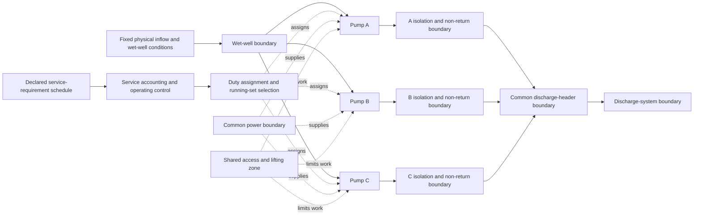

# ABOUTME: Defines the complete ASW-8 three-pump reference system and its acceptance plan.
# ABOUTME: Maps coupled operation, shared resources, generated work, and conservation to the current pump-station code.

# ASW-8 reference-system design

| Field | Value |
| --- | --- |
| Status | Accepted task-world design; implementation acceptance is withheld pending the continual-world boundary correction in draft PR 74 |
| Design record | `ASW-8-RS1` |
| Reference-system profile | `pump-station-reference-system.asw-8-rs1.v1` |
| Opening-state specification | `pump-station-asw-8-rs1-initial-state.v1` |
| Event schedule | `pump-station-asw-8-rs1-event-schedule.v1` |
| Station-data profile | `AU-NSW-LH-SYN-SPS-v2` |
| Parent plan | [Asset Stewardship Worlds PRD](asset-stewardship-worlds-prd.md#asw-8--coupled-assets-and-endogenous-backlog) |
| Date | 2026-08-02 |
| Boundary amendment | 2026-08-03 |
| Owner | Pump-station task world |

This design remains the authority for pump-station semantics. It does not
approve the parallel runtime structure in draft PR 74. The correction must
preserve the useful ASW-8 domain work while it routes that work through one
continual-world runtime and the existing pump-station run lineage.

| Layer | Owns |
| --- | --- |
| Continual-world runtime | Durable commands, commits, snapshots, replay, recovery, idempotence, sessions, branches, rollout groups, and transport ports |
| Stewardship capability | Obligations, work lifecycle, authority, evidence continuity, review, and governed intervention semantics |
| Pump-station task world | Pump physics, SCU rules, task actions and controls, events, work generation, views, and verifier logic |
| RS1 profile | Opening state, event schedule, station package, temporal documents, and reference-controller objective |

The normative correction plan and complete PR 74 disposition are in
[Continual-World Runtime Boundary](../../docs/CONTINUAL_WORLD_RUNTIME.md).

## 1. Decision

ASW-8 will use one deliberately small reference system:

> A single three-pump station with two required service levels, one shared
> field-work lane, one maintenance crew, one independent verifier, one
> consumable clearance kit, and deterministic work generated by operating and
> maintenance decisions.

The fixed reference identity is:

- managed assets: Pump A, Pump B, and Pump C;
- operating topology: an ordered duty assignment with one or two running
  pumps; all remaining pumps are non-running and available only when their
  recorded state permits;
- normal service requirement: 1 synthetic service-capacity unit (`SCU`);
- peak service requirement: 2 SCU;
- maximum running pumps: two;
- one station only; and
- no network, fleet, or enterprise work-management system.

This is the smallest system that exercises all ASW-8 concerns together:

1. a duty assignment that is not a fixed A-to-B swap;
2. more than two coupled assets;
3. shared people, equipment, access, and consumable stock;
4. planned outages constrained by required service;
5. measured exposure that accrues on covering pumps and is attributed to the
   unavailable baseline pump; and
6. future work generated by earlier decisions.

The system is an original synthetic benchmark. It does not represent an
identified Lower Hunter station. Its topology, staff, stock, durations, and
rules are not operational advice.

## 2. Why this is a new reference profile

`AU-NSW-LH-SYN-SPS-v1` is a duplex station. It contains exactly Pump A and
Pump B, permits one running pump, and defines one canonical A-to-B transfer.
Its change-control rule requires a profile revision when the component count
or duty topology changes. See:

- `au-nsw-lh-syn-sps-v1-claim-and-profile.md`, especially **Asset boundary**,
  **Operating modes**, and **Change control**;
- `src/aec_bench/task_world_templates/stewardship/wastewater_pump_station/physical_models.py::PumpStationModel`;
- `src/aec_bench/task_world_templates/stewardship/wastewater_pump_station/physical_models.py::PumpStationState`; and
- `src/aec_bench/task_world_templates/stewardship/wastewater_pump_station/physical_kernel.py::pump_station_model_from_package`.

The production reader also pins the v1 profile, file inventory, manifest
fields, cross-file identities, and file hashes in
`reference_package_reader.py`. ASW-8 must therefore not insert Pump C into the
accepted v1 files or relabel those files as v2.

The implementation must:

- preserve the accepted v1 package and all current hashes;
- create and promote a separate v2 station-data package;
- give that package a separate generation, manifest, profile, and claim
  identity;
- select the expected station-data profile through a closed, validated
  registry or equivalent strict reader;
- reject a v1 package used as v2, a v2 package used as v1, or any unregistered
  profile, content identity, or hash set, while permitting exact certified
  bytes to move to a Harbor task directory; and
- keep research inputs outside the production reader.

`reference_package_models.py::ReferencePackage` can carry either strict
package after validation. The profile-specific compiler and checks must decide
which physical model is valid.

### 2.1 V2 generation, certification, and promotion

The accepted ASW-0B5 research path is not a generic profile builder.
`generator/boundary.py`, `certifier/boundary.py`,
`promotion/package_gate.py`, `promotion/package_checker.py`, and
`promotion/package_builder.py` hard-code `AU-NSW-LH-SYN-SPS-v1` and v1 schema
domains. `promotion/package_builder.py::_payloads` also writes exactly
`pump-a` and `pump-b`. Those files and their receipts remain unchanged.

ASW-8 uses a small task-local successor path under
`research/asset-stewardship/asw-8-reference-system/station-data-v2/`. This is
not a new family study and does not extract shared research machinery. Its
generator:

1. reads the exact promoted v1 package through its own strict input boundary;
2. pins the v1 package and member content identities used as the physical
   source;
3. copies every accepted pump-local physical constant and composite without
   numeric conversion;
4. writes A, B, and C as symmetric peers, a maximum physically running count
   of two, ordered assignment support, and the v2 claim ceiling; and
5. emits canonical candidate bytes and generation receipts without writing to
   the production package path.

An independent v2 certifier does not import the generator. It reads candidate
bytes separately and checks:

- the exact four-file inventory and canonical JSON;
- every schema, role, visibility, cross-file identity, content hash, and
  source-v1 identity;
- exactly three distinct pump IDs and a maximum physically running count of
  two;
- A/B/C equality for every pump-local parameter;
- unchanged v1 fluid, wet-well, force-main, pump-curve, inflow, degradation,
  observation, intervention, resource-duration, and exposure-limit values;
- the discrete 1-SCU-per-service-running-pump arithmetic and separate
  test-running exclusion;
- the absence of a combined parallel-pump hydraulic claim; and
- the synthetic, non-operational, one-station claim ceiling and evidence
  rights.

Mutation cases must reject a missing, duplicate, fourth, or renamed pump;
maximum count 0, 1, or 3; one asymmetric pump parameter; any changed inherited
constant; v1 bytes under v2 identity; v2 bytes under v1 identity; an unknown
file or field; a bad hash or link; a test-running SCU contribution; and any
network, real-station, or parallel-hydraulic claim.

Only an independently passing candidate can be promoted. The promoted
inventory remains:

| File | Schema | Visibility |
| --- | --- | --- |
| `physical-member.json` | `pump-station-physical-member.v2` | Host-private |
| `physical-reference-checks.json` | `pump-station-physical-reference-checks.v2` | Host-private |
| `public-profile.json` | `pump-station-public-profile.v2` | Public |
| `promotion-manifest.json` | `pump-station-promotion-manifest.v2` | Host manifest |

The manifest declares package schema `pump-station-reference-package.v2`,
profile `AU-NSW-LH-SYN-SPS-v2`, all payload hashes, the source-v1 package and
member identities, generation and certification receipts, rights and
visibility decisions, permitted claims, prohibited claims, and the final
package content ID. Production stores the promoted bytes under
`reference_packages/au-nsw-lh-syn-sps-v2/`. The current `reference_package/`
directory and its v1 bytes do not move.

## 3. Code-grounded starting point

The table records the current implementation boundary. It is a change map, not
an instruction to move pump-station types into shared contracts.

| Concern | Current code | ASW-8 treatment |
| --- | --- | --- |
| Certified station data | `reference_package_reader.py` pins the v1 identity, four-file inventory, manifest shape, and hashes | Add strict v2 selection and validation; do not alter v1 bytes |
| Pump topology | `physical_models.py::PumpStationModel` requires a two-item `pump_ids` tuple and `maximum_running_pumps == 1` | Add a task-owned coupled model for three pump identities and a maximum running count of two |
| Physical state | `physical_models.py::PumpStationState` stores one duty pump, one standby pump, and exactly two pump states | Add a coupled physical state with three pump states, target-local isolation, common-boundary availability, and separate service-running and test-running sets |
| Operating interval | `physical_models.py::OperatingInterval` and `physical_kernel.py::advance_pump_station` assign exposure to one duty pump | Add per-pump operating deltas and an interval that advances both physical running sets |
| Starts | `stewardship_state_machine.py` currently advances scheduled operation with `duty_completed_starts=0` | Generate starts from entry into either physical running set |
| Hydraulic result | `physical_kernel.py` computes one pump operating point and drawdown | Keep pump-local physics; use SCU only for synthetic service accounting; do not claim parallel-pump hydraulics |
| Duty change | `stewardship_models.py::TransferDuty` and `physical_kernel.py::transfer_duty_to_standby` implement a two-pump swap | Keep old action for old records; add `RequestDutyAssignment` for v2 |
| Outage admission | `rich_work_processes.py::_dependency_satisfied` rejects clearance on the single duty pump | Replace this in v4 with assured-SCU lookahead across actor-visible service intervals |
| Resources | `PumpStationWorkResources` stores one access duration, one repair-kit Boolean, and one intervention-slot count | Add named quantity-bearing pools and reservations |
| Reservations | `PumpStationResourceReservation` has one resource kind and no quantity; state permits one reservation per kind | Add `PumpStationPoolReservation` with pool, quantity, target, process, lifecycle, and disposition |
| Work processes | `rich_work_processes.py` implements dependencies, reservation, suspension, resumption, cancellation, and completion | Retain the accepted rules and generalise only the resource and outage representation |
| Backlog | No durable backlog type exists | Add typed work demand, lifecycle, priority, links, and closure rules |
| Work generation | Events can create follow-up effects, but no record proves exactly-once generated work | Add durable generation records and stable generated item identities |
| Events | `stewardship_events.py` and the state machine already order scheduled events and same-time groups | Add declared service, common-boundary, stock-arrival, and backlog events |
| Actor view | `stewardship_views.py` projects one duty pump, one standby pump, singleton resources, obligations, work orders, and processes | Add service demand, assignment, service-running and test-running sets, assured capacity, pools, backlog, and exposure |
| Time display | `time_presentation.py` already owns `pump-station-current-state.v4` | Keep temporal v4 unchanged; use actor projection v5 for ASW-8 |
| Durable history | `world_run.py` and `world_run_repository.py` publish immutable states, receipts, commits, and a current head | Migrate their mature publication and recovery mechanics behind the continual-runtime port; add v4 to the same pump run; do not add a coupled repository or second head |
| Replay | `stewardship_verifier.py` replays v1-v3 records and compares the complete transition | Add v4 replay and derive conservation reports from the immutable chain |
| Branches | `rollout_control.py` creates isolated ASW-7 world-run children from a verified origin but does not initialise their temporal-evidence repositories | Extend the same branch system after v2/v4 support; move only task-neutral lineage mechanics behind the continual-runtime port; do not add a second rollout control |
| Evaluation | `evaluation/stewardship.py` recomputes existing metrics and terminal items | Add a task-local evaluation v2 and a derived conservation-report identity |
| Trial evidence | Shared `TrialRecord` already carries world execution, provenance, evaluation evidence, and artifact hashes | Reuse it; do not add pump-station ledger rows to the shared contract |

Two current behaviours need explicit correction in the new record version:

- verification failure must retain the run-in restriction and generate rework
  exactly once; and
- condition assessment must apply to the named process target, not the current
  singular duty pump.

The relevant current paths are
`stewardship_events.py::_complete_functional_checks` and
`stewardship_events.py::_complete_verification`, which call
`physical_kernel.py::assess_pump_station`; its result uses the singular duty
pump. Historical v1-v3 replay keeps its accepted meaning. ASW-8 must not
rewrite old outcomes.

## 4. System boundary and connection model



Only Pumps A, B, and C are managed assets. The wet well, discharge header,
power supply, isolation edges, and access zone are explicit constraints. They
do not get independent maintenance backlogs in ASW-8.

| Entity | Role | Assured service contribution | Relationship |
| --- | --- | ---: | --- |
| Pump A | Managed pump | 1 SCU when assured and available | A local defect removes A only |
| Pump B | Managed pump | 1 SCU when assured and available | B work can transfer service exposure to A or C |
| Pump C | Managed peer pump | 1 SCU when assured and available | C is not a hard-coded emergency spare |
| Wet-well boundary | Common physical source condition | 0 | It affects pump-local hydraulic conditions; it does not set the SCU requirement |
| Service-accounting control | Declared operating requirement | 0 | It selects the required SCU interval and running-set size without claiming hydraulic flow |
| Discharge header | Common operating boundary | 0 | A declared hard stop makes all pumps unavailable |
| Power supply | Common operating boundary | 0 | A declared loss makes all pumps unavailable |
| Shared field zone | Common work constraint | 0 | Withdrawal suspends field work but does not stop unaffected operating pumps |
| Pump isolation edge | Target-local work boundary | 0 | One target can be isolated without isolating its siblings |

### 4.1 Task-owned physical records

The minimum physical additions are:

| Record | Purpose |
| --- | --- |
| `PumpStationCoupledModel` | Profile identity, three pump IDs, topology, common boundaries, service units, and maximum running count |
| `PumpStationCoupledEnvironment` | Current inflow and wet-well level without the legacy station-wide `isolated` Boolean |
| `PumpStationCoupledPhysicalState` | All pump states, target-local isolation, common-boundary state, service-running set, and test-running set |
| `PumpStationBoundaryAvailability` | Declared power and discharge availability and the source transition |
| `PumpStationPumpBoundary` | Durable pump-local operating mode, source permit or evidence, effective transition, and allowed next modes |
| `PumpStationPumpAvailability` | Visible service-run eligibility, controlled-test eligibility, and outage-planning assurance, with evidence and restriction sources, decision role, effective time, and closure rule |
| `PumpStationServiceRequirement` | Exact half-open interval and required SCU |
| `PumpStationBaselineAssignment` | Scenario-owned expected assignment for one exact service interval |
| `PumpStationDutyAssignment` | Assignment ID, ordered eligible pump IDs, active or suspended status, source need, effective transition, suspension source, and revalidation or supersession transition |
| `PumpStationOutageEpisode` | Named unavailable baseline pump, start and end transitions, source restriction or work, and current status |
| `PumpStationResourceState` | Named reusable and consumable pool values for v4, selected instead of the legacy singleton resource record |
| `PumpStationPoolReservation` | Quantity-bearing v4 reservation with pool, process, target, lifecycle, retention, lineage, and disposition |
| `PumpStationOperatingDelta` | One pump's service runtime, test runtime, total runtime, start, degradation, and cover attribution for an interval |
| `PumpStationCoupledOperatingInterval` | Exact interval, required service, assignment, service-running set, test-running set, and all pump deltas |
| `PumpStationCoupledObservation` | Per-pump visible measurements, clocks, availability, assignment, service-running set, and test-running set without latent condition |
| `PumpStationCoupledResult` | Previous and current coupled state, target-local change, pump-local capability, observation, and authoritative operating interval |
| `PumpStationCapacityInterval` | Verifier-derived required, served, unserved, surplus, and attribution row |

These are task-local names. They must not become shared library contracts in
ASW-8. The old `PumpStationModel`, `PumpStationState`, and `OperatingInterval`
must remain stable because the model hash is stored in a run and checked on
resume by `world_run.py`.

`PumpStationCoupledOperatingInterval` is the authoritative persisted interval
and is named by its transition receipt. `PumpStationCapacityInterval` is
derived independently from that interval, the authoritative persisted
`PumpStationServiceRequirement`, and the immutable availability records. The
verifier compares the result. The
state does not store a second mutable capacity account.

`PumpStationStewardshipState` remains the task-owned durable envelope. Its
`physical` field becomes the strict union
`PumpStationState | PumpStationCoupledPhysicalState`, and its `environment`
field becomes `PumpStationEnvironment | PumpStationCoupledEnvironment`.
State and reference-system profile versions select both unions before decode.
ASW-8 fields are v4-only and are excluded from historical profiles. A separate
top-level repository or second world-run state type is not added.

Coupled pump state and SCU semantics remain task-local. A separate coupled run,
repository, snapshot, session, combined actor/control interface, rollout
runtime, Harbor bridge, evaluator, or replay path is not permitted.

V4 evidence-health regime identity includes the named target pump, ordered
assignment, normalized service-running set, and normalized test-running set.
It does not hash only their union. V1-v3 regime strings remain unchanged.

## 5. Service and operating semantics

### 5.1 SCU boundary

`SCU` is a discrete synthetic service-accounting unit. It is not flow,
hydraulic capacity, pump-curve output, or proof that two parallel pumps provide
twice the hydraulic service.

- Each assured pump contributes 1 available assured SCU.
- Normal service requires 1 SCU.
- Declared peak service requires 2 SCU.
- At most two pumps may be physically running across the service-running and
  test-running sets.
- The existing certified pump-local degradation and intervention rules apply
  separately to each running pump.
- ASW-8 does not calculate a combined parallel-pump operating point.

The v2 certification work must check the topology, pump-label symmetry,
per-pump exposure, start rules, service arithmetic, and claim limits. It must
not state a new hydraulic-performance claim.

### 5.2 Pump boundary, eligibility, and outage-planning assurance

`PumpStationPumpBoundary` prevents physical completion from silently becoming
operating permission. It has these task-local modes:

| Mode | Service-run eligible | Controlled-test eligible | Assured for outage planning | Meaning |
| --- | --- | --- | --- | --- |
| `isolated_for_work` | No | No | No | The pump is isolated and available only to its accepted field-work process. |
| `test_only` | No | Yes | No | Clearance and reassembly are complete, but Operations permits only a controlled functional check. |
| `run_in_service` | Yes | No | No | Operations accepted provisional return under the active run-in restriction. |
| `service_available` | Yes | No | Yes | Accepted initial assurance exists, or verification passed and Operations accepted the restriction review. |

The B chain is exact. B opens in `isolated_for_work`. Successful clearance and
reassembly move it to `test_only`, not to a service-ready state. An authorised
functional-check process may then place it in the test-running set. Completion,
failure, suspension, or interruption removes it from that set. A passed check
leaves the boundary at `test_only` until Operations accepts a separate
provisional return. That decision moves it to `run_in_service`. Accepted
verification plus Operations review moves it to `service_available`.

An accepted inspection or clearance request includes Operations isolation
permission and moves its non-running target to `isolated_for_work`. A
no-finding inspection does not release that isolation by itself. The separate
Operations boundary review may restore the pump's prior `service_available`
mode. A finding keeps it isolated and lets the applicable work-generation rule
define the next work.

The durable `PumpStationPumpAvailability` record contains three separate policy
predicates:

- `run_eligible`: the visible operating status permits the pump to run under
  its current restriction; and
- `test_eligible`: the visible boundary permits one authorised controlled
  functional check, but not service operation; and
- `assured_for_outage_planning`: the pump may justify a separate planned
  outage.

A run-eligible pump supplies 1 served SCU only while it is in the
service-running set. A pump supplies 1 available assured SCU for planned outage
admission only when all of these statements are true:

1. an accepted initial assurance record or accepted post-maintenance
   verification covers the pump;
2. no active hard operating restriction excludes it;
3. it is not failed or intentionally isolated;
4. the common power and discharge boundaries are available; and
5. its visible operating-availability status is `available`.

A pump under post-maintenance run-in may operate within its restriction. It
can therefore be `run_eligible` and supply served SCU, but it supplies 0
assured SCU for authorising another planned outage.

A `test_only` pump has `test_eligible = true`, `run_eligible = false`, and
`assured_for_outage_planning = false`. Its functional check can add physical
exposure only through the separate test-running set. It cannot enter the
service-running set, satisfy demand, cover an outage, or justify another
planned outage.

The authority rule does not inspect latent obstruction, clearance loss, or an
unpublished future event. A typed transition updates the availability record
from accepted evidence, visible restrictions, isolation, failure declarations,
or common-boundary state. The record names its pump, status, all three predicates,
source transition, accepted evidence, active restriction, responsible decision
role, effective calendar time, visibility, and closure rule. Every transition
receipt names the old and new boundary modes, changes to both running sets,
and the accepted permit, evidence, or decision that caused the change.

The separate Operations step uses task-local host input
`PumpStationOperationsBoundaryReviewRequest`, version
`pump-station.operations-boundary-review.v1`. It contains review ID, review
kind (`post_verification_restriction` or `post_inspection_isolation`), pump ID,
restriction or isolation permit ID, accepted evidence ID, requested outcome
(`release` or `retain`), exact base-state content ID, Operations authority ID,
and reason. It is content-addressed and produces its own v4 transition and
receipt. It is not an actor action.

RS1 host control submits the matching review immediately after accepted A or B
verification and after C's accepted no-finding inspection. The evidence
completion is published first. The boundary remains `run_in_service` or
`isolated_for_work` if the review is missing, denied, stale, or mismatched. A
permitted post-verification review releases run-in and moves the pump to
`service_available`; a permitted no-finding inspection review releases target
isolation and restores C's prior `service_available` mode. This explicit host
step replaces the current automatic restriction lift only in v4.

The state for the reference journey must include accepted initial evidence for
Pump C. The actor must not have to infer C's assurance from missing data.

### 5.3 Capacity terms

The implementation must not use one ambiguous `delivered` value. It must keep:

- `available_assured_scu`: capacity that can support outage planning;
- `assigned_operating_scu`: capacity in the current service-running set;
- `served_scu`: assigned capacity capped by required service;
- `unserved_scu`: required service that was not served; and
- `surplus_operating_scu`: assigned operating capacity above required service.

For each interval:

```text
required capacity-time
  = served capacity-time
  + unserved capacity-time
```

```text
assigned operating capacity-time
  = served capacity-time
  + surplus operating capacity-time
```

A new half-open capacity interval starts whenever required service, assignment,
either physical running set, pump availability, isolation, or a common
boundary changes. Every value in both equations is constant inside that
interval.

### 5.4 Assignment and running set

The duty assignment, service-running set, and test-running set are different
records.

- The ordered duty assignment contains the pumps that may meet demand.
- The service-running set contains the first eligible assigned pumps needed
  for the current declared service requirement.
- The test-running set contains only the target of an active, authorised
  minimum functional check. It is disjoint from the service-running set.
- Normal service runs one assigned eligible pump.
- Peak service runs two assigned eligible pumps.
- Assignment does not mean that all assigned pumps run.
- A functional check may start only when the target is outside the
  service-running set, common boundaries are available, the process owns its
  declared resources, and the total physically running count remains at most
  two. Starting or resuming the process places its target in the test-running
  set. Suspension, interruption, or completion removes it.
- Test operation adds target pump runtime, starts, and physical degradation.
  It supplies no served SCU, assured SCU, surplus SCU, or collateral runtime.

A pump receives one start when it changes from neither running set into either
running set. A pump that remains physically running receives no new start.
Moving a pump between the disjoint sets requires a close and open boundary but
does not add a start unless the pump stopped between them. Removing a pump does
not create a start.

### 5.5 Baseline and collateral exposure

The RS1 event schedule declares a baseline duty schedule. The v2 station-data
package owns topology and service-accounting rules, not scenario timing. The
host compares the scenario baseline with the actual service-running set. It
does not trust an agent's reason text or an actor-supplied outage ID.

Collateral runtime is runtime assigned to a covering pump because a named
baseline pump is unavailable. Collateral starts use the same host-derived
attribution. Starts are evidence in `ASW-8-RS1`; they do not generate separate
work.

`PumpStationOutageEpisode` is the durable attribution source. It records the
episode ID, unavailable baseline pump, source restriction or work item, opening
transition, optional closing transition, and status. `WG-07` uses this host
record. The optional actor reference provides context only.

For the reference journey:

- Pump C is the baseline normal-duty pump from Day 0 06:00 to 18:00;
- Pumps A and B are the baseline peak set from 18:00 to 02:00;
- C's operation before 18:00 is normal baseline work;
- at 18:00 C replaces unavailable B; and
- C accrues eight hours of B-attributed collateral runtime by 02:00.

This correction makes `WG-07` trigger once at the intended time.

### 5.6 Declared and hidden events

Service changes and known capacity changes are exact scheduled events with
transition receipts. Planned outage admission can use only intervals disclosed
in the actor's current view through expected process completion.

If the disclosed schedule does not cover the full duration, the proposal is
deferred or rejected. The policy must not use a hidden ASW-7 future event to
approve or deny work because that result could leak private future state.

A hidden event can still occur after work starts. The normal event order then
applies the safety event and suspends or interrupts unfinished work before any
unearned physical effect.

## 6. People, equipment, access, and stock

Decision rights and execution resources remain separate. Operations decides
duty and isolation. Maintenance decides and executes maintenance work.
Engineering decides conditional deferral and escalation. Work Management
controls administrative work state. Verification accepts post-maintenance
evidence independently.

These decision roles are not consumed or reserved as resource stock.

### 6.1 People

| ID | Quantity | Work | Reference availability | Separation rule |
| --- | ---: | --- | --- | --- |
| `maintenance-crew-01` | 1 crew unit | Isolation support, lifting, inspection, clearance, reassembly, functional check | Exact journey windows W1, W2, and W3 | Cannot accept its own verification |
| `verification-engineer-01` | 1 person | Independent post-maintenance verification and evidence acceptance | Exact journey windows W1, W2, and W3 | Cannot execute the maintenance scope being verified |
| `operations-controller` | Decision role | Assignment, isolation, provisional return, restriction review | Decision events | Performs no maintenance or verification |
| `engineering-authority` | Decision role | Deferral, conditions, escalation | Decision events | Cannot edit physical state |
| `work-management-authority` | Decision role | Work-item administration and provisional work-order closure | Decision events | Cannot lift a restriction or accept verification |

The reference calendar has no generic phrase such as "working day". It stores
exact half-open availability intervals:

- W1: Day 0 `[06:00, 17:00)`;
- W2: Day 1 `[06:00, 22:00)`; and
- W3: Day 2 `[06:00, 15:00)`.

Travel, fatigue, leave, and person-level rosters are excluded.

### 6.2 Resource pools

| Pool | Initial amount | Class | Required by | Suspension and completion rule |
| --- | ---: | --- | --- | --- |
| `field-access-slot` | 1 | Reusable temporal capacity | Inspection, clearance, functional check, verification | Release on suspension, cancellation, or completion |
| `lifting-isolation-set-01` | 1 | Reusable equipment | Inspection and clearance | Release on suspension, cancellation, or completion |
| `diagnostic-test-set-01` | 1 | Reusable equipment | Inspection, functional check, verification | Release on suspension, cancellation, or completion |
| `maintenance-crew-01` | 1 | Reusable personnel | Inspection, clearance, functional check | Release on suspension, cancellation, or completion |
| `verification-engineer-01` | 1 | Reusable personnel | Verification | Release on suspension, cancellation, or completion |
| `obstruction-clearance-kit` | 1 | Consumable stock | Obstruction clearance | Retain reservation during suspension; consume only on successful clearance; release unused stock on cancellation |

`PumpStationResourcePool` is discriminated by resource class. A reusable pool
contains capacity, free, reserved, unavailable, and exact availability
intervals. A consumable pool contains on-hand, free, and reserved quantities;
it does not use an unavailable quantity. `PumpStationPoolReservation` contains
a stable reservation ID, pool ID, quantity, process ID, target, status,
creation and release times, suspension-retention rule, prior reservation link,
and final disposition.

V4 does not store the legacy singleton resources beside these pools.
`PumpStationStewardshipState.resources` becomes the strict version-selected
union `PumpStationWorkResources | PumpStationResourceState`. Its existing
`resource_reservations` field becomes a profile-selected legacy-or-v4
reservation collection. V1-v3 require `PumpStationWorkResources` and only
`PumpStationResourceReservation` entries. V4 requires
`PumpStationResourceState` and only `PumpStationPoolReservation` entries.
Mixed resource or reservation forms fail before state identity is computed.
Legacy serializers keep their existing fields and bytes.

The v4 pool state and its reservation collection are one validated resource
account. Every transition updates them atomically and validates each pool's
reserved total against its live reservation quantities. The conservation
report derives from this account and receipts. There is no copied legacy
Boolean, slot count, or second mutable resource ledger.

Reservation status follows this closed lifecycle:

```text
reserved -> active
active -> suspended_retained | released | consumed | cancelled
suspended_retained -> active | cancelled
```

The clearance kit keeps the same reservation ID through
`suspended_retained -> active`. A reusable reservation becomes `released` on
suspension. Resume creates a new reservation identity linked to the released
one. A stable `(pool_id, process_id, reservation_ordinal)` key makes retry
return the same content or fail closed.

For reusable resources, suspension, completion, and cancellation return the
reserved quantity to `free`; suspension and completion end as `released`, and
cancellation ends as `cancelled`. For the consumable kit, cancellation before
consumption ends as `cancelled` and returns the reserved quantity to `free`.
`consumed` is valid only after successful clearance and reduces on-hand stock.
These class rules give each process transition one reservation outcome and one
quantity movement.

For a consumable, a declared `CONSUMABLE_ARRIVAL` event increases on-hand stock
after the fixed lead time. A later priority change does not move that event.
RS1 has no stock-discard transition, so `discarded = 0` in every RS1 balance.

For the reference journey, the access, lift, diagnostic, maintenance-crew, and
verification-engineer reusable pools all use W1, W2, and W3. Each opens at Day
0 06:00 with capacity 1, free 1, reserved 0, and unavailable 0. The clearance
kit is continuously stock-available until reservation or consumption. It opens
with on-hand 1, free 1, and reserved 0. Decision roles are available only at
declared decision points and do not enter these balances.

### 6.3 Process bundles

| Process | Required resources |
| --- | --- |
| Inspection | Maintenance crew, access slot, lift/isolation set, diagnostic set |
| Obstruction clearance | Maintenance crew, access slot, lift/isolation set, clearance kit |
| Minimum functional check | Maintenance crew, access slot, diagnostic set |
| Post-maintenance verification | Verification engineer, access slot, diagnostic set |
| Sensor condition check | No field resource |
| Duty assignment or administrative closure | No field resource |

The bundle must be available for the complete expected or remaining duration.
Availability intervals are half-open.

## 7. Operating and outage rules

| ID | Rule |
| --- | --- |
| `OC-01` | Normal service requires 1 SCU. A declared peak requires 2 SCU. |
| `OC-02` | At most two pumps may be physically running across the service-running and test-running sets. |
| `OC-03` | A planned field process can start only when assured capacity excluding the target is at least the required capacity in every actor-visible interval through expected completion. Incomplete visible coverage causes deferral or rejection. |
| `OC-04` | Only one pump may be intentionally isolated for field work at one time. |
| `OC-05` | The target pump must be outside the ordered duty assignment and both running sets before inspection or clearance starts. A functional-check target must be in `test_only`, have `test_eligible = true`, remain outside the service-running set, and enter only the test-running set under an accepted Operations permit. |
| `OC-06` | A `test_only`, failed, isolated, or prohibited pump cannot serve demand. A `run_in_service` pump may serve only within its active restriction but cannot supply assured SCU for another planned outage. A `service_available` pump may serve and support outage admission. |
| `OC-07` | Only one field process may reserve `field-access-slot` at one time across the station. |
| `OC-08` | Administrative work, sensor checks, observation, and planning may overlap field work. Two field processes may not overlap. |
| `OC-09` | Declared access must cover the complete proposed duration. Unexpected withdrawal suspends the process. It does not complete it. |
| `OC-10` | Suspension releases reusable crew, access, and equipment. A clearance kit already committed to suspended clearance remains reserved. |
| `OC-11` | Resume rechecks dependencies, assured capacity, isolation, access, skills, and all pools. It executes only the remaining duration. |
| `OC-12` | Active work must suspend before cancellation. Cancellation releases unused resources but does not remove its source required action, restriction, backlog item, or liability. |
| `OC-13` | A declared common power or discharge hard stop makes all pumps unavailable, blocks field-process starts, and cannot be solved by duty assignment. |
| `OC-14` | If required service rises or available capacity falls during work, the scheduler applies the safety event first and suspends or interrupts unfinished work before any unearned effect. |
| `OC-15` | An actor may request a new ordered duty assignment. Operations validates it. The set cannot contain duplicate, isolated, failed, or prohibited pumps. Operations rejects an assignment that creates an avoidable current service deficit when another permitted assignment can meet service. Unavoidable degraded operation is recorded with explicit unserved SCU and decision detail. |

These rules retain the accepted ASW-5 semantics in
`rich_work_processes.py`: AND dependencies, exact remaining duration,
deadlines continuing during suspension, retained kit reservation, reusable
resource release, no partial clearance effect, narrow waiver scope, and
idempotent transition publication.

### 7.1 V4 event order

At a timestamp, the scheduler first closes the preceding half-open capacity
interval `[previous_time, event_time)`. It applies per-pump runtime, starts,
degradation, and cover attribution, then creates any threshold-generated work
atomically with that interval closure.

Host-private treatment activation occurs before the visible event that it
causes. The scheduler then keeps the accepted eight-class semantic order:

1. common-boundary hard stops, physical safety events, and service-requirement
   changes;
2. restriction activation, expiry, and pump-availability changes;
3. required-action due, overdue, and breach transitions;
4. resource arrival, availability, and withdrawal;
5. process interruption and failure;
6. process completion;
7. scheduled evidence generation or release; and
8. declared decision points.

Work generation occurs inside its source transition. It is not a free-standing
later event. Resource withdrawal therefore remains earlier than a process
completion at the same time. The extended W3 window makes the RS1 inspection
complete before withdrawal instead of changing this safety order.

Priority is recalculated after any service or capacity change, due-boundary
crossing, dependency or blocker change, backlog or process transition,
resource arrival or withdrawal, restriction change, or required-action
change. The scheduler publishes the final ranked eligible-work view only after
the complete same-time group. A typed actor proposal, followed by the required
decision, selects work.

Runtime due and breach checks run for every pump in the service-running or
test-running set, not only the first assigned pump. The next event is the
earliest valid calendar or per-pump runtime boundary under this class order.
V1-v3 retain their current single-duty-pump event meaning.

## 8. Actor action

The semantic proposal type is:

```text
request_duty_assignment.v1
```

The actor tool name is:

```text
request_duty_assignment
```

The typed proposal `RequestDutyAssignment` contains:

- `proposal_version`: `request_duty_assignment.v1`;
- `ordered_pump_ids`: one or two distinct pump IDs;
- `source_outage_id`: optional declared outage or unavailable-pump identity;
- `source_backlog_item_id`: optional work-demand identity; and
- the reason already carried by `ProposalContext`.

The assignment takes effect at the successful transition. It remains active
until a later accepted assignment or a transition suspends or invalidates it.
A common-boundary hard stop clears both running sets and suspends the
assignment; restoration requires Operations to validate it again. The request does not
contain its own time-advance or stopping event. `continue_operation` remains
the only actor action that advances time. This is an explicit correction to
the source proposal so that the task has one scheduling path.

Optional outage and backlog links must resolve to visible current records.
They are context only. The host-derived baseline assignment and outage episode
remain the only source for collateral attribution.

The request must not repeat the base view or information-set identities inside
its arguments. `contracts/world_interface.py::WorldActorActionRequest.binding`
already binds the visible base state, information set, tenure, and sequence,
and `actor_interface.py` creates the proposal context from that binding.

Actor interface v1 and the old `transfer_duty` action remain valid for old
runs. The topology-specific `request_conditional_deferral` also remains only
on legacy interfaces. ASW-8 actor interface v2 has this exact action catalogue,
in order:

1. `continue_operation`;
2. `request_duty_assignment`;
3. `request_inspection`;
4. `request_obstruction_clearance`;
5. `request_functional_check`;
6. `request_provisional_return`;
7. `request_provisional_closure`;
8. `request_post_maintenance_verification`;
9. `resume_process`;
10. `cancel_process`;
11. `request_dependency_waiver`;
12. `request_condition_check`;
13. `search_evidence`; and
14. `fetch_evidence`.

Interface v2 omits `transfer_duty` and `request_conditional_deferral`; it does
not expose a two-pump swap or the legacy fixed transfer-then-isolate rule. The
read-only native session tools `observe_pump_station` and
`snapshot_pump_station` remain available but are not actor actions. Host
control, verification, evaluation, and rollout tools remain outside the actor
catalogue.

`request_functional_check` creates a `RequestFunctionalCheck` proposal with
`proposal_version = request_functional_check.v1`, the pump ID, the exact WG-03
backlog item ID, and the natural-language reason in `ProposalContext`. The
target must be in the actor-visible `test_only` boundary, and Operations owns
the controlled-test permit. The proposal requires Maintenance and Operations,
matching the existing multi-authority field-work pattern: Maintenance admits
and executes the process, and Operations permits pump operation inside the
test boundary. Acceptance schedules the check and records both authorities and
the permit; process start or resume, not proposal creation, adds the target to
the test-running set. Process exit always removes it.

If the functional check fails, the target remains `test_only` and cannot enter
service. The failed attempt and evidence are appended to the same WG-03 backlog
item, which returns to `planned` and may be requested again. No new backlog
identity is created because WG-01 to WG-09 declare no follow-up rule for this
failure. Retry and replay must retain the same item and attempt history.

The v2 schemas for `request_inspection`, `request_obstruction_clearance`, and
`request_post_maintenance_verification` also require the exact current backlog
item ID in addition to their existing pump and evidence fields. Policy checks
the item type, target, status, source, and eligibility. V4 proposal
serialization carries these links; legacy record profiles omit them. This is
where an essential process code is required, while the reason remains natural
language.

The repository persists the two new proposals by
`$type=RequestDutyAssignment` and `$type=RequestFunctionalCheck` and their
explicit proposal versions. Their public tool names remain
`request_duty_assignment` and `request_functional_check`.

## 9. Work demand and deterministic generation

### 9.1 Separate records

The system keeps these meanings separate:

- **required action:** a decision-bearing duty, stored by the current code as
  an obligation;
- **backlog item:** recognised demand for work;
- **work order:** the administrative container;
- **process:** execution through simulated time; and
- **restriction:** a current operating limit.

A work-order closure does not close a backlog item, lift a restriction, or
discharge a required action unless the separate rules for those records are
satisfied.

### 9.2 `PumpStationBacklogItem`

The task-owned record contains:

```text
item_id
work_type
target_kind                 # asset | resource_pool
target_id
generation_rule_id
generation_ordinal
originating_record_id
linked_obligation_ids
linked_restriction_ids
linked_work_order_id
linked_process_id
generated_at_calendar_seconds
base_priority
effective_priority
due_calendar_seconds
due_runtime_clock_kind       # pump_total | outage_episode_collateral
due_runtime_clock_id
due_runtime_limit_seconds
status
blocked_from_status
blocked_since_calendar_seconds
accumulated_blocked_seconds
closure_rule
closure_evidence_ids
supersedes_item_id
superseded_by_item_id
```

Optional links and due values use explicit `None`, not sentinel numbers. The
target union permits both pump work and clearance-kit replenishment.

### 9.3 Lifecycle

```text
open -> planned -> in_progress -> completed -> closed

open | planned | in_progress -> blocked
blocked -> blocked_from_status

open | planned | blocked -> cancelled | superseded
```

An `in_progress` item must first suspend and enter `blocked` before
cancellation. `completed` means that the physical or administrative activity
finished. `closed` means that its closure rule and evidence are satisfied.

No item is deleted. Cancellation and supersession are terminal states with
decision and lineage records. `blocked_from_status` gives the deterministic
return state. Calendar age and accumulated blocked time are separate values.

Process cancellation and backlog disposition are different transitions.
Cancelling a process releases its resources and returns the linked backlog item
to `planned`; it does not terminally cancel the item. Planning occurs
atomically when an accepted typed work request schedules the linked process. A
terminal backlog cancellation is host-applied only when accepted evidence
proves that the source required action or restriction ended and the receipt
records the Work Management decision. Supersession occurs atomically with
creation of exactly one durable successor and records the decision role that
owns the source condition. Closure is a host-applied result of the declared
closure rule, not a free status edit. These rules add no general actor
status-edit tool.

### 9.4 Priority and age

Use the highest matching urgency at each decision-relevant event:

| Priority | Exact condition |
| --- | --- |
| `P0` | Work is linked to unmet current service, a breached safety or verification required action, operation outside an active restriction, or work that blocks such an item |
| `P1` | Calendar slack is at most `D_calendar`, target-runtime slack is at most `D_runtime`, it must finish before the next declared peak, or it blocks P0 or P1 work |
| `P2` | The applicable slack is greater than its matching `D_calendar` or `D_runtime` boundary and at most twice that boundary, it is a collateral inspection, or it is non-blocking stock replenishment |
| `P3` | No more urgent condition applies |

Calendar age starts at generation and never resets. It continues through
block, suspension, reschedule, and handover. An item without a due boundary has
an urgency floor of P2 after `2D_calendar` accumulated blocked time and P1
after `4D_calendar`.
Age alone cannot create P0.

Calendar slack is `due_calendar_seconds - now_calendar_seconds`. Runtime slack
is `due_runtime_limit_seconds - current_target_runtime_seconds`. A value at or
below zero is due or overdue. The two clock domains are never converted into a
guessed date. Evaluate both and use the more urgent priority band.

Sort eligible work by this fixed tuple:

1. priority;
2. due or overdue before not yet due;
3. calendar slack, with no calendar limit last;
4. runtime slack, with no runtime limit last;
5. greatest calendar age; and
6. stable item ID.

The fixed calendar-before-runtime tie order is a benchmark rule. It does not
claim that one runtime second equals one future calendar second.

This tuple controls the ranked actor view and the reference scheduler's
default recommendation. It does not remove actor choice. An actor may request
a lower-ranked eligible item. The proposal's required decision role or roles
accept it only when every applicable hard service, assurance, isolation,
resource, and window rule passes. The decision record keeps the selected item,
the higher-ranked alternatives, and the actor's reason. Priority alone is not
a rejection rule.

Urgency can decrease only after a durable change to the due basis, dependency,
declared service schedule, or underlying condition.

The constructed values are typed by clock domain:

- `D_calendar = 28,800` elapsed calendar seconds, shown as 8 hours;
- `D_runtime = 28,800` affected-pump operating seconds, shown as 8 hours;
- `A_process = 14,400` elapsed process seconds, shown as 4 hours;
- `L_calendar = 1,209,600` calendar seconds, shown as 14 days;
- minimum functional check: `A_process / 4 = 3,600` elapsed process seconds;
  and
- `V_process = 28,800` elapsed process seconds for verification duration.

These are benchmark values, not operating advice. Internal rules retain exact
seconds. The actor sees dates, clock times, and plain durations through the
current time-presentation system.

### 9.5 Generation rules

| Rule | Source transition | Generated item | Initial urgency | Due rule | Closure rule |
| --- | --- | --- | --- | --- | --- |
| `WG-01` | Accepted condition indication requires physical assessment | Pump inspection | P2; P1 when needed before the next peak | Earlier of the next capacity-critical interval or generation plus `2D_calendar` | Accepted inspection evidence for the correct pump and regime |
| `WG-02` | Inspection accepts an obstruction finding | Obstruction clearance | P1 when the pump is needed for the next peak; otherwise P2 | Earlier of the next capacity-critical interval or generation plus `2D_calendar` | Successful physical completion and generation of the functional check |
| `WG-03` | Obstruction clearance completes successfully | Minimum functional check | P1 | Before provisional return; target completion within `A_process/4` | Accepted functional-check evidence |
| `WG-04` | Pump is provisionally returned | Post-maintenance verification | P1 | Earlier of `2D_calendar` or `D_runtime` affected-pump runtime | Verification accepted and Operations completes the linked restriction review |
| `WG-05` | Verification fails | Rework investigation | P0 if the pump is serving; otherwise P1 | Earlier of `D_calendar` or `D_runtime` affected-pump runtime | Accepted rework investigation; its typed finding can generate a later clearance item |
| `WG-06` | Clearance kit is consumed | Replenish clearance kit | P2; P1 if missing stock blocks urgent clearance | Earlier of consumption plus `L_calendar` or the earliest linked clearance due boundary | Declared arrival occurs and stock is durably recorded |
| `WG-07` | A covering pump reaches `D_runtime` for one named outage episode | Collateral-duty inspection | P2 | Earlier of generation plus `2D_calendar` or another `2D_runtime` collateral runtime after generation | Accepted inspection; a finding generates target-specific work |
| `WG-08` | A process is suspended | No new item | Existing item becomes blocked | Original boundaries continue | Resume or authorised cancellation or supersession |
| `WG-09` | A process is cancelled while the source duty remains | No duplicate item; linked item returns to planned unless one successor supersedes it | Existing urgency remains or the one successor inherits it | Original source duty remains | Resume or replan the item, or create one authorised successor with lineage |

For RS1, `WG-07` creates one inspection per covering pump and named outage
episode when the first `D_runtime` threshold is crossed. A later independent outage can
create another item. A stable generation ordinal is still recorded so a later
profile can define repeated thresholds without changing identity rules.

At C's generation boundary, the episode collateral clock is 28,800 seconds.
Its runtime due limit is therefore 86,400 seconds, which leaves exactly
`2D_runtime` of slack. Its calendar due time is 151,200, Day 1 18:00, exactly
`2D_calendar` after generation. Both clocks place the item at P2 on generation
and at Day 1 06:00. Its calendar slack reaches the inclusive `D_calendar`
boundary at Day 1 10:00, so it becomes P1 then. At Day 1 11:00 it has 25,200
seconds of calendar slack and ranks before the newly generated B verification
by the fixed calendar-slack tie rule.

A failed functional check does not satisfy WG-03 and does not trigger a new
generation rule. Its backlog item remains the one recognised demand for a
minimum functional check, returns to `planned`, and records the failed attempt
and evidence. Only accepted functional-check evidence closes it.

### 9.6 Exactly-once rule

`PumpStationWorkGenerationRecord` uses this identity:

```text
(rule_id, source_transition_id, target_kind, target_id, generation_ordinal)
```

The backlog item ID is derived from this identity. Retry, resume, replay, and
ASW-7 child recovery must return the same record. They must fail if the same
identity has different content. Proposal idempotence alone is not enough.

## 10. Conservation reports

The ledgers are verifier outputs. They are not a second mutable truth. The
state and transition receipts remain authoritative. A
`PumpStationConservationReport` is an immutable derived artifact bound to the
initial state and ordered receipt hashes.

### 10.1 Duty report

Each interval records required SCU, baseline assignment, actual assignment,
running pumps, served SCU, unserved SCU, surplus SCU, runtime and start deltas,
and host-derived cover attribution.

```text
required capacity-time
  = served capacity-time
  + unserved capacity-time
```

```text
assigned operating capacity-time
  = served capacity-time
  + surplus operating capacity-time
```

```text
total pump runtime delta
  = service-running time
  + test-running time
```

The two time terms are disjoint. Only service-running time enters SCU and
collateral accounts. A functional check therefore changes physical exposure
without creating service or cover.

```text
collateral runtime
  = actual runtime attributed to replacement of a named unavailable baseline pump
```

For the eight-hour peak:

```text
required:          2 SCU x 8 h = 16 SCU-h
served by Pump A:                  8 SCU-h
served by Pump C:                  8 SCU-h
unserved:                          0 SCU-h
surplus:                           0 SCU-h
```

Pump C's eight hours are attributed to Pump B's outage and generate one
collateral inspection.

### 10.2 Resource report

For each reusable pool at a snapshot:

```text
pool capacity = free + reserved + unavailable
```

For each consumable over an interval:

```text
opening on-hand + arrivals
  = closing on-hand + consumed + discarded
```

At a snapshot:

```text
on-hand = free + reserved
```

The clearance-kit path is `1 free -> 1 reserved -> 1 consumed`. Suspension
keeps `1 reserved`; it does not consume the unit.

### 10.3 Work report

The report works on unique identities, not counts alone. Each item has exactly
one active or terminal classification.

```text
opening active identities union generated identities
  = closing active identities union terminal identities
```

The reference journey numerical check is:

```text
opening work:    2
generated work:  4
terminal work:   5
closing work:    1

2 + 4 = 5 + 1
```

The closing item is clearance-kit replenishment.

### 10.4 Liability report

Work identity and liability identity are separate. Liability identities are
derived from canonical owner records; there is no second mutable liability
list. The owner mapping is:

- verification: the required-action or obligation ID;
- return to assured service: the outage-episode ID;
- collateral inspection: the backlog item ID; and
- stock replenishment: the backlog item ID.

One `B-return-to-assured-service` identity spans clearance, functional check,
provisional return, verification, and Operations review.

```text
opening identity set union created identity set
  = discharged identity set union transferred identity set union closing identity set
```

For each quantity-bearing identity and one unit at a time:

```text
opening quantity + created quantity + accrued quantity
  = discharged quantity + transferred quantity + closing quantity
```

A transfer names its destination and keeps its lineage. Handover alone is not
a transfer or discharge. Counts, runtime seconds, elapsed seconds, stock units,
and SCU-hours remain separate measures. A new one-unit required action records
`created quantity = 1`; a time or stock liability records the typed initial
quantity declared by its source owner. Later growth is accrual, not creation.

The reference journey identity check is:

```text
opening:
  A verification
  B return to assured service           = 2

created:
  B verification
  C collateral inspection
  clearance-kit replenishment           = 3

discharged:
  A verification
  B return to assured service
  B verification
  C collateral inspection               = 4

closing:
  clearance-kit replenishment           = 1

2 + 3 = 4 + 1
```

The open replenishment item is a visible future commitment, not a failed run.

### 10.5 Evaluation meaning

`PumpStationCoupledVerificationReport`, serialized with
`report_version = pump-station-verification-report.v2`, contains the replay
result, the complete task-local conservation report, and its content ID. The
existing `PumpStationVerificationReport` remains the exact legacy type. A
report with no `report_version` is accepted only by the legacy v1 report
decoder. The existing `verification-report.json` artifact path and shared
provenance reference bind either report through the selected run profile.

Any unexplained duty, resource, work, or liability residual fails its matching
integrity gate and makes the complete task evaluation invalid. A fully
attributed closing item, such as clearance-kit replenishment, remains visible
in the terminal result but does not by itself fail the run.

Evaluation v2 treats actor proposals and host-control transitions as separate
step types. Decision-time checks require proposal context only for actor
steps. Control steps instead require their private typed control input,
decision right, receipt, and replay match. Neither path can be accepted through
missing context from the other.

Cross-transport parity uses a task-local `PumpStationSemanticOutcome`. It is a
separate comparison projection, not a stored replacement for
`EvaluationResult`. It contains:

- ordered semantic action outcomes: actor action or control kind, pump or
  resource target, semantic backlog key, authority outcome, execution status,
  boundary effect, process result, normalized evidence version results, and
  structured error class;
- a terminal semantic state: pump exposure and boundary modes, availability,
  assignment, both running sets, service values, resource quantities, temporal
  availability and remaining-budget values, and work, restriction,
  required-action, process, and liability meanings;
- every typed conservation value, residual, and structured failure class; and
- a semantic evaluation projection: reward, the three `ValidityCheck`
  Booleans, normalized validity-error classes, evaluation validity, the ordered
  integrity-gate Booleans and normalized gate-error classes, the complete
  metric vector, and terminal-liability meanings and quantities.

Generated work and action references are normalized by semantic keys. A
generated item uses `(generation_rule_id, target_kind, target_id,
generation_ordinal)` plus its result. A scenario-opening item uses its declared
RS1 key. Exact item, proposal, request, receipt, evidence, transition, state,
commit, branch, run, artifact, and content identities remain available for
within-run replay but do not enter this cross-transport projection.

In particular, the semantic evaluation projection omits the complete
`StewardshipEvaluationEvidence` object. Harbor import fills
`imported_artifact_sha256`, while a direct evaluation does not, and the other
fields bind manifest, state, and transition content identities. It also omits
free-text errors, annotations, confidence metadata, and breakdown content
unless v2 defines a task-local normalized semantic field for them. Direct and
Harbor runs compare only `PumpStationSemanticOutcome`; they do not compare the
full `EvaluationResult`. Replay and reload inside each individual run remain
byte-exact.

## 11. Complete reference journey

### 11.1 Initial state

At Day 0 06:00, which is
`2026-01-01T06:00:00+11:00` and `calendar_seconds = 21,600` under the existing
time-presentation origin:

| Pump | State | Assured SCU | Open work |
| --- | --- | ---: | --- |
| A | Provisionally returned under run-in restriction | 0 | Post-maintenance verification, P1, due before the peak |
| B | `isolated_for_work`; accepted inspection found obstruction | 0 | Obstruction clearance, P1 |
| C | Verified and unrestricted by accepted initial evidence | 1 | None |

The physical exposure meters open at these exact values:

| Pump | Obstruction | Clearance loss | Runtime seconds | Completed starts | Opening operating state |
| --- | ---: | ---: | ---: | ---: | --- |
| A | `0.02039999999998400` | `0.00011999999998800` | 3,600 | 1 | Not running; its completed functional-check test run is part of opening history |
| B | `0.70` | `0.00` | 0 | 0 | Not running and isolated |
| C | `0.00015` | `0.00` | 0 | 1 | Service-running; the start that entered the opening run is already recorded |

The ordered assignment is `{C}`, the service-running set is `{C}`, and the
test-running set is empty. No new C start is recorded merely because the
evaluation window opens. The coupled environment uses
`inflow_m3_s = 0.0155` and `wet_well_level_m = 1.65`. Power and discharge
boundaries are available. B alone is target-isolated.

The opening boundary modes are A `run_in_service`, B `isolated_for_work`, and
C `service_available`. Their visible availability predicates follow the table
in section 5.2. In particular, B is neither service-run eligible nor
controlled-test eligible until its clearance and reassembly complete.

These decimals use the current certified v1 pump-local constants without
rounding: inspection edges `0.25` and `0.60`, obstruction runtime rate
`0.00000006944444444`, obstruction start rate `0.00015`, clearance runtime
rate `0.00000003333333333`, obstruction-clearance effectiveness `0.85`, and
residual `0.02`. The v2 package must carry these unchanged values for all three
pumps and certify their symmetry. It also carries every other accepted v1
fluid, wet-well, force-main, pump-curve, inflow, observation, intervention, and
exposure constant unchanged. The v2 physical change surface is the declared
topology and service metadata, not a retuning of pump physics. A's row is the
exact result of one 3,600 s test run and one start from obstruction `0.02` and
clearance loss `0.00`.
C's opening obstruction includes its already recorded start. B's opening
obstruction produces `SUBSTANTIAL_MATERIAL_PRESENT`; clearance changes it to
`0.105`, and its later 3,600 s test run and one start change it to
`0.10539999999998400`, with clearance loss
`0.00011999999998800`. B's functional check and C's later inspection must
therefore reproduce their declared results from the physical kernel. At C's
inspection, its 72,000 service-running seconds since the opening state give
obstruction `0.00514999999968000` and clearance loss
`0.00239999999976000`. A narrow calculation through the current copied
pump-local kernel gives no capability review for B after its test and
`NO_MATERIAL_CONFIRMED` for C at that condition. These are fixed acceptance
expectations, not new hydraulic claims.

The service schedule is:

- normal requirement: 1 SCU until Day 0 18:00 (`64,800` seconds);
- peak requirement: 2 SCU from Day 0 18:00 to Day 1 02:00 (`93,600`
  seconds); and
- normal requirement after Day 1 02:00.

The scenario baseline is `{C}` until Day 0 18:00, `{A, B}` through the peak,
and `{A}` from Day 1 02:00 onward. The service and resource schedule is
disclosed through Day 2 15:00 (`226,800` seconds). The reusable pool windows
are W1 `[21,600, 61,200)`, W2 `[108,000, 165,600)`, and W3
`[194,400, 226,800)`. Each reusable pool opens free 1, reserved 0, and
unavailable 0. The kit opens on-hand 1, free 1, and reserved 0.

The RS1 event schedule also contains the branch-neutral visible v4 clock stop
`document-review-point-c-001` at Day 1 04:00 (`100,800` seconds), with event
kind `PumpStationEventType.DOCUMENT_REVIEW_POINT`.
It exists so `continue_operation` can stop when the C note becomes searchable.
Unlike the current `DECISION_POINT`, this v4-only event does not refresh an
observation source. It advances the normal operating interval, records its own
scheduled-event effect in the receipt, and changes no physical, evidence,
resource, work, or authority state. The temporal creation and ingestion events
at 95,400 and 97,200 do not create actor turns or world transitions; the
temporal gateway evaluates their state against the world clock at the review
point. Legacy event semantics remain unchanged.

The opening B outage episode is `outage-b-001`. It names B as the unavailable
baseline pump, `initial-b-inspection-accepted` as its opening source,
`restriction-b-isolated-001` as its restriction, and
`backlog-b-clearance-001` as its work link. It remains open until B has accepted
verification and Operations completes the restriction review at Day 1 19:00.

The two opening backlog records are exact initial-state records:

| ID | Type and target | Source | Generated | Due basis | Status and links |
| --- | --- | --- | ---: | --- | --- |
| `backlog-a-verification-001` | Post-maintenance verification for A | `WG-04`, `initial-a-provisional-return` | 7,200 | Calendar 64,800; A total runtime 32,400 | P1, planned; `obligation-a-verification-001` and `work-order-a-001` |
| `backlog-b-clearance-001` | Obstruction clearance for B | `WG-02`, `initial-b-inspection-accepted` | 21,600 | Calendar 64,800 | P1, planned; `restriction-b-isolated-001`, `outage-b-001`, and `work-order-b-001` |

A's declared pre-window history contains one test-running interval from Day 0
01:00 to 02:00, followed by `initial-a-provisional-return` at
`calendar_seconds = 7,200`. That transition generates its WG-04 item, so
`7,200 + 2D_calendar = 64,800`. This history fixes A's opening meter and
condition but is outside the Day 0 06:00 evaluation and resource-ledger
opening boundary. B's WG-02 item is generated at the evaluation opening and is
due at the earlier 18:00 capacity-critical interval.

The two opening liability owners are `obligation-a-verification-001` and
`outage-b-001`. Latent pump conditions remain in private physical state; the
visible availability records, not those latent values, control outage
admission.

### 11.2 Decisions and effects

| Time | Agent decision | Host decision and execution | Durable consequence |
| --- | --- | --- | --- |
| Day 0 06:00 | Compare A verification with B clearance | Both are valid, but one access slot permits one field process | B needs 4 h clearance, 1 h functional check, and 8 h verification. It cannot restore assured capacity before 18:00 |
| Day 0 06:00 | Request A verification, then `continue_operation` | Verification reserves verifier, access, and diagnostic pools; time advances to the accepted completion at 14:00; RS1 host control then submits `operations-review-a-001` | The verification receipt leaves A in `run_in_service`; the separate accepted Operations review lifts run-in and moves A to `service_available`, so A supplies 1 assured SCU. C's operation is baseline, not collateral |
| 14:00 | Observe that W1 has 3 h left and send no B clearance request; then `continue_operation` | The host records no rejected proposal and advances to the 18:00 service event | No partial physical effect and no stock use |
| 18:00 | Request assignment `{A, C}`, then `continue_operation` | Operations accepts the immediate assignment and advances to Day 1 02:00 | Peak service supplies 16 SCU-h. C replaces B and receives 8 h collateral runtime |
| Day 1 02:00 | Complete the operation transition, then hand over | The old tenure first publishes the interval closure, generated C item, service change, service-running set, and snapshot; handover then copies that state | The fresh tenure receives exactly one C inspection already created by `WG-07`; handover itself changes no world state |
| 02:00 | Search for the exact C collateral inspection note | The note is not yet searchable | No future document or private event leaks through the evidence tools |
| 02:00-04:00 | Call `continue_operation` to the declared C-document review point | The host advances normal operation to 04:00; the v4 clock stop refreshes no observation source, and temporal creation and ingestion times do not create separate actor turns | World time and derived evidence availability advance; the C backlog identity remains unchanged |
| 04:00 | Repeat the same search and fetch its one result | The v2 B procedure and C note are now searchable; the fetch returns the descriptor-bound synthetic content | Search and fetch consume their declared evidence budget and create branch-local access receipts, not work or authority |
| Day 1 06:00 | After `continue_operation`, compare B clearance P1 with C inspection P2 | The ranked view places B first; the agent selects B | No resource changes occur until the typed request |
| 06:00-10:00 | Request B clearance, then `continue_operation` | Maintenance and Operations accept; crew, access, lift, and kit reserve; time advances to successful clearance and reassembly | Kit is consumed; B moves from `isolated_for_work` to `test_only`; `WG-03` creates the functional check; `WG-06` creates replenishment |
| 10:00-11:00 | Request B functional check, then `continue_operation` | Maintenance admits the process and Operations permits the controlled test; process start adds B only to the test-running set; time advances; completion removes B and the check passes | B remains `test_only` and becomes eligible for a separate provisional-return decision; it never supplies service during the check |
| 11:00 | Request B provisional return | Operations accepts the return under run-in | B moves to `run_in_service`; `WG-04` creates B verification and the run-in restriction becomes active |
| 11:00 | Request provisional work-order closure | Work Management closes the administrative scope | B's backlog, restriction, return-to-assured-service liability, and verification duty remain |
| 11:00-19:00 | Observe that C inspection is now ranked before B verification, but request B verification with a reason that completes B's return chain | Verification records and accepts the lower-ranked choice because all hard rules pass, then reserves verifier, access, and diagnostic pools. At 18:00 C becomes due, but this priority event does not interrupt accepted B verification; repeated `continue_operation` reaches the 19:00 pass; RS1 host control submits `operations-review-b-001` | The verification receipt leaves B in `run_in_service`; the separate accepted Operations review lifts run-in and moves B to `service_available`; B supplies 1 assured SCU; the B return-to-assured-service liability discharges; C remains visible and overdue until Day 2 work |
| Day 2 06:00-14:00 | After `continue_operation` to 06:00, request assignment `{A, B}`, then request C inspection and `continue_operation` | Operations accepts the assignment; Maintenance and Operations accept C work and move C from `service_available` to `isolated_for_work`. Inspection completes at 14:00, one hour before W3 closes, with no finding; RS1 host control submits `operations-review-c-001` | The separate accepted Operations review releases C isolation and restores `service_available`; C item closes; A is the normal baseline, so no new cover item is generated |
| Day 2 14:00 | Observe the terminal state | No further action is required | All pumps are verified and available. `{A, B}` remains assigned. No service deficit or overdue duty remains |

At Day 1 02:00, the exact order is:

1. close the Day 0 18:00 to Day 1 02:00 capacity interval;
2. add C's eighth B-attributed collateral hour and create the `WG-07` item;
3. apply the peak-to-normal service change;
4. apply the declared `{A}` normal baseline, keep the actual `{A, C}` assignment,
   and recalculate the service-running set to `{A}`;
5. publish the transition and snapshot; and
6. create the new tenure and handover from that unchanged snapshot.

`continue_operation` always advances to one next event. Where the table spans
an intermediate access-window or decision event, the controller repeats the
same tool until the stated time. No maintenance request itself advances time.

Every work-start action uses the exact backlog ID from the bound current view.
The opening A and B actions use `backlog-a-verification-001` and
`backlog-b-clearance-001`. For generated B functional-check, B verification,
and C inspection work, the reference controller resolves the unique eligible
item by generation rule, target, and ordinal in its bound view, then sends that
item's exact ID. It does not guess an ID, rely on reason text, or reuse an ID
from another run.

### 11.3 End state

- Pumps A, B, and C are available and assured.
- `{A, B}` is the current ordered assignment. Normal service makes `{A}` the
  service-running set; the test-running set is empty; B and C are available but
  not running.
- No operating restriction or verification required action is open.
- No collateral inspection is open.
- The clearance-kit on-hand quantity is zero.
- One P2 replenishment item remains under the fixed `L` arrival rule.
- The conservation report shows no unexplained loss of service, resource,
  work, or liability identity.

This journey makes the actor distinguish:

- quickest physical work from work that restores assured capacity soonest;
- urgent work from generated lower-priority work;
- physical completion from verified return;
- available labour from available outage capacity;
- stock use from work closure; and
- successful current service from a visible future stock commitment.

## 12. Actor information boundary

Actor projection v5 contains:

- current local date and time;
- the complete ordered service schedule from the current time through
  `service_schedule_disclosed_through`, including every intermediate service
  change;
- the complete ordered availability intervals for every visible resource pool
  through `resource_schedule_disclosed_through`, so an omitted interval or
  unknown future period is not mistaken for continuous availability;
- available assured, assigned operating, served, unserved, and surplus SCU;
- ordered duty assignment, service-running set, and test-running set;
- pump availability and visible restrictions;
- common-boundary status when it is currently observable;
- resource pools, quantities, availability intervals, and reservations;
- backlog work type, target, urgency, age, due basis, blocker, and eligible
  action;
- active required actions, work orders, and processes;
- actual collateral runtime and starts already accrued; and
- explicit closing commitments relevant to current planning.

The actor does not see:

- latent pump health;
- hidden ASW-7 treatment labels or activation schedule;
- sibling branch identities;
- future events outside the disclosed planning horizon;
- verifier-only expected balances; or
- counterfactual outcomes.

### 12.1 RS1 temporal-evidence template

ASW-8 does not reuse the current reference corpus as-is.
`temporal_evidence/corpus.py` fixes its reference time at `7,200,000` seconds,
cites `AU-NSW-LH-SYN-SPS-v1`, and applies its documents to the two-pump
`normal-duty-standby` regime. Those events would be outside the RS1 window and
would not cover Pump C.

The descriptor therefore binds a new branch-neutral template with schema
`pump-station-temporal-evidence-template.v1`, identity
`pump-station-asw-8-rs1-temporal-template.v1`, and builder identity
`pump-station-asw-8-temporal-builder.v1`. The current
`build_reference_temporal_evidence_bundle` remains unchanged for legacy runs.
A separate `build_asw_8_reference_temporal_evidence_bundle` consumes the RS1
template, v2 package, world branch, and initial budget.

The minimum rights-cleared synthetic corpus is:

| Version | Exact temporal boundary | Applicability | Actor use |
| --- | --- | --- | --- |
| `coupled-pump-field-work-bulletin.v1` | Searchable at 7,200 seconds, before the RS1 opening | Station and Pumps A, B, and C; isolation, shared access, and controlled testing | Explains that documentary text cannot grant authority and that target-local permits and process evidence control work |
| `pump-b-clearance-procedure.v1` | Searchable at 7,200; effective until and superseded at 100,800 | Pump B obstruction clearance | Gives the original clearance, reassembly, and functional-check sequence |
| `pump-b-clearance-procedure.v2` | Event and creation 95,400; ingestion 97,200; searchable and effective at 100,800 | Pump B obstruction clearance and controlled testing | Makes the `test_only` boundary and separate provisional return explicit |
| `pump-c-collateral-inspection-note.v1` | Event 93,600; creation 95,400; ingestion 97,200; searchable and effective at 100,800 | Pump C and B-attributed collateral exposure | Contains unique marker `CCR28H`; records the completed peak cover and resulting inspection need after the world has already generated it |

The C note cannot create WG-07 work or reveal a private future. Its event time
is the already-published Day 1 02:00 interval closure, and its later search
availability supplies documentary context only. The bulletin explicitly covers
Pump C, so C is not silently outside the procedure set.

The template binds source text hashes, citations, rights, version IDs, temporal
fields, applicability, retrieval and access policy values, cost policy, branch
namespace policy template, and this initial budget: 20 calls, 50 returned
references, 40,000 visible bytes, 10,000 visible tokens, 20 turns, zero
simulated duration, and zero provider spend. The realised evidence-version,
availability, corpus, branch-policy, capability, and bundle hashes include the
root world branch and belong in that root run's manifest. A rollout child
inherits those exact immutable public bundle identities from its parent. Its
child provenance binds the inherited bundle, full ancestor chain, child branch,
and fresh private retrieval state; it does not realise the template again.

At Day 1 02:00, `search_evidence` with query `CCR28H`, scope `operations`, and
maximum results 1 must not return the C note. `continue_operation` reaches the
separate RS1 review point
at the note's 04:00 searchable boundary; temporal availability events do not
create turns themselves. The same search then returns one visible reference,
and `fetch_evidence` returns the bound content. The direct root, Harbor root,
and a child created at the 02:00 snapshot must show the same availability
meaning. Direct and Harbor roots retain their own realised content identities.
The child retains its parent's exact bundle identities and creates only its own
branch-local access receipts.

`stewardship_views.py` and `time_presentation.py` must project ASW-8 dates,
durations, and due boundaries without exposing raw episode-second values as the
primary display. Information-set binding and handover reconstruction remain as
implemented.

## 13. Version and compatibility contract

| Surface | ASW-8 identity | Compatibility rule |
| --- | --- | --- |
| Task-world template | `wastewater-pump-station-stewardship.v1` | Keep the current template identity; select ASW-8 through the separate reference profile |
| Reference-system descriptor | Schema `pump-station-reference-system-descriptor.v1`; identity `pump-station-reference-system.asw-8-rs1.v1`; exact SHA-256 content ID | Binds station data, opening-state specification, event schedule, coherent versions, required branch-neutral temporal-evidence template, actor surface, verification, evaluation, and controller objective before a run starts |
| Opening-state specification | `pump-station-asw-8-rs1-initial-state.v1` plus its SHA-256 content ID | Owns every opening physical, exposure, environment, assignment, availability, resource, work, restriction, required-action, and outage record; the constructed state must match it exactly |
| Event schedule | `pump-station-asw-8-rs1-event-schedule.v1` plus its SHA-256 content ID | Owns the exact RS1 service, baseline-duty, resource, and host-event schedule; it is not station data |
| Station-data profile | `AU-NSW-LH-SYN-SPS-v2` | Separate promoted package; no relabel or migration from v1 |
| Stewardship state | `pump-station-stewardship-state.v4` | Contains v3 evidence-health semantics plus ASW-8 records |
| State snapshot | `pump-station-state-snapshot.v4` | Starts only from the promoted v2 profile |
| Transition receipt | `pump-station-transition-receipt.v4` | Names changed pools, reservations, backlog, generation, operating intervals, and canonical liability owners; its nested decision uses policy v4 |
| Policy | `pump-station-authority-policy.v4` | Uses assured-capacity and resource-pool rules |
| Transition rules | `pump-station-transition-rules.v4` | Adds deterministic service, boundary, backlog, arrival, and generation rules |
| Actor projection policy | `pump-station-current-state.v5` | Keeps existing temporal projection v4 unchanged |
| Actor observation schema | `pump-station.actor-view.v4` | Adds coupled planning fields and retains evidence-health content |
| Information boundary | `pump-station-actor-view.v4` | Binds the projected view used by Harbor, handover, and ASW-7 lineage |
| Actor interface | `pump-station.actor.v2` | Replaces `transfer_duty` and the fixed-transfer `request_conditional_deferral` with `request_duty_assignment`, adds `request_functional_check`, requires backlog IDs for work-start tools, and retains the other named rich-work, evidence-health, and search/fetch actions; legacy interface identities remain unchanged |
| Operations boundary review | `pump-station.operations-boundary-review.v1` | Host-only content-addressed input produces a separate v4 receipt after accepted verification or no-finding inspection; it never enters the actor catalogue |
| Temporal evidence | Existing runtime schema `pump-station.temporal-evidence.v1`, with RS1 template `pump-station-asw-8-rs1-temporal-template.v1`, builder identity, source-text hashes and version definitions, branch-invariant policy values, branch-policy template, and initial budget bound by the descriptor | Required for every RS1 root and child; each root binds its realised branch-specific bundle, while a child binds and copies its parent's exact immutable public bundle and starts a fresh private retrieval ledger |
| World-run manifest | `pump-station-world-run.v2` | Adds required descriptor, opening-state source, event-schedule, station-data, and temporal-capability bindings; a root binds its realised bundle, while a child binds the exact inherited parent bundle plus child branch and ancestry provenance; a v1 manifest remains byte-stable and decodes only under the legacy profile |
| Rollout child request | `pump-station.rollout-child-request.v2` | Strict content-addressed child ID, run ID, world branch, agent condition, and seed; its canonical JSON SHA-256 is the selected child-request content ID; the unversioned v1 dataclass remains unchanged |
| Rollout group request | `pump-station.rollout-request.v2` | Binds the verified parent, descriptor, full event schedule, information boundary, ordered v2 child requests, and their canonical content IDs before child creation; v1 remains unchanged |
| Rollout child receipt | `pump-station.rollout-child-receipt.v2` | Published after child creation and binds group and child requests, child manifest, initial snapshot, remaining-schedule hash, and child temporal-corpus identity; v1 remains unchanged |
| Rollout lineage | `pump-station.rollout-lineage.v2` | Binds the v2 receipt set and keeps the existing v1 lineage readable without reinterpretation |
| Rollout control interface | `pump-station.rollout-control.v2` | Uses v2 request and result models that name the v2 rollout records; `PumpStationRolloutControlResultV2.origin_verification` is `PumpStationCoupledVerificationReport`; the v1 request, result, verification type, JSON schema, and installed and Harbor routes remain unchanged |
| Verification report | `pump-station-verification-report.v2` | Nests the conservation report and its content identity; v1 remains readable |
| Task evaluation | `stewardship-evaluation.v2` | Uses verification report v2 without adding pump fields to shared contracts |
| Harbor export | `aecbench.pump-station-harbor-export.v2` | Binds descriptor, opening-state, event-schedule, temporal-template and realised capability, package, record, projection, observation, information-boundary, and interface identities |
| Harbor run | `aecbench.pump-station-harbor-run.v2` | Dispatches the ASW-8 controller or model route without changing v1 routes |
| Harbor verification | `aecbench.pump-station-harbor-verification.v2` | Replays v4 and validates the nested conservation report |
| Reference controller | `pump-station-asw-8-reference-controller.v1` | Executes the closed Day 0 to Day 2 journey; old reference controllers remain unchanged |

`world_run_serialization.py` currently uses one internal `_V4` profile for the
temporal actor projection. The ASW-8 implementation must separate state-record
selection from actor-projection selection. A generic v4 switch must not refer
to both.

The following guarantees are mandatory:

- existing v1-v3 state, snapshot, decision, rules, transition, and receipt
  bytes remain unchanged;
- existing actor projection v3 and temporal projection v4 bytes remain
  unchanged;
- v4 state serializers include all inherited v3 evidence-health fields;
- unsupported version combinations fail closed;
- no migration converts a historical two-pump run into a three-pump run;
- a new v4 run starts from v2 station data only; and
- ASW-7 children copy the parent's v2 package and coherent v4 record set.

`PumpStationCoupledVerificationReport` owns the complete
`PumpStationConservationReport` and its content ID. Evaluation recomputes this
report from the immutable run. The existing
`WorldTrialProvenance.verification_report` binds `verification-report.json` in
the `TrialRecord`; Harbor import also includes the report hash in
`StewardshipEvaluationEvidence.imported_artifact_sha256`. ASW-8 therefore
needs no new pump-station field in `TrialRecord`, `EvaluationResult`, or
`StewardshipEvaluationEvidence`.

Start and Harbor export select a closed registered profile. Resume, actor
session, verify, evaluate, Harbor import, and ASW-7 rollout resume resolve that
profile from immutable run or export metadata. They accept no user override.
Exact certified station-data bytes may be relocated into a Harbor task.

Before the first state exists, start and Harbor export load a registered
task-local `PumpStationReferenceSystemDescriptor`. Its content binds the exact
descriptor ID and hash, opening-state specification ID and hash, event-schedule
ID and hash, station-data profile and package identity, coherent record and
actor-surface versions, required temporal-evidence template ID and hash,
builder identity, source-text hashes, branch-invariant retrieval, access, and
cost policy values, branch-policy template, initial budget values, verification
and evaluation versions, and controller objective. The registered builder is
`temporal_evidence/corpus.py::build_asw_8_reference_temporal_evidence_bundle`.
World-run manifest v2 carries the static descriptor bindings. A root manifest
also carries its realised branch-specific capability, corpus, availability,
branch-policy, and bundle content identities. A child manifest carries those
same exact inherited parent-bundle identities plus its child branch and ordered
ancestor provenance. Resume, replay,
Harbor import, and child creation compare them with the immutable artifacts and
fail closed on an absent or changed identity.

Manifest v2 also contains one closed `PumpStationInitialStateSource` union:

- `reference_system_specification` is valid for a root start only. It binds the
  opening-state specification ID and hash, reconstructs that state, and
  requires its content identity to equal `initial_state_id`.
- `rollout_parent_snapshot` is valid for an ASW-7 child only. It retains the
  descriptor and opening-state specification as scenario provenance, but binds
  the exact parent run, branch, state, and commit, rollout group request ID and
  content hash, and selected child-request content ID. Its `initial_state_id`
  must equal the copied verified parent state, not the RS1 opening state.

Resume, replay, Harbor import, and child open dispatch on this source kind and
reject any third origin or partial union. The state hash is an additional
result binding; it is not a substitute for source selection.

This order avoids a content cycle. The v2 group request is published first.
Each nested v2 child request is content-addressed from its complete strict
canonical JSON, including its version. The group request binds the ordered
records and IDs. The child manifest binds that earlier request, selected child-request content ID, and
verified parent snapshot. After child creation, rollout child receipt v2 binds
the child manifest content ID and initial snapshot. Rollout lineage v2 then
binds the receipt set. No manifest refers to a receipt that does not yet exist.

The descriptor, initial-state specification, and event schedule are production
task-template artifacts, separate from the certified station-data package.
They live under
`src/aec_bench/task_world_templates/stewardship/wastewater_pump_station/reference_system/asw-8-rs1/`
and are loaded through the closed registry in `reference_system.py`. Start
accepts the registered reference-system identity only. The existing caller
schedule remains available for legacy profiles, but an ASW-8 caller-supplied
schedule or opening-state override fails closed. Harbor export copies the exact
four registered artifacts and hashes, including the temporal template; it does
not regenerate them in the task container.

RS1 always requires temporal evidence because actor interface v2 always
contains `search_evidence` and `fetch_evidence`. A root direct start and a root
Harbor start use the descriptor-bound template to initialise a bundle for the
declared world branch before they publish the actor catalogue. They then run
`temporal_evidence/verification.py::verify_temporal_evidence_repository` and
compare branch-neutral inputs with the descriptor and realised content
identities with the root manifest. Direct and Harbor roots may therefore have
different complete bundle hashes without semantic drift. A child must retain
the exact parent bundle hash. A missing, optional, stale, or partly initialized
repository fails closed.
`PumpStationWorldSessionFactory` must not let its current optional
`temporal_evidence` Boolean create an RS1 session with advertised but unusable
tools. Legacy profiles retain their current optional capability rule.

The realized temporal bundle is built and strictly validated before manifest
v2 is constructed, so the manifest can bind its content identities. Initial
run publication stages the manifest, opening state, temporal bundle, and first
head under the same startup lock and uses the repositories' atomic publication
patterns. A crash cannot expose an actor-ready RS1 run with only one side
present. Open either completes an exact staged publication through selected
recovery or fails closed; it never rebuilds a different corpus under the
existing manifest.

An ASW-7 child also needs the temporal-evidence capability that backs the v2
actor tools. Child creation copies the parent's exact immutable capability,
corpus, availability schedule, and policies through a typed child-initialisation
path; it does not rerun the RS1 builder. It records the parent
ancestor chain followed by the parent branch as the child's full ordered
ancestor chain, and creates a fresh child-namespaced retrieval state and budget.
Every resumed child temporal-access context loads this persisted chain instead
of using an empty tuple. It does not copy the parent's private sessions,
opaque references, access receipts, or reliance records. Child open fails
closed if the parent had the capability but the child corpus or branch binding
is absent or changed.

Two schedule hashes keep separate meanings. The descriptor event-schedule hash
identifies the complete immutable RS1 exogenous schedule and is inherited by a
child manifest. The existing ASW-7 lineage `event_schedule_sha256` identifies
the exact remaining `scheduled_events` at the parent origin, including any
endogenous due or process events. Child creation continues to compute that
value through the parent's complete record profile and binds it in the rollout
lineage and receipt. ASW-8 does not rename, reuse, or change the v1 rollout
field. Child validation requires both bindings.

Version routing must be explicit in `stewardship_models.py`,
`world_run_models.py`, `world_run_serialization.py`, `stewardship_identity.py`,
`world_run.py`, `world_run_repository.py`, `stewardship_verifier.py`, and
`world_session.py`, plus `rollout_models.py`, `rollout_repository.py`, and
`rollout_control.py`. Exact `.v3` feature checks in the current code must not
cause v4 to lose evidence-health behaviour.

## 14. Ownership and implementation map

The correction uses these owners:

| Layer | Current source and target rule |
| --- | --- |
| Continual-world runtime | Extract only task-neutral lifetime mechanics after pump and SSC-03 pass the same contract tests |
| Stewardship capability | Keep obligations, work lifecycle, authority, evidence continuity, and review semantics separate from storage and transport |
| Pump-station task world | Keep pump state, SCU, action, event, work, view, and verifier meaning in the existing task package |
| RS1 profile | Keep descriptor, opening state, schedule, promoted package, temporal corpus, and reference controller declarative and task-local |

The final shared package path, public runtime type, registry version, and
migration API remain pending until the two-consumer contract tests select the
smallest real boundary. The file map below remains authoritative for ASW-8 task
semantics, but it must be read with this correction rule.

### 14.1 Station data and physical world

| Path | Planned work |
| --- | --- |
| `research/asset-stewardship/au-nsw-lh-syn-sps-v2-*` | New profile, claim limits, generation, certification, rejection, and promotion records |
| `src/aec_bench/task_world_templates/stewardship/wastewater_pump_station/reference_package_reader.py` | Closed profile registry or strict profile-aware reader; preserve v1 constants and bytes |
| `reference_package_models.py` | Reuse generic loaded-package envelope unless a proven field is missing |
| `physical_models.py` | Add task-local coupled model, coupled environment, coupled state, separate service-running and test-running sets, per-pump delta, service, boundary, interval, observation, and result records |
| `physical_kernel.py` | Compile v2, advance all service-running and test-running pumps, assess the named target, apply target-local isolation, and compute SCU accounting separately from test operation and hydraulics |

### 14.2 Policy, work, and events

| Path | Planned work |
| --- | --- |
| `stewardship_models.py` | Add v4 constants, `RequestDutyAssignment`, `RequestFunctionalCheck`, `PumpStationOperationsBoundaryReviewRequest`, v4 work-start backlog links, and task-owned assignment, pump boundary, three-predicate availability, outage, pools, reservations, backlog, generation, and operating-interval records; select legacy or pool resource forms by profile and reject mixtures; receipts name canonical liability-owner changes rather than a second liability list |
| `stewardship_policy.py` | Admit assignments and field work through exact assured-capacity, schedule, isolation, restriction, and resource rules |
| `rich_work_processes.py` | Generalise reservations to pool quantities while retaining all accepted ASW-5 process effects |
| `stewardship_events.py` | Add the v4 event order, service changes, hard stops, arrivals, v4-only no-refresh `DOCUMENT_REVIEW_POINT`, priority changes, exactly-once follow-up generation, and coupled evidence regime IDs; temporal availability events still create no actor turn; WG-03 creates planned backlog in v4 instead of directly activating checks; keep failed verification restricted and preserve old behaviour for v1-v3 |
| `stewardship_state_machine.py` | Advance the service-running and test-running sets, enforce the four pump-boundary modes, create per-pump starts and exposure, apply canonical event order, and publish complete v4 receipts with mode, running-set, permit, and evidence changes |

### 14.3 Views, history, and replay

| Path | Planned work |
| --- | --- |
| `actor_interface.py` | Add the exact interface v2 catalogue, schemas, `request_duty_assignment`, and `request_functional_check`; omit the two topology-specific legacy actions from v2; require descriptor-bound temporal evidence before advertising search and fetch; retain binding and all legacy catalogues unchanged |
| `stewardship_views.py` | Add projection v5 fields and redaction; retain information-set binding and handover |
| `time_presentation.py` | Format service intervals, backlog due dates, resource windows, and durations in local time |
| `world_run_models.py` | Add one coherent v4 record set and world-run manifest v2; do not add v3-to-v4 topology migration or change manifest v1 |
| `world_run_serialization.py` | Add strict state and projection profiles without `_V4` collision; encode only the selected legacy or v4 resource form and preserve old bytes |
| `stewardship_identity.py` | Include every v4 field in content identity and keep old profiles stable |
| `world_run.py` and `world_run_repository.py` | Register v4 records and both new proposal types; reuse immutable publication and recovery |
| `stewardship_verifier.py` | Replay v4 and publish verification report v2 with the derived, validated, and identified conservation report |

### 14.4 Direct execution, Harbor, and evaluation

| Path | Planned work |
| --- | --- |
| `reference_system.py` and `reference_system/asw-8-rs1/*.json` | Add the closed descriptor registry and exact descriptor, opening-state, event-schedule, and branch-neutral temporal-template artifacts; reject unregistered IDs, hashes, paths, and ASW-8 schedule overrides |
| `temporal_evidence/corpus.py` | Preserve the current v1 builder and add the descriptor-selected RS1 root builder with v2 lineage, exact in-window document times, Pump C applicability, and root-branch realization; child creation copies the parent's exact public bundle instead of calling this builder |
| `world_session.py` | Keep the task-world ID; select `pump-station-reference-system.asw-8-rs1.v1`; construct the opening state only from its bound specification; initialise and verify its required temporal bundle; do not infer features from suffix Booleans |
| `src/aec_bench/cli/commands/pump_station_world.py` | Select a registered profile only at start and export; resolve it from immutable metadata for resume, verify, evaluate, and import; reject arbitrary user package paths |
| `harbor_export.py` | Add export v2 and copy the descriptor-bound temporal template and source artifacts, then bind the Harbor branch's realised temporal identities with the opening-state specification, event schedule, package, record, projection, observation, information-boundary, and interface identities and hashes; retain export v1 |
| `harbor_session.py` | Add run v2 and the named ASW-8 controller and model routes; retain `deterministic-reference-controller` and every v1 route; do not prescribe the gold sequence to a model |
| `harbor_verifier.py` | Add verification v2 for replay and conservation; dispatch by validated profile and retain the old v1 objective |
| `evaluation/stewardship.py` | Dispatch task evaluation v2 for ASW-8, recompute the report, and validate actor-proposal and host-control steps separately; retain evaluation v1 |
| `harness/harbor_importing/stewardship.py` | Recompute and compare report content or hash; do not trust stored pass claims |
| Task-local `semantic_outcome.py` | Build `PumpStationSemanticOutcome` from normalized action, state, conservation, gate, metric, and terminal-liability meanings; exclude `StewardshipEvaluationEvidence` and all run-specific identities before direct-to-Harbor comparison |
| `contracts/evaluation_result.py` and `contracts/trial_record.py` | Reuse existing shared envelopes; no pump-station ledger rows in ASW-8 |
| `rollout_models.py`, `rollout_control.py`, `world_session.py`, and `temporal_evidence/repository.py` | Add content-addressed child request, group request, receipt, and lineage v2 with the acyclic request-to-manifest-to-receipt chain; reuse child creation and treatment controls after explicit v2/v4 routing; copy and verify descriptor, opening-state provenance, full exogenous event schedule, package, and immutable temporal-corpus identities; separately preserve the existing parent-origin remaining-schedule hash; persist and load the full ordered ancestor chain; initialise a fresh child-namespaced retrieval state without copying parent-private retrieval records |
| `rollout_interface.py`, `local_interface.py`, `src/aec_bench/cli/commands/pump_station_world.py`, and `harbor_session.py` | Add the separate rollout-control v2 request/result and direct and Harbor dispatch routes; keep the v1 models, schema, operation catalogue, and routes byte-stable; reject cross-version request and record combinations |
| `world_control.py`, `local_interface.py`, and `harbor_session.py` | Route the host-only Operations boundary review through direct and Harbor control surfaces; publish its separate receipt, keep it unavailable to actors, and preserve old automatic completion behaviour only for v1-v3 |

The explicit task-local reference-system selection in `world_session.py` is an
important design repair. The current exact suffix checks can make a v4 state
lose v3 evidence features. ASW-8 must not add another Boolean combination.

## 15. Implementation order

The boundary correction runs first:

1. Keep PR 74 draft and record the complete file ownership map.
2. Write the common runtime contract tests against the pump station and
   SSC-03.
3. Extract the mature existing durable engine without changing legacy pump
   bytes.
4. Route ASW-8 through the existing pump run, session, state machine, and
   verifier.
5. Reuse the separate actor and host-control envelopes.
6. Extend the existing rollout path and extract only task-neutral branch
   mechanics.
7. Add registry-driven CLI, Harbor, agent, and evaluation dispatch.
8. Route verification and evaluation through registered task-owned ports.
9. Retire duplicate paths only after parity evidence passes.
10. Apply the separate research and behaviour-based test cleanup changes.
11. Run the final requirement-by-requirement merge audit.

The original task-semantic implementation order follows. It remains useful for
coverage and migration, but it is not architecture acceptance. The numbered
items are implementation dependencies, not new freeze or approval stages.

1. Write failing focused tests for v1 byte preservation, v2 identity, three
   pumps, and v4/v5 version routing.
2. Create, independently certify, reject invalid cases for, and promote the v2
   station-data package.
3. Add the coupled physical, service, four-mode pump boundary,
   three-predicate availability, assignment, running-set, and per-pump exposure
   records.
4. Add immediate duty assignment and actor-visible outage-admission rules.
5. Generalise resource pools and reservations while preserving ASW-5 process
   behaviour.
6. Add backlog lifecycle, exact priority, canonical liability-owner mappings,
   and exactly-once work generation.
7. Add declared service, common-boundary, resource-arrival, and backlog events.
8. Add v4 persistence, receipts, identity, resume, handover, and replay.
9. Add actor interface v2, its required verified temporal-evidence capability,
   and current-state projection v5 through direct and Harbor paths.
10. Add the verifier-derived conservation report, evaluation v2, normalized
    semantic outcome, and strict TrialRecord import parity.
11. Add rollout records and rollout-control interface v2, then reuse ASW-7 to
    prove one v4 child cannot change its parent or sibling.
12. Execute the complete deterministic Day 0 to Day 2 journey through the
    installed actor surface and local Harbor.
13. Run one separately bounded real-agent journey against the same closed tools
    and natural-language reason fields. This is a behaviour check, not a model
    study and not part of the provider-free mechanism claim.

Use test-driven development for each item. Run focused unit, integration, and
end-to-end cases for the affected path. Do not run the full repository suite
after each step.

## 16. Acceptance matrix

### 16.1 Unit cases

| Case | Required result |
| --- | --- |
| V2 station-data identity | Exact three-pump topology loads; wrong identity, file set, hash, or cross-profile use fails closed |
| Reference-system binding | Descriptor, opening-state specification, event schedule, station data, branch-neutral temporal template and policies, root-realised or child-inherited temporal identities, coherent versions, and initial-state source agree; any missing or changed ID or hash and any ASW-8 caller override fails closed |
| Actor catalogue | Interface v2 has the exact 14 actions, omits both two-pump actions, requires current backlog IDs for work starts, and leaves both legacy catalogues unchanged |
| Actor capability | RS1 cannot publish interface v2 until the descriptor-bound temporal repository verifies; a missing or stale capability fails closed in direct and Harbor starts |
| Temporal template | The RS1 builder uses v2 station-data lineage, exact 21,600-to-226,800 window times, and declared Pump C applicability; the current 7,200,000-second v1 builder and outputs remain unchanged |
| Branch realization | The same static template can produce different valid bundle identities for independent root branch IDs; each root manifest binds its own realization. A child copies and binds its parent's exact public bundle, adds child branch and ancestry provenance, starts fresh private state, and rejects a rebuilt or changed bundle |
| Topology | Exactly A, B, and C exist; one or two may run; three running pumps fail closed |
| Assignment versus running | Normal service runs one eligible assigned pump; peak runs two |
| Assignment admission | Operations rejects an avoidable deficit and records explicit unserved SCU for unavoidable degraded operation |
| Field-work target | Inspection or clearance cannot start while its target remains assigned or physically running; functional check uses only the test-running set |
| Starts | Only a not-running to running transition adds one start |
| Functional-check boundary | Clearance moves B from `isolated_for_work` to `test_only`; only an accepted Operations permit can start its check; provisional return moves it to `run_in_service`; accepted verification plus Operations review moves it to `service_available` |
| Functional-check exposure | A test-running pump gains runtime, starts, and degradation; it adds no served or collateral SCU; completion, failure, suspension, and interruption remove it from the test-running set |
| Failed functional check | B remains `test_only`; the same WG-03 item returns to planned with failed-attempt evidence and no duplicate or undeclared follow-up item |
| Operations boundary review | Verification or no-finding inspection completion does not release a v4 boundary; a valid separate Operations control receipt does. Missing, denied, stale, wrong-pump, wrong-restriction, or wrong-evidence input leaves the existing mode and assurance unchanged |
| Assured capacity | Failed, isolated, restricted, unverified, or common-boundary-blocked pumps contribute 0 assured SCU |
| Planned outage | Excluding the target must cover every visible service interval through completion; the disclosed-through marker covers the full process |
| Hidden-future fairness | Two actor-equivalent states receive the same admission decision even when private future events differ |
| Resource pools | Reusable and consumable quantity equations hold for reserve, release, unavailable, arrival, and consumption; discard is fixed at zero in RS1 |
| Resource profile routing | V1-v3 accept only singleton resources and legacy reservations; v4 accepts only pool state and quantity reservations; every mixed form fails before identity or persistence |
| Priority | Inclusive calendar-D and runtime-D boundaries, blocked-age floors, cross-clock slack, and stable tie order are exact; WG-07 leaves `2D_runtime` slack, is P2 at Day 1 06:00, and becomes P1 at Day 1 10:00 before the 11:00 choice; a lower-ranked eligible request needs a recorded reason but is not rejected by rank alone |
| Generation identity | Same key and content returns one item; changed content under the same key fails |
| Failed verification | Restriction remains and exactly one rework item is generated |
| Target assessment | Inspection and verification apply to the named pump target |
| Conservation equations | Both duty equations and every resource, work, and liability balance detect injected mismatches |

### 16.2 Integration cases

| Case | Required result |
| --- | --- |
| Shared lane | Two field processes cannot reserve the one access, crew, lift, or diagnostic pool |
| Window length | A process cannot start when any required pool ends before its remaining duration |
| Window endpoint | Resource withdrawal wins at the same instant as completion; the RS1 C inspection completes at 14:00 before W3 closes at 15:00 |
| Suspension | Reusable pools release, the clearance kit remains reserved, due time continues, and no physical effect occurs |
| Resume | Dependencies, service, isolation, access, and all resources recheck; only remaining duration runs |
| Cancellation | Active work suspends first; unused resources release; originating demand and liability remain |
| Common hard stop | Power or discharge loss stops assured service, blocks new field work, and is not repaired by duty assignment |
| Baseline cover | Only operation beyond the baseline assignment counts as collateral exposure |
| Collateral threshold | B-attributed C runtime reaches `D_runtime` and creates one inspection for that outage episode |
| Competing clocks | Across two running pumps, the earliest calendar or per-pump runtime boundary fires under the v4 event order without changing v1-v3 results |
| Temporal availability | Query `CCR28H`, scope `operations`, maximum results 1 returns no C note at 93,600; v4 `DOCUMENT_REVIEW_POINT` stops `continue_operation` at 100,800 without refreshing observation sources or turning creation and ingestion into actor turns; the same query then returns exactly `pump-c-collateral-inspection-note.v1` and it is fetchable through the real repository and gateway. Direct and Harbor roots agree without comparing their content hashes; the child retains the parent public bundle but no parent-private access receipt |
| All generation rules | WG-01 to WG-09 create, update, or retain exactly the declared item |
| Continuity | Backlog, resources, assignment, service, and exposure survive snapshot, resume, handover, and provisional closure |
| Crash recovery | An interruption before or after publication cannot duplicate work or resource effects |
| V4 replay | Independent replay reconstructs the same state, receipt effects, and conservation report |
| Rollout-control compatibility | Installed direct and Harbor routes accept v2 requests only with v2 child, group, receipt, lineage, and coupled-verification records and reject every v1-v2 cross-combination; every selected child content ID is recomputed from its full canonical v2 record; the v1 request, result, verification type, schema, and routes remain unchanged |
| ASW-7 isolation | A child manifest uses `rollout_parent_snapshot`, binds the earlier group and child requests, verified parent snapshot, inherited full descriptor schedule, and separate parent-origin remaining schedule; the later child receipt binds that manifest and initial snapshot. The child can execute ASW-8 work without moving its parent or sibling, and its v2 evidence tools load the full ordered ancestor chain from a confined child temporal repository with no parent-private retrieval records |
| ASW-7 coupled treatment | A v4 common-cause treatment can name A, B, and C in one child, replay exactly, leave parent and sibling unchanged, and keep its label and schedule out of projection v5 |

### 16.3 End-to-end cases

| Case | Required result |
| --- | --- |
| Complete reference journey | Installed JSON actor tools execute Day 0 to Day 2 and produce the stated end state and balances |
| Direct verification and evaluation | Replay succeeds and evaluation recomputes all four valid conservation sections |
| Local Harbor parity | Direct and Harbor runs have the same `PumpStationSemanticOutcome`, including normalized ordered actions, terminal task meaning, conservation, validity, gates, metrics, and terminal liabilities; the comparison excludes all provenance, content, evidence, and generated run identities and never compares the full `EvaluationResult`; replay inside each run remains byte-exact |
| TrialRecord import | Import recomputes verification and conservation; altered stored pass or report data is rejected |
| Historical compatibility | Existing v1-v3 state records, v3-v4 actor views, ASW-5, ASW-6, and ASW-7 fixtures reload and verify unchanged |
| Bounded agent journey | One authorised model sees only projection v5, uses closed tools, and supplies natural-language reasons without private leakage |

The provider-free gate proves mechanism, persistence, replay, transport, and
conservation. A model result can assess decision quality only. It cannot repair
or weaken a failed provider-free gate.

## 17. Exclusions

ASW-8 does not add:

- a second station, network, or fleet;
- parallel pump-curve or hydraulic optimisation;
- economic dispatch;
- crew travel, fatigue, leave, or individual rosters;
- more than one maintenance crew;
- suppliers, warehouses, or procurement decisions;
- probabilistic failure arrival;
- adaptive maintenance policy;
- FMECA or schedule changes;
- adaptive or actor-authored priority-policy changes;
- common-header maintenance;
- a provider study;
- a new top-level repository domain;
- promotion of pump, SCU, outage, backlog, resource, or verifier semantics into
  the shared runtime; or
- broad cleanup of phase-specific names and tests.

The boundary correction may extract only task-neutral lifetime mechanics. That
extraction requires a written ownership and migration plan and the same
contract suite passing for the pump-station world and a real SSC-03
hydraulic-interaction adapter. The later cleanup must first classify general
library contracts, pump-station task-template rules, and research-only support.

## 18. Exit gate

ASW-8 is complete only when all of these statements are supported by focused
evidence:

1. one versioned pump run and repository path supports v1 through v4;
2. the shared runtime imports no pump-station or SSC-03 task type;
3. the pump-station world and a real SSC-03 adapter pass the same runtime
   contract suite;
4. actor and host-control requests remain separate;
5. CLI, Harbor, agent, and evaluation execution resolve a registered world
   definition without an ASW-8 branch;
6. no duplicate coupled run, interface, rollout, agent, Harbor, replay, or
   evaluation path remains;
7. the v2 package is independently promoted and loads without changing v1;
8. one or two pumps can serve declared demand while per-pump physics and
   exposure remain attributable;
9. outage admission uses assured capacity and only actor-visible schedules;
10. shared people, equipment, access, and stock cannot be over-allocated;
11. every generated work item has one durable source and one stable identity;
12. backlog and liabilities continue through time, handover, suspension,
   cancellation, resume, and ASW-7 branching;
13. independent replay reconstructs the v4 state and v5 actor boundary;
14. direct execution, local Harbor, evaluation, and TrialRecord import agree;
15. old package, state, view, and replay bytes remain unchanged; and
16. duty, resources, work, and liabilities balance without an unexplained
    residual.

The compact target remains:

> Three pumps, two service levels, one shared work lane, one consumable spare,
> deterministic cover exposure, deterministic work generation, and four
> independently checked balances.
