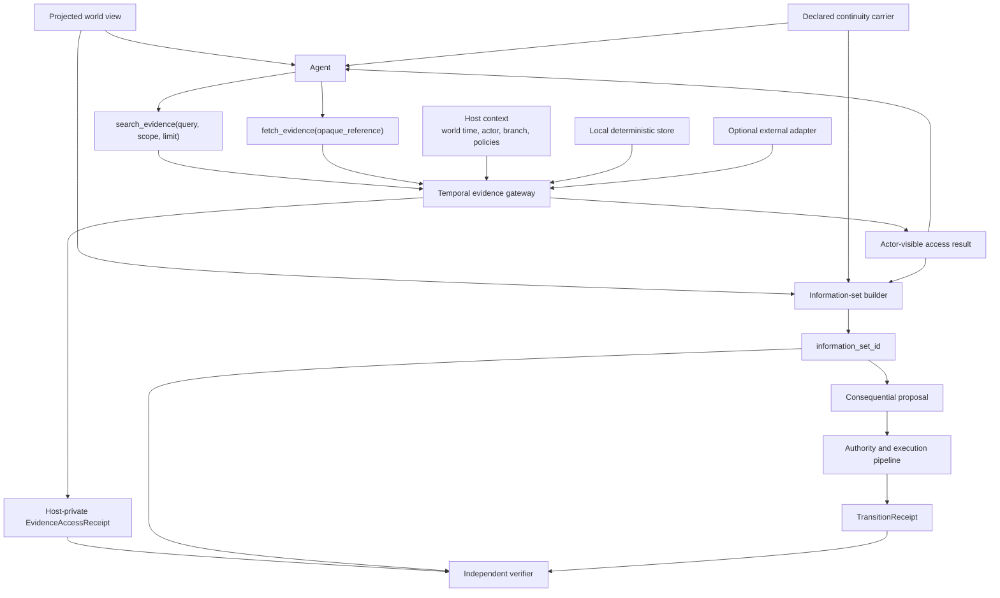

# ABOUTME: Defines the optional temporal-evidence and backresearch capability for asset-stewardship worlds.
# ABOUTME: Extends the stewardship PRD without putting any TEF contract, retrieval, or external provider on the ASW-1–ASW-5 path.

# Temporal Evidence Frontier — Companion Product Requirements Document

| Field | Value |
| --- | --- |
| Status | ASW-5 accepted; TEF remains disabled while ASW-6A local evidence health is built |
| Date | 2026-08-01 |
| Revision | `TEF-PRD-G-2026-08-01` |
| Companion content identity | Recorded externally in the [ASW-0A baseline and authority record](asw-0a-baseline-and-authority.md); the document does not carry a self-referential hash |
| Target repository | `aec-bench` |
| Target branch/worktree | `main` at ASW-5 merge `be24edd42dc16b01ff13f8a860c402ecde297501` / a clean stage worktree |
| Implementation baseline | Accepted ASW-5 asset-local world with versioned state, rich work processes, direct and Harbor execution, durable replay, and independent evaluation |
| Parent product document | [Asset Stewardship Worlds PRD](asset-stewardship-worlds-prd.md) |
| Required parent revision | `ASW-PRD-L-2026-08-01` |
| Parent content hash | `962c85815ba2c7c48f58a0f7b7702427bd0b536b54626afc30b74da0f8cb5bd3` |
| Required parent world | `AU-NSW-LH-SYN-SPS-v1`, independently certified to parent validity level V3 |
| Capability status | Design only; no temporal-evidence or BackSearch implementation exists |
| Core programme impact | No TEF schema, field, tool, capability declaration, or implementation dependency in ASW-1 through ASW-5 or the authorized ASW-6A local evidence-health core |
| Canonical implementation | ASW-6A local deterministic temporal evidence store |
| Optional integration | ASW-6B external historical-archive adapter |
| First confirmatory study | Retrieval-state continuity under delayed evidence |

## Executive decision

After a later parent checkpoint explicitly authorizes the temporal hypothesis,
add a capability-gated **Temporal Evidence Frontier** to the certified
synthetic stewardship world. The ASW-5 checkpoint does not give that authority.
The capability is introduced only with its real ASW-6A producer and consumer;
no TEF-specific declaration is reserved in ASW-1 through ASW-5 or the local
evidence-health core.

The capability generalises SSC-03's staged evidence precedent from host-pushed release of a fixed evidence catalogue to agent-pulled retrieval over a host-controlled, time-bounded, actor-specific corpus. It is a targeted extension to the proposed stewardship architecture, not a redesign and not a dependency of the initial obligation-continuity study.

When the capability is enabled, the world—not the agent—owns:

- current world time;
- actor and agent-tenure identity;
- branch scope;
- logical corpus and immutable corpus snapshot, or an explicitly weaker opaque-provider descriptor;
- availability schedule for a deterministic snapshot, or a host availability policy with explicit unknown completeness for an opaque pilot;
- access policy;
- retrieval policy;
- branch namespace policy; and
- any declared retrieval-cost policy.

The canonical implementation is a local deterministic store. BackSearch or any other historical-search service is an optional host-side provider integration above that protocol, not an agent adapter or asset dependency. A completed local trial or opaque pilot execution must be verifiable from captured immutable artifacts without contacting the provider again.

The parent owns the generic host information-set contract independently of temporal retrieval. This companion consumes that contract after ASW-6A begins and defines only how TEF actor-visible results contribute to it. Search, fetch, corpus, ranking, access-result, access-receipt, carrier, provider, and capability schemas do not enter ASW-1 through ASW-4. The first implementation remains inside the `AU-NSW-LH-SYN-SPS-v1` stewardship package; this companion does not create a top-level `worlds` domain.

The live worktree supplies useful content-addressing, transaction, agent-loop, Harbor, and study-planning machinery, but no Temporal Evidence Frontier. Those surfaces are implementation precedents, not evidence that retrieval, frontier state, information-set chaining, or the confirmatory study already exists.

Temporal retrieval governs which pre-existing evidence can be discovered. It does not:

- generate a new inspection, test, or measurement;
- mutate physical truth;
- fulfil, waive, or cancel an obligation;
- establish institutional acceptance;
- confer maintenance authority;
- reveal a counterfactual physical outcome; or
- demonstrate that an agent remembered or learned anything.

The companion relies on the parent-owned host-derived `information_set_id`: a consequential proposal binds the complete host-supplied information available at commitment time, not merely its opening `view_id`. TEF neither creates nor owns that generic identity; after ASW-6A, its actor-visible results are one possible parent-governed contribution.

In short:

> **The world controls not only what is true at time `t`, but what each actor could discover by time `t`, what the host actually supplied, and which evidence had authority to support action.**

## 1. Relationship to the parent PRD

### 1.1 Authority and scope

The parent PRD remains authoritative for:

- the persistent stewardship-world engine;
- physical and institutional state;
- clocks and event progression;
- obligations, restrictions, work orders, and processes;
- action authority and execution;
- transition receipts;
- evaluation windows and terminal liabilities;
- ASW-0 through ASW-10; and
- the first ASW-4 obligation-continuity study.

This companion PRD is authoritative only for the optional temporal-evidence capability after ASW-6A begins. The parent remains authoritative for the generic information-set identity, serializer, null behavior, current-context projection, proposal binding, and evidence-health programme.

If the two documents appear to conflict:

1. implementation and study work stops;
2. the exact parent revision and `parent_prd_sha256` recorded by ASW-0A are compared with the document named above;
3. parent physical, authority, replay, information-set, synthetic-world, and evaluation invariants prevail; and
4. this document governs only capability-local retrieval behavior after the conflict is explicitly reconciled and both document identities are re-frozen.

Silence, a newer file modification time, or the table in section 1.3 cannot resolve drift.

### 1.2 Identifier policy

This companion uses a `TEF-*` namespace so it can evolve without silently renumbering the parent document.

Earlier proposal notes suggested future parent-number mappings. PRD-F intentionally reserves none: the parent now uses several of those identifiers for unrelated requirements, risks, and decisions. The `TEF-*`, `TE-*`, and `KFG-*` identifiers in this document are normative and capability-local. Any later consolidation is a new explicit decision that must update both documents, preserve traceability, and re-freeze both content identities.

### 1.3 Parent-contract prerequisites and dependency map

This companion targets parent revision `ASW-PRD-F-2026-07-27`. ASW-0A must freeze its exact `parent_prd_sha256` before either document authorizes implementation. The table below is a non-authoritative dependency map: it explains where later TEF behavior consumes the parent contract, but it cannot amend the parent or resolve a hash/revision mismatch.

| Parent location | Parent wording or concept | Companion interpretation |
| --- | --- | --- |
| ASW-I04 | Commitment binds the base view and host information set | Temporal retrieval results join the declared host-supplied context visible before commitment |
| Architecture diagram | Proposal is bound to the current `information_set_id` | The base `view_id` remains one required input |
| Stewardship interaction surface | `propose_action(action, based_on_information_set)` | The host supplies and validates the current identity |
| Section 9.2 scheduler | Evidence availability may be a next decision-relevant event | An epistemic availability event may advance silently and creates an observable decision point only under an explicit versioned notification policy |
| Section 9.4 proposal schema | Base `view_id` and exact `information_set_id` | Temporal results and public failures enter the append-only observation history and exact current context projection |
| Section 9.5 verifier | Judges against bound view and host information set | Uses the exact observation-history and current-context manifests and never later evidence |
| Section 9.9 transition receipt | Proposal, base view, and information-set identity | Retains links to the access artifacts that contributed to that identity |
| FR-06 | Bind base view and immutable host information set | After ASW-6A, temporal access may contribute actor-visible events without replacing the parent identity |
| AC-07 | Decision points to exact base view and host information set | Temporal verifier reconstructs both at commitment |
| R-07 | Avoid hindsight with base-view and information-set binding | Access receipts, observation history, and current context make the binding auditable |
| ASW-1 through ASW-4 | Parent-owned world, projection, information-set, proposal, execution, and study contracts | No TEF schema, field, tool, capability declaration, or temporal-evidence compatibility placeholder is added |

The parent conceptually binds the base view, tenure observation history, and exact current context projection into one host-derived information set. ASW-1 must approve the required semantics and promotion plan; the later parent stage with the real producer and consumer freezes the importable names, serializer, hash profile, and empty or absent-category behavior. This companion neither prescribes an empty-manifest identity nor chooses between canonical nulls and another strict parent representation. After its real ASW-6A boundary exists, a TEF result contributes through the parent-defined actor-visible event mechanism without changing the promoted parent composition.

## 2. Evidence and claim boundary

### 2.1 Implemented substrate

The following live repository surfaces are relevant inputs:

- SSC-03 has a fixed conditional-evidence protocol that hides later evidence until a bounded request is committed.
- Lifecycle episode requests content-bind the exact host-visible checkpoint context.
- Lifecycle operation records bind visible and physical source hashes before and after execution.
- The immutable artifact store publishes exact bytes and typed models with confinement, collision rejection, and hash validation.
- Adapter transcripts record tool calls and tool results linked by tool-call identity.
- Harness instances already have bounded context and tool bindings, although those are execution capabilities rather than world-semantic capabilities.
- Harbor import supports allowlisted execution-specific evidence extensions.
- Harbor export has stable I/O, content-pinned manifests, agent/verifier surface separation, and a declared no-internet environment policy.
- `TrialRecord` can reference immutable artifacts and has existing paired execution/provenance precedents.
- The execution-scoped artifact store can bind one run to immutable terminal objects and claims.
- The provider broker demonstrates credential isolation, budgets, and request/response fingerprints, but its contracts are specific to LLM/RLM `generate` calls.
- Factorial and ablation runners demonstrate content-addressed plans, counterbalancing, paired blocks, resumability, exact coverage checks, and retention of failed executions, but their treatment and analysis contracts do not match Temporal Study 1.

These are reusable patterns and seams. They do not implement the Temporal Evidence Frontier.

Repository search on 2026-07-26 found no implementation of:

- BackSearch;
- BackResearch;
- a temporal evidence store;
- a knowledge frontier;
- `information_set_id`;
- `EvidenceAccessReceipt`; or
- temporal search/fetch tools.

The parent stewardship-world paths are also proposed rather than implemented.

### 2.2 Decisions established by this PRD

This PRD establishes:

- the capability boundary;
- the temporal and branch semantics;
- the separation between access receipts and transition receipts;
- the rules by which later TEF results contribute to the parent-owned host information set;
- the local-first and provider-optional architecture;
- the conditional ASW-6 delivery plan;
- the capability-specific falsification suite;
- the first identifiable temporal-evidence study;
- evaluation and claim limits;
- repository ownership guidance; and
- risks and unresolved decisions.

### 2.3 Provisional elements

The following remain provisional until ASW-6A:

- exact Python contract names;
- exact package ownership and contract-promotion state for each capability type;
- the final evidence-version schema;
- the TEF event projection that will be submitted to the parent-owned actor-visible event boundary;
- query language and normalization;
- local indexing and ranking technology;
- snippet construction;
- availability-time provenance rules for the selected corpus;
- handover projection contents;
- material-evidence equivalence classes;
- numeric retrieval budgets;
- simulated-time cost semantics;
- external-provider eligibility;
- external API behaviour, rights, retention, pricing, and snapshot guarantees;
- study effect threshold and repetition count; and
- whether any external archive qualifies for confirmatory rather than exploratory use.

### 2.4 Claims this PRD does not establish

This PRD does not establish that:

- temporal retrieval improves stewardship;
- any model can discover material evidence reliably;
- BackSearch is necessary, sufficient, deterministic, or superior;
- a publication date proves contemporaneous discoverability;
- an external provider exposes a complete historical frontier;
- captured provider responses make a future live execution reproducible;
- retrieved evidence is true or institutionally authoritative;
- search-state continuity is model memory;
- a continuity effect is learning; or
- the capability should proceed if ASW-4 does not establish a useful stewardship research object.

### 2.5 Parent synthetic-world prerequisite

Temporal-evidence implementation depends on the parent-certified package `AU-NSW-LH-SYN-SPS-v1`: a fictional duplex submersible wastewater pumping-station archetype in a Lower Hunter, New South Wales operating context.

Before ASW-6A-TE0:

- the package must pass the parent V3 construct-valid benchmark gate;
- its world, generator, independent-certifier, source, rights, derivation, assumption, engine-role, and promotion manifests must be frozen and content-addressed;
- the parent ASW-4 obligation-continuity study and checkpoint must be accepted; and
- a later parent checkpoint must explicitly authorize the temporal hypothesis; and
- TEF must record the exact parent revision, package identity, lineage head, and certification report it consumes.

V4 empirical or SME calibration is optional and is not a TEF prerequisite. V3 does not support claims that the package is an identified real station, a compliance design, an operational recommendation, or a digital twin.

The temporal corpus may contain original synthetic records derived for this benchmark, redistributable source material, or metadata-only references to cite-only sources. Every item must retain its source class, rights class, derivation chain, transformations, units where applicable, and assumption references. Cite-only source bytes must not be copied into a redistributable corpus.

## 3. Product problem and research objective

### 3.1 Problem

The parent world can reveal a current actor-specific view and schedule later evidence. That is sufficient for host-pushed evidence. It is insufficient once an agent can choose what historical material to search or fetch before committing an action.

The benchmark must then distinguish:

```text
evidence exists
    != evidence belongs to the actor's corpus
    != evidence is accessible at the current world time
    != evidence was returned in a search result
    != evidence was fetched in full
    != evidence entered the institutional record
    != evidence was accepted by an authority
    != evidence was supplied through handover
    != evidence was explicitly relied upon
    != the agent internally remembered it
```

The last state is not directly observable. The benchmark can establish what the host supplied and what the agent did, not inspect latent model memory.

### 3.2 Capability question

> Can a deterministic world expose agent-pulled historical evidence while enforcing time, actor, branch, access, and corpus boundaries and preserving exact action-time information for verification?

### 3.3 Later research question

> When material maintenance evidence becomes accessible after an earlier unsuccessful search, does carrying unresolved retrieval state across handover reduce decision-time failure for a fresh agent tenure?

The first question is answered by engineering falsification. The second requires the separately preregistered study in section 24.

## 4. Terminology

| Term | Meaning |
| --- | --- |
| Backresearch | Agent-pulled retrieval of pre-existing evidence from a world-bounded historical corpus |
| Temporal Evidence Frontier | The optional world capability enforcing corpus, time, actor, branch, access, and retrieval policy |
| Evidence version | One immutable documentary version with temporal, source, authority, applicability, branch, and content identity |
| Accessible frontier | Evidence versions eligible for a particular actor, branch, world time, corpus snapshot, and policy set |
| Observed evidence | Search snippets, references, fetched content, or other evidence actually supplied to the agent |
| Recorded evidence | Evidence entered into the durable institutional record |
| Accepted evidence | Evidence explicitly accepted by the relevant institutional authority |
| Evidence-access result | The actor-visible result of one search or fetch |
| Evidence-access receipt | The immutable host record of one search or fetch, including private resolution and frontier data |
| Information set | The complete host-supplied context bound to a consequential action under the parent-owned generic interaction contract |
| Retrieval-state carrier | A sanitized handover projection of prior actor-visible searches, results, costs, and unresolved retrieval work |
| External provider | An optional historical-search service adapted above the provider-neutral temporal-evidence protocol |
| Synthetic evidence record | An original benchmark record whose source, derivation, assumptions, rights, world lineage, and constructed fields are explicitly declared |

## 5. State and timeline model

The capability preserves seven distinct timelines:

```text
physical timeline
    what happened to the asset

documentary timeline
    when a record was created or versioned

availability timeline
    when each actor could retrieve each version

observation timeline
    what the agent actually searched, received, and fetched

institutional timeline
    what was recorded, accepted, superseded, waived, or governed

action timeline
    what the agent committed using its bound host information set

learner timeline
    what, if anything, changed in the agent or policy
```

An inspection can occur on Monday, its report can be written on Wednesday, ingested on Thursday, become accessible to one role on Friday, and be accepted by an authority the following Monday. The Monday inspection date does not make the report retrievable on Tuesday.

## 6. Actors and authorities

| Actor | Responsibility | Must not control |
| --- | --- | --- |
| Experiment controller | Selects capability condition, corpus snapshot, policies, availability treatment, budgets, study identities, and hidden evaluation material | Physical truth, retrieval outcomes after execution, or verifier conclusions |
| Parent world generator/oracle | Produces the certified synthetic physical world and allowed derived data under its frozen role manifest | Temporal retrieval outcomes, documentary authority, its own independent certification, or agent-visible access to sealed truth |
| Parent independent certifier | Reproduces and checks the synthetic package under the parent V3 protocol | Corpus ranking, temporal treatment assignment, agent-visible disclosure, or generation authority |
| Parent runtime and optional engineering tool | Executes declared world semantics or an explicitly allowlisted agent-visible calculation surface | Gold outcomes, sealed generator state, documentary acceptance, or temporal-evidence verification |
| Agent under evaluation | Issues permitted queries, fetches returned references, and proposes actions using supplied information | World time, actor identity, branch, corpus, access policy, future availability, or private receipt data |
| Temporal evidence gateway | Filters and retrieves versioned evidence by host context and emits immutable access results and receipts | Physical truth, institutional acceptance, maintenance authority, or counterfactual outcomes |
| Projector | Produces the current world view and any permitted handover carrier | Search ranking, physical mutation, or institutional acceptance |
| Institutional authority | Accepts, rejects, supersedes, or governs evidence according to versioned rules | Documentary history or latent physical truth |
| Scheduler | Applies epistemic availability events and any separately authorised retrieval-cost transitions | Query ranking or verifier outcomes |
| External adapter | Normalizes one external provider into the provider-neutral search/fetch contract | Branch-local records, physical state, institutional truth, or agent credentials |
| Verifier | Reconstructs accessible, observed, relied-upon, recorded, and accepted evidence from authoritative artifacts | Agent-visible disclosure or world mutation |

The gateway is distinct from the projector. The projector decides what arrives automatically in a world view; the gateway handles material the agent elects to seek.

## 7. Scope

### 7.1 Committed scope

The programme introduces no TEF seam before ASW-6:

- Parent ASW-0A through ASW-0C freeze the baseline, certify `AU-NSW-LH-SYN-SPS-v1` to V3, and preregister the first stewardship study without a TEF deliverable.
- Parent ASW-1 through ASW-4 own the generic world, host information-set, projection, execution, falsification, and obligation-continuity study contracts. No field, capability declaration, tool, schema, registry entry, compatibility placeholder, or import is added on TEF's behalf.
- Temporal retrieval is behaviorally absent through ASW-4: there is no TEF object with `enabled: false`, no search/fetch surface, and no synthetic temporal field in historical records.
- ASW-6A-TE0 may begin only after the parent V3 package and ASW-4 study are accepted and a later parent checkpoint explicitly authorizes the temporal hypothesis. It implements and validates the local deterministic capability while consuming the parent-owned information-set boundary.
- Temporal Study 1 then tests retrieval-state continuity over that local deterministic capability.
- ASW-6B0 may begin a paper-only eligibility and governance review after TS1-A; provider implementation and the external pilot remain blocked until TS1-C is accepted.

### 7.2 Non-goals

- A BackSearch dependency in ASW-2, ASW-3, or ASW-4.
- Direct agent internet access.
- Agent-controlled `as_of`, actor, branch, corpus, or policy parameters.
- Using an external provider for branch-local work orders, inspections, decisions, or handovers.
- Treating a generic harness retrieval strategy as a world-semantic capability.
- Treating the current LLM/RLM provider-broker contract as an evidence-retrieval protocol.
- Overloading SSC-03's `EvidenceRequestActionRecord`.
- Overloading `WorldSnapshotRef` with evolving frontier state.
- Extending proposal-session candidate DAGs to represent temporal-evidence access.
- Forcing Temporal Study 1 into the existing four-cell H/P factorial contract or scalar-reward analysis.
- Search or fetch as a substitute for inspection, testing, sensing, or intervention.
- Retrieval automatically changing physical truth, obligation state, or institutional acceptance.
- A temporal corpus, retrieved document, generator/oracle output, independent-certifier report, or agent-visible engineering calculation silently becoming another form of physical truth.
- Eagerly placing the entire accessible corpus into the prompt.
- Rewarding percentage of corpus read.
- Requiring one exact successful query or one gold document path.
- Assuming an external provider exposes a complete historical frontier.
- Calling captured external responses prospective execution replay.
- Evaluating learner adaptation.

## 8. Architectural invariants

### TEF-I01 — Evidence has more than one time

The world distinguishes underlying event time, record-creation time, actor-specific availability time, applicability interval, and supersession time. No one timestamp substitutes for another.

### TEF-I02 — The host owns the declared knowledge boundary

For `deterministic_snapshot`, the host supplies world time, actor, tenure, branch, corpus snapshot, access policy, availability schedule, branch namespace, and retrieval policy. The acting agent cannot override them.

For `opaque_external_pilot`, the host owns only the declared control plane and the boundary of its ignorance: world time, actor, tenure, branch, provider descriptor, query projection, access policy, host availability policy, namespace, and retrieval policy. The declaration must set `availability_completeness: unknown`. This policy governs when the host may issue a request and which independently verified availability metadata it may accept; it does not assert when an item first became discoverable inside the provider's hidden historical corpus.

### TEF-I03 — Accessible, observed, recorded, and accepted evidence remain distinct

Becoming searchable does not mean a record was retrieved. Retrieval does not place it in the institutional record. Recording does not make it accepted. Acceptance does not make its claim physically true.

### TEF-I04 — Decisions bind to the host information set

Under the parent-owned interaction contract, every consequential commitment binds an immutable `information_set_id` containing the base view, the tenure's append-only actor-visible observation history, and the exact current context projection. The current projection binds the declared continuity carrier, conversation prefix, workspace/tool contract, and material actually presented at commitment.

This companion does not own the identity, serializer, or generic event ledger. After ASW-6A, each TEF result contributes one parent-valid actor-visible event projection. The identity describes the complete host-supplied information set. It does not describe the model's latent knowledge, private reasoning, or actual cognitive recall.

### TEF-I05 — Evidence access is non-mutating

Search and fetch emit access artifacts, not physical transitions. If retrieval has a declared simulated cost, a separate transition applies that cost and references the access receipt.

### TEF-I06 — Local retrieval is canonical

The local store is the reference implementation. For identical declared inputs, filtering, ranking, truncation, visible results, and canonical receipts are deterministic.

### TEF-I07 — External providers are optional and offline verifiable

Provider responses may be captured as evidence for one realised pilot execution. No completed pilot execution requires another provider call for artifact verification. Capture does not prove that a future live query will return the same result.

### TEF-I08 — Hidden frontier state does not influence visible retrieval

Under `deterministic_snapshot`, future, denied, cross-branch, or otherwise inaccessible evidence cannot affect visible rank, counts, pagination, snippets, fetchability, error shape, or declared result metadata. An opaque pilot cannot claim this property for provider-internal ranking.

### TEF-I09 — Capability absence is behavioural absence

Through ASW-4, and later whenever the capability is absent, the world exposes no search/fetch tools and requires no temporal-evidence identities, fields, declarations, or artifacts. Existing SSC-03 and capability-disabled stewardship behavior remains unchanged.

### TEF-I10 — Retrieval is not authority

All retrieved content retains source, rights, derivation, assumption, world-lineage, applicability, origin, and authority classes. External, public, synthetic, engine-derived, or certifier-derived evidence is not silently promoted into authoritative asset evidence.

### TEF-I11 — Filter before rank

Query normalization depends only on the actor-visible query and a content-pinned normalization policy. Candidate evidence is then filtered by corpus, actor, branch, world time, and access before ranking, counting, pagination, score normalization, snippet selection, or tie-breaking.

Applicability is normally returned as evidence metadata and judged by the agent, authority, and verifier. It becomes a hard retrieval exclusion only when an explicitly versioned corpus-scope policy requires it.

### TEF-I12 — Retrieved content is untrusted data

Archived text cannot grant tool authority, change system policy, expose credentials, or act as executable instructions merely because it was retrieved.

### TEF-I13 — Capability-local types are not platform contracts

Evidence versions, corpus records, queries, ranks, snippets, access results, receipts, retrieval carriers, provider captures, and the TEF capability declaration remain asset- or capability-local until the ASW-6 stage that exercises their real boundary. No TEF type or placeholder enters the ASW-1 through ASW-4 shared surface. The parent-owned actor-visible event, observation-history/current-context, information-set, and consequential-proposal contracts remain generic and must not import TEF.

### TEF-I14 — Provider identity is host execution state

Reusable task-world data declares provider-neutral capability and host policies only. Vendor, account, region, credential, SDK, runtime, and adapter-build identity belong to the host execution manifest and immutable provider receipts. Concrete provider code remains behind the repository provider boundary and is never imported by asset physics, task data, agent adapters, or the local deterministic gateway.

### TEF-I15 — Temporal evidence cannot create its own authority

An access receipt proves what the host supplied under a declared policy. A transcript corroborates what the model interface displayed. A provider capture preserves one external trace. None can promote content into accepted institutional evidence, mutate a task verifier, alter a `TrialRecord`, approve a study, or grant itself repository-contract status.

### TEF-I16 — Documentary evidence and physical truth have separate authorities

The parent physical state and allowed derived quantities come only from the certified synthetic package, its declared runtime, and its role-separated engine interfaces. TEF retrieves documentary records about that world. A record may describe a measurement, inspection, standard, calculation, or certifier outcome, but retrieval never turns the record into physical truth or gives the gateway access to latent/gold state.

The offline generator/oracle, independent certifier, asset runtime, optional agent-visible engineering tool, temporal gateway, institutional authority, and evaluator remain distinct roles. No role may generate a world, certify its own output, disclose sealed state, retrieve its own authority, and award benchmark success through one unchecked path.

### TEF-I17 — Corpus derivation and rights remain auditable

Every corpus snapshot is traceable to the parent V3 package and to a content-addressed corpus-build manifest. The manifest records included evidence versions, source and rights classes, permitted redistribution, derivation transformations, assumption references, unit conversions, constructed-treatment labels, generator lineage where applicable, and excluded source bytes. A corpus build cannot erase the `external_unverified`, synthetic, cite-only, excluded, or sealed origin of an item.

## 9. System architecture



The asset-domain physics never imports an external search client.

## 10. Capability declaration and identity

### 10.1 Presence model

This declaration is introduced only by ASW-6A. It is not reserved, serialized, or carried as an absent field in ASW-1 through ASW-4.

The temporal-evidence object is absent when disabled. The implementation does not encode both a capability object and a competing `enabled: false` state.

Conceptual enabled form:

```yaml
capabilities:
  temporal_evidence:
    schema_version: "1"
    profile: deterministic_snapshot
    evidence_corpus_id: corpus-logical-id
    corpus_snapshot_id: sha256-content-identity
    retrieval_policy_id: retrieval-policy-v1
    access_policy_id: access-policy-v1
    availability_schedule_id: availability-schedule-v1
    branch_namespace_policy_id: branch-policy-v1
    simulated_cost_policy_id: zero-simulated-time-v1
```

Every field in the selected profile must be exercised by that world. Capability-disabled stewardship packages carry no temporal-evidence declaration or dynamic state.

Two profiles are distinguished:

| Profile | Corpus authority | Permitted use |
| --- | --- | --- |
| `deterministic_snapshot` | Complete immutable local corpus and index snapshot | Conformance testing and confirmatory studies |
| `opaque_external_pilot` | Provider-neutral opaque-corpus declaration plus a host execution manifest and captured realised responses; full provider corpus/frontier and historical availability may be unknown | Non-study exploratory adapter conformance and archival pilot only |

An external source can satisfy `deterministic_snapshot` only by supplying or being ingested into a frozen local corpus before agent execution. A live opaque provider does not truthfully populate `corpus_snapshot_id`, cannot claim complete frontier reconstruction or controlled historical discoverability, and is exempt from neither result-capture nor security requirements. Its profile uses a `provider_corpus_descriptor_id`, is not a temporal-evidence study, and is ineligible for Temporal Study 1.

Conceptual opaque form:

```yaml
capabilities:
  temporal_evidence:
    schema_version: "1"
    profile: opaque_external_pilot
    provider_corpus_descriptor_id: provider-corpus-unknown-v1
    retrieval_policy_id: host-query-policy-v1
    access_policy_id: host-access-policy-v1
    host_availability_policy_id: provider-availability-unknown-v1
    availability_completeness: unknown
    branch_namespace_policy_id: branch-policy-v1
    simulated_cost_policy_id: zero-simulated-time-v1
```

The reusable capability object does not carry a vendor adapter, account, region, credentials, or SDK/runtime identity. The host execution manifest binds those details after ASW-6B authorization, and the immutable access transaction binds the exact realized provider origin and runtime.

### 10.2 Identity model

Every `deterministic_snapshot` execution preserves:

- parent world-package identity, V3 certification identity, and world-lineage head;
- corpus-build manifest and its source, rights, derivation, and assumption-register identities;
- logical `evidence_corpus_id`;
- immutable `corpus_snapshot_id`;
- `retrieval_policy_id`;
- `access_policy_id`;
- `availability_schedule_id`;
- `branch_namespace_policy_id`;
- `simulated_cost_policy_id`;
- local index-build identity;
- query-normalization identity;
- ranking and tie-break identity;
- result/snippet truncation identity; and
- optional external-adapter build and provider metadata.

The logical corpus identity and immutable snapshot identity are not interchangeable. One corpus may have multiple content-addressed snapshots.

The host execution evidence for an `opaque_external_pilot` instead preserves:

- `provider_corpus_descriptor_id`;
- provider and adapter identities;
- host access and query-projection policies;
- host availability policy and request world time;
- request and response timestamps;
- exact realised requests, ordered responses, and fetched content;
- any provider-reported corpus/index version; and
- explicit `frontier_completeness: unknown` and `availability_completeness: unknown` markers.

### 10.3 Frontier fingerprint and access context

For `deterministic_snapshot`, the content-derived `knowledge_frontier_fingerprint` is derived from authoritative state rather than independently mutated:

```text
knowledge_frontier_fingerprint =
    H(
        world_instance_id,
        world_branch_id,
        world_state_id,
        world_time,
        actor_id,
        corpus_snapshot_id,
        branch_evidence_namespace_head_id,
        access_policy_id,
        availability_schedule_id,
        branch_namespace_policy_id,
        retrieval_policy_id
    )
```

An execution-specific access context is separate:

```text
access_context_id =
    H(
        knowledge_frontier_fingerprint,
        agent_tenure_id,
        session_id,
        tool_contract_id,
        simulated_cost_policy_id,
        remaining_retrieval_budget
    )
```

Two fresh tenures with the same actor permissions can therefore have the same accessible frontier but different execution contexts, issued opaque references, and budgets.

The fingerprint and context may be stored in a receipt for audit, but the receipt does not become the frontier authority. An `opaque_external_pilot` derives its host access context directly from its world, actor, tenure, branch, request time, provider descriptor, host policies, tool contract, and remaining budget. It records that context and the realised delivered trace, but it does not claim or synthesize a complete knowledge-frontier fingerprint.

## 11. Evidence-version contract

This is a conceptual capability-local contract until ASW-6A-TE0 implements it inside the `AU-NSW-LH-SYN-SPS-v1` package. Its presence in this PRD does not authorize a global `aec_bench.contracts` model or public registry export.

Every evidence version declares the applicable fields below. A field that does not apply uses a versioned canonical null reason rather than disappearing from the derivation record:

- stable logical document identity;
- immutable version identity;
- content hash and media type;
- underlying event time or interval;
- record-creation time;
- ingestion time where relevant;
- actor-specific availability rule or transition;
- effective-from and effective-to times;
- supersession time and superseding version;
- source identity;
- source and rights class;
- derivation, transformation, assumption, and unit-conversion references;
- parent world-package and generator-lineage references where applicable;
- authority class;
- access-policy labels;
- branch namespace and inheritance status;
- applicable assets, components, mechanisms, and operating regimes;
- immutable snippet or extraction-policy identity; and
- provenance or explicit constructed-treatment status for each temporal field.

Source material classified as cite-only is represented by permitted metadata and citation identity, not copied bytes. Excluded or sealed source bytes cannot enter a public/development corpus. A derived synthetic record retains the chain back to the source, assumption, transformation, generator, and parent-world manifests that justified it.

Temporal fields are not forced into an invalid universal ordering. A newly digitized historical record can describe an old event. A retrospective rule can have a declared effective date. Asset-specific validation must nevertheless reject impossible combinations for its source type.

Source disappearance changes accessibility. It never deletes an immutable version already captured as trial evidence.

## 12. Epistemic events

Beginning at ASW-6A-TE0, an enabled asset-local temporal capability adds `epistemic` to its event-source taxonomy:

```text
physical
observational
operational
resource
institutional
epistemic
```

This is not an ASW-1 through ASW-4 parent-schema amendment. Any later promotion must demonstrate a real cross-boundary producer and consumer and pass the parent contract-promotion gate.

Epistemic events include:

- report publication;
- ingestion or indexing completion;
- actor access grant or revocation;
- a document becoming searchable;
- source unavailability;
- supersession;
- external-provider outage; and
- an explicitly scheduled retrieval-policy version change.

An inspection producing a measurement is observational. The later report becoming searchable is epistemic. The report being accepted into an authoritative configuration record is institutional.

A hidden evidence-availability event does not automatically create an agent turn. Otherwise the timing of an unsolicited prompt would itself reveal that evidence became available.

## 13. Frontier and branch semantics

### 13.1 Accessible frontier

For actor `a`, branch `b`, world time `t`, corpus snapshot `c`, and policy set `p`, the accessible frontier is conceptually:

```text
K(a, b, t, c, p) = {
    e in c
    where available(e, a, t)
      and access_permitted(e, a, t, p)
      and branch_visible(e, b, p)
      and corpus_eligible(e, c, p)
}
```

Retrieval order is:

```text
normalized_query = normalize(actor_visible_query, frozen_query_normalization_policy)
eligible = filter(corpus_snapshot, branch_evidence_head, actor, branch, world_time, access, corpus_scope)
results = rank(eligible, normalized_query, frozen_ranking_policy)
visible = truncate(results, frozen_result_policy)
```

Query normalization occurs before matching and depends on no corpus state. Frontier filtering occurs before result counts, ranking, pagination, score normalization, snippets, and tie-breaking.

Applicability, effective interval, authority, and supersession are normally visible properties of an accessible version. The benchmark must be able to observe an agent finding and then incorrectly relying on stale or inapplicable evidence.

### 13.2 Evidence layers

The world can contain:

1. **External exogenous evidence** shared across compatible branches, such as public notices, weather history, standards, or OEM bulletins.
2. **Institutional evidence** such as FMECA versions, procedures, schedules, accepted reports, configuration records, and authority decisions.
3. **Branch-local operational evidence** created by the realised trajectory, such as work orders, inspections, decisions, handovers, and maintenance reports.

### 13.3 Branch inheritance

- A branch inherits evidence in its declared ancestor namespace up to the fork.
- Evidence created after divergence is branch-local by default.
- A sibling branch cannot retrieve another branch's post-fork evidence.
- Propagation requires a separately authorised institutional action with provenance.
- Copy-on-write lineage preserves the source branch and propagation decision.
- External adapters never own or supply branch-local operational evidence.

## 14. Agent interaction surface

An enabled world may expose:

```text
search_evidence(query, scope?, limit?)
fetch_evidence(reference)
```

The agent interface does not expose:

- `as_of`;
- a world-time override;
- actor override;
- tenure override;
- branch override;
- corpus identity;
- access-policy identity;
- availability schedule or host availability policy;
- retrieval-policy selection;
- host-private frontier identity; or
- private resolution reason.

`scope` and `limit` are bounded allowlisted values, not arbitrary policy overrides.

The current permitted clock values can remain visible in the base world view. The prohibition is on selecting an arbitrary retrieval time or asking the gateway to search from another temporal position.

Search returns actor-visible ordered references and snippets. A snippet containing decision-relevant content counts as supplied evidence even if the full version is not fetched.

Fetch accepts only an opaque reference previously supplied to the current tenure or explicitly carried through an authorised handover. Guessable document IDs must not become an existence oracle.

Search and fetch retrieve existing documentary evidence. New inspections, tests, samples, and measurements remain world processes with physical or observational transitions.

## 15. Evidence-access results and receipts

### 15.1 Actor-visible result

An `EvidenceAccessResult` contains only information permitted to the acting agent, including:

- access-result ID;
- search or fetch kind;
- normalized visible query or issued opaque reference;
- ordered visible references;
- visible snippets or fetched content;
- visible source/provenance and applicability metadata;
- result truncation notice where applicable;
- declared actor-visible cost; and
- one public status.

Public failure statuses are:

- `NO_ACCESSIBLE_RESULT` for no match, future evidence, denied access, branch mismatch, or absence from the actor's eligible corpus; and
- `RETRIEVAL_UNAVAILABLE` for an infrastructure or provider failure.

An infrastructure failure must not be misrepresented as proof that no accessible evidence exists.

### 15.2 Host-private receipt

Every search and fetch emits an immutable `EvidenceAccessReceipt` containing:

- receipt schema and sequence;
- access-operation identity and idempotency key;
- actor and tenure identity;
- world instance, branch, state, and world-time identity;
- base view and prior information-set identity;
- corpus snapshot or opaque-provider descriptor and policy identities;
- deterministic frontier fingerprint where available;
- execution-specific access-context identity;
- original and normalized query or fetched opaque reference;
- canonical ordered returned-result identities;
- eligible-frontier and ranking-input fingerprints for `deterministic_snapshot` only;
- sanitized request fingerprint, realised provider-response fingerprint, and explicit unknown-frontier marker for `opaque_external_pilot`;
- exact visible result supplied to the agent;
- hashes of snippets and fetched content;
- public status;
- host-private resolution reason;
- exact retrieval-budget vectors before, consumed by, and after the access, covering calls, returned references, visible bytes/tokens, turns, simulated duration, and provider spend where applicable;
- external-provider request and response artifact references where applicable; and
- resulting information-set identity.

The full receipt is not placed in the prompt or handover. Only its actor-visible projection can be supplied.

### 15.3 Relationship to transition receipts

`EvidenceAccessReceipt` records a non-mutating access operation.

`TransitionReceipt` records a world-state mutation.

If a later cost policy advances simulated time or consumes an in-world resource:

1. the policy freezes whether retrieval resolves against invocation time or completion time;
2. the actor-visible result is frozen once issued;
3. a separate authorised cost transition references the access receipt;
4. the transition applies exactly once; and
5. later time or availability changes do not rewrite the issued result.

ASW-6A uses zero simulated duration to avoid mixing retrieval value with physical progression. Real calls, turns, tokens, and visible bytes remain measured. External retrieval-provider spend is zero; model-inference spend is measured separately.

### 15.4 Atomic publication and recovery

One access operation stages the actor-visible result, host-private receipt, exact budget arithmetic, retained content, and resulting information-set event as a single idempotent transaction.

- No visible result is delivered unless its private receipt and budget evidence can be recovered.
- No information-set identity advances unless the exact visible event is durably bound.
- Retry or resume with the same idempotency key returns or reconciles the realised operation and cannot consume budget twice.
- A crash before commit leaves no authoritative access; a crash after the first durable external effect enters reconciliation and cannot blindly redispatch it.
- Public and private artifacts may be stored separately, but their terminal commit identities cross-bind.

The implementation reuses lifecycle staging, commit-marker, drift-detection, and reconciliation patterns. It does not reuse checkpoint request models.

## 16. Host information-set binding

### 16.1 Composition

The parent contract must distinguish two semantic questions: what actor-visible host material has been supplied during the current tenure, and what exact material is present in the current execution context at commitment. This companion depends on that distinction but does not name either identity, prescribe a formula, or select its serializer, hash chain, null behavior, field set, or empty representation.

After ASW-6A, a TEF contribution must pass through the parent-owned actor-visible event boundary approved conceptually in ASW-1 and frozen only when its real producer and consumer exist. The projection must carry enough validated semantics for that parent boundary to preserve event kind, actor/tenure/session ownership, public payload and artifact identity, and ordering or lineage. These are integration requirements, not proposed parent field names; ASW-1 records the required semantics and promotion stage, while that later stage freezes the canonical representation and validation points.

TEF contributions are typed as visible results or public errors; an evidence-negative status remains an `EvidenceAccessResult`, not a second error channel. This preserves interleavings such as result → error → result. The parent stream may include temporal retrieval and any other host tool output supplied before commitment, but TEF does not own the stream or non-TEF events.

The promoted parent representation must make prior host supply and current presentation independently auditable. This companion does not choose whether the parent satisfies that requirement with manifest hashes or another strict content-addressed representation. Neither semantic question asserts what the model recalled or reasoned about.

### 16.2 Authority

- The parent owns canonical composition, serialization, null behavior, chain/hash version, generic event ordering, current-context projection, and proposal validation.
- TEF owns only the canonical projection of one committed actor-visible access result into that parent boundary after ASW-6A.
- The host attaches the current `information_set_id` at commitment.
- The agent does not select or merely echo an arbitrary identity.
- The proposal retains the base `view_id` for projection lineage.
- Every visible TEF result must be incorporated according to the parent-frozen history and current-presentation rules before a later consequential commitment.
- A new world view or handover retains only context allowed by the parent-frozen tenure and continuity-carrier rules.
- TEF must not cause prior-tenure material to enter a new tenure except through an authorised carrier or explicit host re-supply permitted by the parent contract.
- Context truncation, compaction, or carrier transformation follows the parent-frozen explicit, content-addressed representation.

### 16.3 Decision-time verification

The verifier uses the bound host information set to establish:

- what the host supplied;
- which evidence versions and snippets were visible;
- which failures were visible;
- which policy and tool surface applied;
- whether cited or relied-upon evidence was actually available; and
- whether later evidence contaminated the justification.

The proposal should carry typed `relied_on_evidence_refs` when evidence is asserted as a decision basis. Retrieval alone proves observation, not use.

## 17. Retrieval-state handover

A full host-private receipt is never a handover artifact.

The optional `RetrievalStateCarrier` contains only actor-visible material:

- queries issued;
- visible ordered result references and snippets;
- fetched actor-visible content references, if the treatment includes them;
- actor-visible negative results;
- retrieval times and declared costs;
- searches explicitly marked unresolved; and
- remaining retrieval budget.

It excludes:

- host-private resolution reasons;
- future availability;
- denied-source existence;
- hidden result counts;
- corpus or frontier fingerprints;
- branch-private membership;
- material-evidence target labels;
- expected query terms;
- verifier annotations; and
- treatment labels.

If fetched content is carried, the treatment is an **observed-evidence carrier**. If only searches and unresolved state are carried, it is a **retrieval-state carrier**. The study must not blur those treatments.

## 18. External-provider boundary

### 18.1 Eligibility

External material enters in one of two ways:

1. ingest and freeze it into the local `deterministic_snapshot` profile before execution; or
2. query a live provider through the explicitly exploratory `opaque_external_pilot` profile.

An external historical-search provider is eligible only if:

- its use is separately approved;
- corpus and content rights permit the planned experiment;
- exact requests, ordered responses, and fetched bytes or canonical extracted content can be retained;
- credentials remain host-controlled;
- private branch, latent, holdout, and identity data can be excluded from provider queries;
- provider outputs can be normalized without changing world contracts; and
- completed-trial verification can run offline.

Eligibility also records the applicable source/rights class, redistribution and retention permissions, transformations, assumption references, and lineage into the frozen corpus or realised pilot trace. Authorization to query does not imply authorization to redistribute or publish captured bytes.

### 18.2 What capture proves

Captured external responses prevent later provider drift from altering the realised trial or its artifact verification.

They do not establish:

- prospective live-query reproducibility;
- corpus-complete frontier reconstruction;
- provider stability;
- deterministic ranking;
- historical availability unless separately sourced; or
- suitability for confirmatory claims.

Confirmatory temporal-evidence claims use the local deterministic store unless a provider offers a versioned immutable corpus and retrieval semantics satisfying the same gates.

An opaque pilot does not satisfy TEF-I06, TEF-I08, or TEF-I11 for the provider's hidden internal corpus. It tests adapter isolation, capture, and historical artifact verification only. The report must state which invariants were untestable rather than quietly claiming full capability conformance.

### 18.3 Pilot controls

An external pilot records:

- provider and version where available;
- region and account/session policy;
- adapter build identity;
- request timestamp and world-time context;
- exact sanitized request;
- exact response bytes;
- normalized result artifacts;
- provider-reported corpus or index identity where available;
- sentinel-query drift checks; and
- condition ordering or interleaving.

A preregistered drift-threshold breach invalidates a paired provider comparison.

### 18.4 Runtime integration

The local `deterministic_snapshot` gateway runs inside the host-owned stewardship world session. It does not require a provider broker or the governed-attempt lifecycle for each deterministic search or fetch.

The model adapter remains `tool_loop`. A separate host-owned world-session discriminator and payload select stewardship execution in `agents/entrypoint_agent.py`; Harbor import resolves that explicit execution kind rather than inferring temporal-evidence semantics from the adapter name.

The current provider broker is not reused as the temporal-evidence contract. Its policies, methods, and receipts encode LLM/RLM generation. ASW-6B must either introduce a sibling historical-search broker or extract a genuinely neutral credential-isolated transport without changing the world, access-result, receipt, information-set, or evaluation contracts.

For an opaque external call, the generic governed-attempt pattern may own durable intent, reservation, dispatch, effect-unknown reconciliation, and terminal import. The authoritative per-access record remains `EvidenceAccessReceipt`, and exact sanitized requests, ordered responses, and fetched content remain immutable temporal-evidence artifacts. A transcript or broker hash alone is insufficient.

## 19. Persistence and TrialRecord

The parent PRD's `TrialRecord` rule remains: one record represents one evaluation window and references immutable world artifacts.

Every enabled temporal-evidence execution references:

- the exact parent PRD revision/hash, `AU-NSW-LH-SYN-SPS-v1` package identity, V3 certification report, and world-lineage head;
- source, rights, derivation, transformation, assumption, and corpus-build manifests;
- capability declaration;
- access, retrieval, branch, and cost policies;
- an availability-control declaration;
- evidence-access receipt ledger;
- actor-visible result artifacts;
- fetched content artifacts;
- information-set manifests;
- retrieval-state handover artifacts;
- temporal-evidence evaluation output.

In `deterministic_snapshot`, it additionally references:

- logical corpus and immutable snapshot manifest;
- availability schedule;
- local index-build and ranking identities;
- evidence-version manifests; and
- verifier frontier reconstruction.

In `opaque_external_pilot`, it instead references:

- explicit opaque-provider descriptor;
- host availability policy;
- sanitized request fingerprints;
- realised ordered provider responses and fetched content;
- host access-context identities;
- `frontier_completeness: unknown` and `availability_completeness: unknown`; and
- offline artifact-verifier output.

These enter the proposed typed `world_execution` and `world_provenance` grouping. They are not loose dictionaries attached only to a report.

Adapter transcripts remain corroborating evidence of what the model interface displayed. They are not the authoritative access ledger because they lack world-time, branch, corpus, policy, applicability, and private resolution identities.

A per-window public/development `TrialRecord` retains its ordinary task-owned `EvaluationResult`, world execution/provenance, and immutable temporal-evidence references. The temporal study plan, paired reducer, and report are separate content-addressed artifacts over frozen eligible records, receipts, and any access-controlled sealed-evaluation references. They never mutate an original record or its verifier-owned reward.

Missing world, information-set, access-receipt, cost, source, treatment-delivery, or immutable-artifact evidence is an integrity or experiment error before endpoint analysis. It is not converted into an epistemic decision failure. Candidate-owned model/tool failures after valid treatment delivery remain outcomes under the preregistered failure policy.

For an opaque pilot, `completeness=complete` can mean only that the realized request/response and model-visible trace are complete and offline-verifiable. It never means the provider frontier or historical availability is complete.

Public and development deterministic executions may use the normal `TrialRecord` path after ASW-6A-TE3. Any execution or adjudication that opens sealed evaluation material uses a separate access-controlled private evaluation ledger and emits only the preregistered redacted aggregate. This companion does not weaken the existing rule that private full-fidelity bytes are ineligible for ordinary public export or normal full-fidelity `TrialRecord` finalization.

## 20. Requirements

### 20.1 Parent FR-06 prerequisite

The parent must already satisfy FR-06 before ASW-6A begins:

> Every consequential proposal must bind the exact immutable host information set on which it was based, including its base world view, append-only tenure observation history, and exact current context projection containing the declared carrier, conversation/workspace material, tool contract, and currently visible host events.

This is quoted as a prerequisite, not amended by this companion. TEF later supplies one additional parent-valid actor-visible event projection; it does not change the generic contract.

### 20.2 Functional requirements

| ID | Requirement | Delivery |
| --- | --- | --- |
| TEF-FR01 | Beginning in ASW-6A, the asset-local host-execution seam must represent temporal-evidence capability presence without requiring lifecycle worlds or capability-disabled stewardship worlds to implement or carry retrieval semantics; before ASW-6A, absence is represented by no TEF declaration at all. | ASW-6A |
| TEF-FR02 | Evidence versions must distinguish event, creation, ingestion, availability, applicability, and supersession time semantics without treating publication date as sufficient availability proof. | ASW-6A |
| TEF-FR03 | In `deterministic_snapshot`, the host must enforce world time, actor, tenure, branch, corpus, access, availability, namespace, and retrieval policy for every search and fetch; an opaque pilot must enforce all host-controlled context and label provider frontier and historical-availability completeness unknown. | ASW-6A / ASW-6B |
| TEF-FR04 | Enabled `deterministic_snapshot` worlds must expose bounded deterministic search and fetch tools while withholding all authority-setting context parameters. | ASW-6A |
| TEF-FR05 | Every search and fetch must emit an immutable access receipt and exact actor-visible result artifact. | ASW-6A |
| TEF-FR06 | Every TEF access result must contribute through the existing parent-owned actor-visible event boundary, and every later consequential proposal must bind the resulting parent-derived information set before commitment. | ASW-6A |
| TEF-FR07 | The verifier must distinguish accessible, observed, explicitly relied-upon, institutionally recorded, and accepted evidence. | ASW-6A |
| TEF-FR08 | Branch-local evidence must inherit declared pre-fork history and remain isolated after divergence unless an authorised propagation action occurs. | ASW-6A |
| TEF-FR09 | Negative retrieval must not disclose future existence, denied access, branch membership, hidden corpus membership, or private resolution reason. | ASW-6A |
| TEF-FR10 | Completed opaque-provider pilot executions must retain exact responses and content needed for offline artifact verification without another provider call. | ASW-6B |
| TEF-FR11 | In `deterministic_snapshot`, query normalization must depend only on the actor-visible query and its pinned policy; frontier filtering must precede ranking, counts, pagination, snippets, score normalization, and tie-breaking. | ASW-6A |
| TEF-FR12 | Local query normalization, index build, ranker, tie-break, result limit, and snippet construction must be content-pinned. | ASW-6A |
| TEF-FR13 | Evidence access must not mutate physical, obligation, restriction, resource, or institutional state except through a separately authorised cost transition. | ASW-6A |
| TEF-FR14 | Retrieval-state handover must be an explicit content-addressed treatment with public/private receipt separation. | ASW-6A |
| TEF-FR15 | The action contract must support typed evidence references explicitly relied upon without requiring one gold document or query path. | ASW-6A |
| TEF-FR16 | Epistemic events must represent publication, ingestion, access, supersession, source availability, and policy-version changes separately from observational and institutional events. | ASW-6A |
| TEF-FR17 | Search and fetch budgets must be explicit vectors covering calls, returned references, visible bytes/tokens, turns, simulated duration, and provider spend where applicable; every access receipt must bind the exact before, consumed, and after vectors. | ASW-6A |
| TEF-FR18 | External adapters must accept only a sanitized public query projection and cannot import into asset physics or branch-local record authority. | ASW-6B |
| TEF-FR19 | Every enabled execution must declare `deterministic_snapshot` or `opaque_external_pilot`; opaque pilots must persist their host-controlled availability boundary and unknown completeness, must not populate fictitious snapshot/frontier identities, and must not be reported as a temporal-evidence study. | ASW-6B |
| TEF-FR20 | Access result, private receipt, budget arithmetic, retained content, and resulting information-set event must publish or recover as one idempotent operation without duplicate access cost or external redispatch. | ASW-6A / ASW-6B |
| TEF-FR21 | Every deterministic corpus and evidence version must bind the parent world lineage and applicable source, rights, derivation, transformation, assumption, unit, and constructed-treatment records without redistributing cite-only, excluded, or sealed source bytes. | ASW-6A |
| TEF-FR22 | Temporal documentary evidence, parent physical truth, engine outputs, institutional acceptance, and evaluator conclusions must retain separate authorities; no TEF tool exposes parent latent/gold state. | ASW-6A |

### 20.3 Quality, security, and compatibility requirements

| ID | Requirement |
| --- | --- |
| TEF-QR01 | All internal semantic capability, evidence, policy, query, result, receipt, carrier, and information-set models are strict and versioned. Raw external-provider transport may be lenient only at ingestion and must normalize immediately into strict owned contracts before authority, persistence, or evaluation. |
| TEF-QR02 | Canonical local inputs reproduce byte-equivalent canonical results and receipts after declared non-semantic transport metadata is excluded. |
| TEF-QR03 | Immutable evidence versions, result sets, snippets, fetched content, and information sets are content-addressed and collision-protected. |
| TEF-QR04 | Under `deterministic_snapshot`, future, denied, cross-branch, and out-of-corpus evidence is non-interfering with every actor-visible retrieval property. |
| TEF-QR05 | Malformed, stale-context, unauthorized, guessed-reference, or budget-exhausted requests fail closed without evidence or state leakage. |
| TEF-QR06 | Declared retrieval cost is conserved across retries and handover and applied exactly once. |
| TEF-QR07 | Capability absence preserves existing lifecycle and stewardship behaviour, contracts, and tools. |
| TEF-QR08 | A provider outage or ranking drift cannot alter a completed opaque pilot execution's stored evidence or verification. |
| TEF-QR09 | No live provider is required for local verification or completed-trial artifact replay. |
| TEF-QR10 | External queries never disclose credentials, latent truth, private branches, holdout targets, or undeclared asset-identifying context. |
| TEF-QR11 | Retrieved content is rendered as untrusted evidence and cannot issue host commands or override system policy. |
| TEF-QR12 | Corpus licensing, retention, privacy, and archival rights permit the immutable evidence required by the declared study. |
| TEF-QR13 | Public failure shape and private diagnostic reason remain separately stored and independently testable. |
| TEF-QR14 | Unit, integration, installed-CLI, Harbor, verifier, replay, and provider-adapter paths use production contracts and real deterministic or separately authorised provider implementations; no mock mode is introduced. |
| TEF-QR15 | Opaque-provider reports enumerate untestable frontier invariants and distinguish realised-trace verification from complete-frontier conformance. |
| TEF-QR16 | Opaque-provider artifacts retain host availability policy, request cutoff, sanitized request and realised-response fingerprints, host access context, and explicit unknown frontier and availability markers without synthesizing local corpus, snapshot, index, ranking, or frontier identities. |
| TEF-QR17 | Access transactions are lock-serialised, crash-recoverable, idempotent, and exactly once with respect to retrieval budget and any dispatched external effect. |
| TEF-QR18 | Implementation fails closed when the recorded parent revision/hash, V3 package identity, certification identity, corpus lineage, rights manifest, or assumption/derivation manifest differs from the frozen run plan. |

## 21. Evaluation

### 21.1 Evidence sets

For each consequential commitment at time `t`, the verifier reconstructs:

```text
A_t = evidence accessible to the actor under the declared local frontier
O_t = evidence actually supplied through search snippets or fetch results
U_t = evidence explicitly relied upon in the proposal
G_t = evidence recorded or accepted by the relevant institution
M_t = preregistered material evidence or authority equivalence classes
```

For an opaque external provider, `A_t` may be unreconstructable. The report must then distinguish:

- host-declared eligible evidence;
- realised delivered evidence; and
- unknown provider corpus coverage.

It must not label realised provider results as the complete accessible frontier.

### 21.2 Evaluation dimensions

When the capability is enabled, evaluation records:

- material-evidence acquisition;
- explicit use of material evidence;
- reliance on stale, superseded, or inapplicable sources;
- hindsight or future-evidence violation;
- revision latency after evidence becomes accessible;
- retrieval efficiency under the declared budget vector;
- search-state handover continuity;
- unresolved acquisition duties at the evaluation boundary;
- branch and access-policy integrity;
- information-set completeness;
- negative-result privacy; and
- provider drift or frontier incompleteness where applicable.

The evaluator does not reward raw corpus coverage. It evaluates whether the agent acquired and used evidence material to the declared decision under the available frontier and budget.

`M_t` specifies evidence or authority equivalence classes, not one exact query string, title, URL, or mandatory retrieval path.

### 21.3 Decision validity

A decision can be:

- defensible because material evidence was unavailable;
- defective because material evidence was accessible and its sealed scenario certificate established an admissible route within budget, but it was ignored;
- defensible under unresolved uncertainty because a conservative action was selected;
- invalid because it used evidence outside the bound frontier;
- stale because it relied on superseded or inapplicable evidence; or
- unverifiable because the host information set is incomplete.

Outcome luck does not replace decision-time validity.

## 22. Capability falsification suite

| ID | Attempted falsification | Required observation |
| --- | --- | --- |
| TE-01 | Future-evidence leakage | Evidence with availability after world time is never returned, even when its event or document date is earlier. |
| TE-02 | Event/availability confusion | A record describing an earlier event remains inaccessible until its declared availability transition. |
| TE-03 | Local retrieval replay | Identical full declared access context, state, sequence, query, and budget produce byte-equivalent canonical semantic projections of receipts and ordered visible results after declared non-semantic transport metadata is excluded. |
| TE-04 | Information-set binding | A proposal made after retrieval binds the exact base view, carrier, tool contract, visible searches, fetches, snippets, content, and public errors supplied before commitment. |
| TE-05 | Branch contamination | Post-fork branch-local evidence never affects or appears in a sibling branch. |
| TE-06 | Negative-result leakage | Public failures do not reveal future existence, denied access, branch membership, private corpus membership, or private resolution reason. |
| TE-07 | Supersession integrity | Old versions remain immutable and retrievable only according to policy; currentness is not inferred from title or URL. |
| TE-08 | External-provider independence | A completed opaque-provider pilot execution's artifacts and verifier result reload with the provider unavailable. |
| TE-09 | Retrieval/physics separation | Search or fetch cannot directly alter physical truth, obligations, restrictions, resources, or institutional acceptance. |
| TE-10 | Cost semantics | A declared simulated cost or provider-spend charge is accounted exactly once and cannot retroactively change the visible result produced under the frozen invocation/completion ordering. |
| TE-11 | Hidden-frontier non-interference | Adding future or restricted evidence cannot change current rank, counts, pagination, snippets, visible latency class, or failure shape. |
| TE-12 | Opaque-reference safety | A reference not previously returned or carried cannot be guessed and fetched as an existence oracle. |
| TE-13 | Handover sanitization | The retrieval-state carrier contains all declared actor-visible state and no host-private frontier, reason, target, or treatment data. |
| TE-14 | Budget conservation | Calls, fetches, returned bytes/tokens, turns, and cost remain conserved across retry, snapshot, resume, and handover. |
| TE-15 | Capability-disabled compatibility | Removing the capability removes its tools and fields without changing lifecycle or capability-disabled stewardship semantics. |
| TE-16 | Untrusted-content containment | Retrieved instructions cannot escalate authority, invoke undeclared tools, or alter host policy. |
| TE-17 | Opaque-profile truthfulness | An opaque pilot retains host availability and access controls, exact realised request/response artifacts, and explicit unknown frontier and availability markers while emitting no fictitious local snapshot, index, ranking, frontier-reconstruction, or historical-discoverability claim. |
| TE-18 | Access transaction recovery | Crashes before and after result, receipt, budget, content, information-set, and external-dispatch publication converge on one terminal access without partial authority, duplicate cost, or blind redispatch. |
| TE-19 | Documentary/engine authority separation | Retrieved records and agent-visible calculations cannot read parent latent/gold state, mutate certified physical truth, certify their own origin, establish institutional acceptance, or award evaluator success. |
| TE-20 | Corpus lineage and rights | Corpus publication and reload reject missing or drifted parent-world, source/rights, derivation, assumption, transformation, and constructed-treatment identities and reject cite-only, excluded, or sealed source bytes in redistributable material. |

Blocking rules:

- TE-01 through TE-07, TE-09, TE-11 through TE-16, and TE-18 through TE-20 block every `deterministic_snapshot` temporal-evidence study.
- An `opaque_external_pilot` is a non-study exploratory execution. Its complete host-side gate set is TE-04, TE-06, TE-08, TE-09, TE-12 through TE-20, plus the external-query security, credential-isolation, rights, retention, and exact-capture controls in section 18.
- TE-10 additionally blocks any study with non-zero simulated retrieval duration or resource cost.
- TE-10 also blocks an opaque pilot when it declares non-zero simulated retrieval duration, resource cost, or provider spend.

## 23. Delivery roadmap

Temporal evidence does not create a new top-level core milestone.

Within ASW-6A, the dependency order is:

```text
asset-backed capability-local models
  -> immutable public/private persistence
  -> deterministic local gateway
  -> world-session information binding
  -> snapshot, branch, resume, and handover
  -> verifier reconstruction and TE gates
  -> Harbor import and TrialRecord provenance
  -> explicit contract-promotion review
  -> dedicated paired study runner and analysis
```

Each arrow is a separate accepted change. No provider implementation, provider dependency, study placeholder, CLI surface, public example, registry export, or global temporal-evidence contract lands before the stage that exercises it.

### Parent ASW-0A through ASW-0C — Prerequisites, not TEF work

Complete the parent sequence first: pin the baseline and document identities, certify `AU-NSW-LH-SYN-SPS-v1` to V3 with independent reproduction and complete source/rights/derivation/assumption lineage, then freeze the ASW-4 study charter. V4 calibration remains optional.

No TEF suitability note, schema, field, capability declaration, corpus, package, registry entry, or implementation is required on that critical path. A later companion discovery note may identify a plausible delayed or superseded evidence scenario, but it remains research evidence until ASW-6A starts.

### Parent ASW-1 through ASW-4 — No TEF deliverables

The parent independently designs and implements its generic world, projection, actor-visible event, observation-history, current-context, information-set, proposal-binding, execution, falsification, and study boundaries. This companion neither amends nor accelerates them.

Through ASW-4:

- no temporal-evidence capability object or absent-field placeholder exists;
- no TEF type, field, tool, import, registry entry, CLI flag, Harbor key, or `TrialRecord` reference exists;
- no search, fetch, corpus, ranker, availability policy, receipt, carrier, provider, or temporal-study behavior exists; and
- historical and capability-disabled records remain unchanged.

### ASW-4 — Temporal-retrieval-free checkpoint

Temporal retrieval remains disabled.

The first obligation-continuity study must not mix:

- continuity carrier;
- search capability;
- ranking policy;
- temporal availability;
- retrieval-state handover; or
- search budget.

Temporal work proceeds only after a parent programme checkpoint explicitly
authorizes the temporal hypothesis. The ASW-5 checkpoint authorizes local
evidence health only and keeps this companion disabled.

### ASW-6A — Temporal-evidence contribution to the parent evidence-health milestone

The parent owns the overall ASW-6A evidence-health milestone, including any
sensor, calibration, observation-quality, contradictory-record, or
post-maintenance-baseline work. This companion contributes only the optional
temporal-frontier slices below. Those slices may start only after a later parent
checkpoint explicitly authorizes the temporal hypothesis.

Within this companion, **accepted TEF contribution** means ASW-6A-TE0 through ASW-6A-TE4 have passed and a parent checkpoint has accepted their evidence. It does not mean the broader parent ASW-6A milestone is complete.

| Stage | Implement only | Exit gate | Still forbidden |
| --- | --- | --- | --- |
| ASW-6A-TE0 — Scenario, corpus, and storage primitives | `AU-NSW-LH-SYN-SPS-v1` delayed/superseded evidence scenario; parent-world lineage; source/rights/derivation/assumption and availability provenance; public/development corpus; strict capability-local evidence-version, corpus-manifest, availability/access-policy, canonical artifact-reference, and storage primitives; canonical serialization; harness-supplied public and host-private stores | Real-filesystem publication, reload, crash tests, and TE-20 prove immutable rights-preserving artifact-store behavior without creating access authority; package/contract register approved | Query, result, receipt, budget, opaque-reference, carrier, access-transaction, search/ranking, session-tool, Harbor, study, provider, or global-contract implementation |
| ASW-6A-TE1 — Deterministic gateway | Strict capability-local query, result, private-receipt, budget, opaque-reference, and negative-result contracts; filter-before-rank local search/fetch; pinned normalization/index/ranker/tie-break/snippet policies; untrusted-content containment | Pure gateway and serialization replay plus TE-01, TE-02, TE-03, TE-06, TE-07, TE-09, TE-11, TE-12, and TE-16 pass | Authoritative access publication, information-set mutation, carrier/handover, session tools, provider code, global contract export |
| ASW-6A-TE2 — Session and continuing state | Conditional host tools; one atomic publication of the actor-visible result, host-private receipt, exact budget arithmetic, retained content, and parent-valid actor-visible event projection; parent information-set binding; snapshot/resume; branch inheritance/isolation; budget conservation; retrieval-state carrier and handover | Direct-session and crash-recovery E2Es plus TE-04, TE-05, TE-13, TE-14, TE-15, and TE-18 pass | Harbor/`TrialRecord`, study outcomes, provider code |
| ASW-6A-TE3 — Verification and import | Verifier frontier reconstruction, relied-on evidence checks, local Harbor export/import, immutable temporal references in the existing world execution/provenance grouping, `TrialRecord` reload | Installed-CLI and local Harbor E2Es, historical loading, exact deterministic-profile gate matrix, and offline artifact reload pass | Study execution, provider code |
| ASW-6A-TE4 — Promotion and preregistration readiness | Dependency/import review, boundary register, contract maturity decision, public/private/sealed storage audit, full deterministic profile falsification | TE-01 through TE-07, TE-09, TE-11 through TE-16, and TE-18 through TE-20 pass; TE-10 also passes if any simulated duration/resource charge is non-zero; every type is explicitly retained local, promoted, repaired, or abandoned | Automatic shared extraction or paid execution |

**TEF-contribution exit gate:** ASW-6A-TE0 through ASW-6A-TE4 pass in order and a parent checkpoint accepts a preregisterable local study without hidden frontier leakage, lineage ambiguity, rights violations, or provider dependence. Passing this gate does not close the broader parent ASW-6A milestone.

### Temporal Study 1 — Retrieval-state continuity under delayed evidence

TS1-A may begin after the accepted TEF contribution. It does not require unrelated parent ASW-6A work to be declared complete unless the parent checkpoint identifies that work as treatment-critical.

| Stage | Scope | Exit gate |
| --- | --- | --- |
| TS1-A — Provider-free freeze | Implement the versioned study-local plan, treatment delivery, origin/basis, failure taxonomy, paired reducer, interval, exact coverage, immutable report, and independent reload over deterministic synthetic records | Zero provider calls and zero observed study outcomes; integrity → validity → endpoint ordering is replayable; `promotion_permitted=false` |
| TS1-B — Authorized shakedown | Run the smallest public model sample needed to validate model/harness identity, carrier delivery, tools, cost, cleanup, and attrition instrumentation | Runtime calibration only; cells are ineligible for the confirmatory estimand |
| TS1-C — Frozen confirmation | Issue a new immutable generation after any repair and run every planned pair under the frozen schedule and budget | Independently reloaded complete coverage supports a bounded positive, negative, or inconclusive conclusion |

Do not reuse Phase 9 sealed holdouts, opened acceptance histories, or shakedown outcomes in TS1-C.

### ASW-6B — Optional external historical-archive adapter

The default dependency order is ASW-6A-TE4 → parent TEF-contribution checkpoint → TS1-A → TS1-B → TS1-C → optional ASW-6B. ASW-6B0 may begin after TS1-A solely as a paper eligibility and governance review. No provider code, dependency, call, capture, or ASW-6B1 through ASW-6B3 work begins until TS1-C is accepted.

| Stage | Scope | Exit gate |
| --- | --- | --- |
| ASW-6B0 — Eligibility and governance | Select one provider; complete security, rights, privacy, retention, archival, query-projection, budget, and unknown-effect reconciliation review; approve a file/package map | No provider code or dependency; explicit authorization to proceed or stop |
| ASW-6B1 — Host provider boundary | Add a provider-neutral host/effect port and one concrete vendor transport under `src/aec_bench/providers/`; keep credentials/connectivity host-controlled; normalize lenient external payloads immediately into strict capability contracts | Unit/integration tests prove asset physics, task data, and agent adapters have no provider dependency |
| ASW-6B2 — Governed external effect | Durable intent/reservation/dispatch/reconciliation, sanitized requests, exact ordered response/content capture, host-owned origin records with persistent `external_unverified` taint, offline reload, and sentinel drift checks | Real provider E2E passes without blind redispatch or authority promotion |
| ASW-6B3 — Opaque exploratory pilot | Run the approved non-study pilot; persist unknown frontier/availability markers and all host-side profile gates | TE-04, TE-06, TE-08, TE-09, and TE-12 through TE-18 pass; TE-10 also passes when simulated duration, resource cost, or provider spend is non-zero |

The adapter must not change world, action, receipt, information-set, or evaluation contracts.

If a provider can supply a complete immutable corpus and deterministic retrieval semantics, that material must enter through a separately frozen `deterministic_snapshot` execution. It does not make a prior opaque pilot confirmatory.

### ASW-10 relationship

Only after controlled temporal-evidence studies may learner adaptation be evaluated over evidence streams. Any learner claim remains conditional on benefit beyond:

- conversation continuity;
- stewardship handover projection;
- retrieval-state carrier;
- observed-evidence carrier;
- institution version;
- policy state; and
- fixed retrieval capability.

## 24. First confirmatory study

### 24.1 Study name

**Retrieval-state continuity under delayed evidence**

### 24.2 Primary question

> Under a fixed local corpus, ranking policy, base continuity carrier, and retrieval budget, does supplying a sanitized record of unresolved pre-handover retrieval activity reduce decision-time failure after material evidence becomes accessible to a fresh tenure?

### 24.3 Hypothesis

A fresh tenure receiving the declared retrieval-state carrier will have a lower paired risk of epistemic decision failure than a fresh tenure receiving the same base continuity carrier without retrieval state.

**Governance preamble:** before execution, the study plan binds a clean source inventory, kernel and harness identity; physically separate public, development, and sealed task/corpus manifests; executable scenario-verifier identity; independent acceptance or adjudication identity; planned coordinates, schedule, budgets, opening/stopping rules, exclusions, and exact coverage; treatment-carrier origin and assignment basis; import and paired-comparison basis; and `promotion_permitted=false`.

Evaluation proceeds lexicographically: integrity, then task/result validity, then the preregistered endpoint. Missing provenance or host-integrity evidence is an experiment error. Candidate-owned failures after valid treatment delivery remain outcomes. The study report cannot mutate a `TrialRecord`, task reward, contract registry, policy, or corpus.

### 24.4 Paired-prefix construction

For every matched block:

1. Both arms reference the same parent-certified `AU-NSW-LH-SYN-SPS-v1` package, complete realised world history, physical state, documentary history, institutional history, conversation prefix, retrieval prefix, scheduled events, and lineage through handover; only declared run and treatment identities differ.
2. Before handover, the outgoing tenure performs a declared search and receives `NO_ACCESSIBLE_RESULT`.
3. The material item becomes accessible through a fixed post-handover epistemic event before the scored decision point, without that event itself prompting the agent.
4. Both fresh tenures receive the same retrieval-clean base continuity carrier and remaining budget.
5. The only treatment difference is whether the sanitized unresolved retrieval-state projection is included.
6. Both arms retain the same ability to search again.
7. The next consequential decision, deadline, `deadline - available_at` interval, complete current actor view, physical projection, and institutional state are identical.
8. One preregistered seeded ordering algorithm assigns hidden treatment labels within blocks and fixes one named execution schedule. The manifest cannot leave counterbalancing versus interleaving unresolved.

The audited diff across every fresh-tenure-visible input must contain only the declared treatment. It must not reveal that evidence will become available, name the material target, or expose a verifier label. A continuing conversation or raw-history carrier is ineligible if it already exposes the pre-handover query, negative result, or unresolved-search state.

The current actor view in both arms must contain all current restrictions, due obligations, available resources, and current institutional status required by the parent projection contract. Matching only a pump reading or other current physical observation is insufficient. The paired carrier treatment is applied within one fixed history; same-reading/different-history pairs belong to parent world-validation work and cannot be used as a hidden TS1 treatment.

The shared prefix artifacts are controller/verifier provenance. They are not automatically supplied to the fresh tenure. Each arm receives only its declared retrieval-clean base carrier plus the treatment projection when assigned.

### 24.5 Primary endpoint

An **epistemic decision failure** occurs when, before the declared decision deadline, the fresh tenure:

- makes no admissible consequential proposal; or
- commits a proposal invalid under the sealed material-evidence and decision rules in the scenario's retrievability certificate.

A conservative action valid under unresolved uncertainty remains admissible.

After valid treatment delivery, poor searches, empty model responses, unsupported claims, wrong completed decisions, carrier-induced context overflow, agent-visible serialization failure, or carrier-specific tool failure remain outcomes.

A paired block is ineligible only for a host failure that occurs before treatment delivery or is demonstrated to be treatment-invariant. Proven host corruption of the declared treatment is reported as protocol failure rather than silently attributed to the model. Attrition is reported by arm and typed reason; systematic or arm-imbalanced protocol failure blocks the study.

### 24.6 Primary estimand

For matched block `i`:

```text
Y(i, absent)    = epistemic decision failure without retrieval-state carrier
Y(i, preserved) = epistemic decision failure with retrieval-state carrier

Delta = mean_i[Y(i, absent) - Y(i, preserved)]
```

A positive `Delta` favours trace preservation.

Before execution, preregister:

- minimum meaningful risk difference;
- repetition count;
- sample-size or precision rationale using the anticipated discordant-pair rate and independent world-history clustering;
- paired uncertainty method;
- clustering at independent world-history level;
- seeded treatment-order and execution-schedule algorithm identity;
- treatment of censored revision latency;
- infrastructure-failure exclusions;
- incomplete-pair policy; and
- support, refutation, and inconclusive thresholds.

Temporal Study 1 requires its own content-addressed study specification, plan, trial evidence, reducer, and report. It may reuse seeded counterbalancing and paired-block construction from `factorial_plan.py`, failure finalisation from the lifecycle ablation runner, and exact coverage validation from the program-necessity machinery. It must not parameterize the existing H/P four-cell classes or reduce the primary binary endpoint to their scalar factorial analysis.

Post-treatment empty outputs, poor searches, tool failures, carrier overflow, and carrier-specific serialization failures remain typed outcomes. Host corruption before treatment delivery and treatment-invariant infrastructure failure follow the preregistered exclusion policy. The runner must not stop at the first failed cell or silently discard it.

### 24.7 Fixed, blocked, and deferred variables

| Role | Variable |
| --- | --- |
| Primary treatment | Sanitized unresolved retrieval-state carrier preserved or absent |
| Fixed | Parent-certified world package and complete realised history, complete current actor view, retrieval-clean base continuity carrier, local corpus, availability schedule, ranker, access policy, model, harness, prompt, terminal rules, one numeric budget vector, and the post-availability decision interval |
| Blocking | Independent world-history seed, material-evidence scenario, and model sampling replicate |
| Control | Complete decision-relevant physical projection and pre-handover prefix |
| Secondary study | Immediate versus delayed availability |
| Later powered moderator | Tight versus generous budget |
| Separate robustness study | Alternative deterministic rankers |
| External pilot | BackSearch or another live provider |

The base continuity carrier is selected before touching temporal-evidence evaluation histories and must be auditable as retrieval-clean. A structured stewardship handover projection with all retrieval-state fields omitted is the default candidate. If ASW-4 results inform selection, the rule is recorded before temporal histories are opened.

The study does not rerun the four-carrier ASW-4 matrix.

### 24.8 Numeric budget vector

The study freezes one vector:

```text
maximum search calls
maximum fetch calls
maximum references per result
maximum visible retrieval tokens or bytes
maximum agent turns
simulated retrieval duration = 0
external retrieval-provider spend = 0
```

Budgets do not silently reset at handover.

Model-inference tokens and spend remain separately measured, matched by design where possible, and reported. They are not relabelled as retrieval-provider spend.

### 24.9 Material evidence and retrievability

Material evidence is defined by sealed equivalence classes and admissible authority routes, not one title or query.

Each evaluation scenario has a sealed `ScenarioRetrievabilityCertificate` containing:

- parent world-package, V3 certification, world-lineage, corpus-build, source/rights, derivation, and assumption identities;
- acceptable evidence and authority equivalence classes;
- development-only query routes produced independently of evaluation outputs;
- rank, returned snippet, fetch requirement, and cost under the frozen policy;
- proof that at least one route fits the common post-handover budget;
- proof that the exact pre-handover query, or a preregistered finite set of allowed refinements, retrieves the material item after availability;
- the fixed `deadline - available_at` interval;
- the decision rule showing why the evidence is material; and
- hashes of the corpus, index, ranker, policies, and budget used for certification.

Development-only calibration must show:

- several reasonable query formulations can retrieve an acceptable evidence class;
- retrieval fits within the frozen budget;
- at least one complete search-and-fetch route fits after availability and before the scored deadline;
- the target is not an oracle-like unconditional first result;
- distractors are credible;
- future or denied items do not affect rank; and
- no evaluation history was used for query, ranker, or budget tuning.

Any human adjudication of evidence equivalence or proposal validity is a strict machine-readable, provenanced record containing reviewer identity, calibration metadata, rubric/version, blinded input references, decision, and reason. It is recorded before treatment and model output are unblinded; free text alone is advisory rather than authoritative.

### 24.10 Study-entry gates

| Gate | Requirement |
| --- | --- |
| KFG-01 | The local temporal store passes required leakage, branch, replay, receipt, and information-binding tests. |
| KFG-02 | Every availability timestamp has provenance or is labelled as a constructed treatment; publication date alone is insufficient. |
| KFG-03 | Material-evidence equivalence classes, admissible decision rules, and a complete retrievability certificate are sealed before evaluation. |
| KFG-04 | Ranker and retrievability calibration are frozen using development material only. |
| KFG-05 | Both arms reference the same immutable prefix artifacts and the diff across all fresh-tenure-visible inputs contains only the declared treatment. |
| KFG-06 | The numeric budget vector and handover-conservation rule are frozen. |
| KFG-07 | The primary estimand, minimum effect, repetitions, sample-size or precision rationale, interval, clustering, and exclusion rules are preregistered. |
| KFG-08 | Evaluation evidence remains untouched by ranker, query, snippet, or budget tuning. |
| KFG-09 | External adapters are unconditionally excluded from Temporal Study 1; any provider replication uses a separate manifest and estimand. |
| KFG-10 | Artifact replay, execution replay, and prospective reproduction are reported as distinct properties. |
| KFG-11 | Prompts, filenames, IDs, tool descriptions, and carrier projections contain no treatment label, gold evidence class, expected query, or verifier hint. |
| KFG-12 | Each arm uses an independent model session with no cross-condition memory, personalization, or model-visible cache state; ordinary measured transport caching is configured consistently. |
| KFG-13 | One content-pinned seeded algorithm randomizes hidden treatment labels within blocks and fixes one named execution schedule; counterbalancing versus interleaving is not left open at execution time. |
| KFG-14 | The scored decision occurs after availability with one frozen opportunity interval and at least one certified route feasible within the remaining calls, turns, and deadline. |
| KFG-15 | A content-level audit proves the common base carrier contains no pre-handover query, result, unresolved-search marker, material-target hint, or equivalent retrieval-state disclosure. |
| KFG-16 | Public/development corpus material and sealed evaluation material are physically separate; sealed bytes are absent from committed/public task packages, registries, prompts, carriers, transcripts, provider requests, and normal full-fidelity ledgers. |
| KFG-17 | The exact parent revision/hash, `AU-NSW-LH-SYN-SPS-v1` package, V3 certification, world lineage, corpus-build, source/rights, derivation, and assumption manifests are frozen and independently reloadable; V4 is not required. |
| KFG-18 | Both arms receive the same complete current actor view containing every current restriction, due obligation, available resource, and current institutional status required by the parent projection contract. |
| KFG-19 | Each matched pair shares the same complete realised world history and scheduled epistemic event; only the declared retrieval-state carrier differs, and a same-reading/different-history contrast is not smuggled into the treatment. |

### 24.11 Secondary outcomes

- material-evidence acquisition;
- explicit material-evidence use;
- stale-source reliance;
- hindsight violation;
- revision latency;
- retrieval calls, fetches, visible bytes/tokens, turns, and cost;
- conservative-action rate;
- search-state handover continuity; and
- unresolved acquisition state at the evaluation boundary.

Secondary outcomes cannot replace the primary endpoint after execution.

### 24.12 Permitted conclusion

The strongest permitted confirmatory statement is:

> Under the frozen reference corpus, availability schedule, retrieval policy, base continuity carrier, model condition, and budget vector, supplying the declared retrieval-state projection at handover changed the paired risk of epistemic decision failure by the reported amount.

The study cannot establish:

- model memory or learning;
- generalisation across assets, corpora, rankers, budgets, or providers;
- BackSearch necessity or superiority;
- truth or authority of all retrieved evidence;
- a representation-only effect if information or token content differs; or
- prospective reproducibility of an external service.

## 25. Candidate later studies

Only after the first confirmatory study:

1. **Availability timing:** immediate versus delayed evidence with carrier and budget fixed.
2. **Budget moderation:** tight versus generous numeric budgets with corpus and ranking fixed.
3. **Carrier interaction:** retrieval-state continuity across one or more preselected base carriers.
4. **Ranker robustness:** repeat the frozen study under another deterministic ranker.
5. **External adapter pilot:** evaluate conformance and drift, not a carrier effect.
6. **Full knowledge-frontier factorial:** consider broader interactions only after effect sizes and costs justify the cell count.

A current physical reading matched across histories is a control, not an independent factor.

## 26. Repository integration map

Parent ASW-0A has pinned and accepted the durable baseline. Every live-worktree surface below remains only a candidate precedent: untracked code, temporary research packages, generated artifacts, and current imports do not become approved temporal-evidence dependencies merely because they exist.

### 26.1 Existing surfaces

| Existing surface | Treatment | Temporal-evidence use |
| --- | --- | --- |
| `src/aec_bench/contracts/harness_kernel.py` | Reuse content-addressing only | Canonical identity and hash validation; do not model world-semantic capability here |
| `src/aec_bench/contracts/harness_instance.py` | Reuse bounded tool/context bindings | Expose conditional tools and budgets after the world declares the capability; generic `RETRIEVAL` is not the world frontier |
| `src/aec_bench/meta_harness/evidence_lifecycle_episode.py` | Reuse binding precedent | Exact host-visible context and request hashing; it does not provide cumulative information sets |
| `src/aec_bench/meta_harness/evidence_lifecycle.py` | Reuse commitment/recovery patterns | Evidence remains hidden until allowed action; do not extend its finite checkpoint state |
| `src/aec_bench/meta_harness/evidence_request_protocol.py` and `src/aec_bench/meta_harness/evidence_request_store.py` | Reuse transaction precedent | Bounded host release, durable transaction, drift detection, and recovery; do not overload fixed request IDs as open search |
| `src/aec_bench/meta_harness/evidence_lifecycle_state.py` | Reuse source-hash precedent | Visible/physical before-and-after binding; do not rename operation records as access receipts |
| `src/aec_bench/meta_harness/immutable_artifact_store.py` | Reuse through harness/composition, not from asset or gateway semantics | Corpus manifests, evidence versions, results, content, receipts, and information sets; any cross-cutting extraction follows the parent's compatibility-preserving promotion rule |
| `src/aec_bench/meta_harness/evaluation_execution_artifact_store.py` | Reuse from outer experiment/evaluation composition only | Bind one execution to immutable terminal artifacts and independently reloadable claims without an upward dependency from the capability |
| `src/aec_bench/adapters/transcript.py` and adapter tool loops | Reuse as secondary witness | Actor-visible call/result transcript; not the authoritative access ledger |
| `src/aec_bench/contracts/provider_broker.py` and provider-broker runtime | Reuse security pattern only | Credential isolation, budgets, effect-unknown receipts, and request/response fingerprints; current `generate*` contracts are not historical search and do not retain all required bodies/content |
| `src/aec_bench/meta_harness/governed_attempt_engine/` | Reuse for optional opaque effects | Durable intent, reservation, dispatch, reconciliation, and terminal import for ASW-6B; not the local gateway or per-access ledger |
| `src/aec_bench/meta_harness/factorial_plan.py`, `factorial_study.py`, and `factorial_analysis.py` | Reuse algorithms, not contracts | Borrow content-addressed planning, counterbalancing, and paired blocks; fixed H/P cells and scalar factorial contrasts do not represent Temporal Study 1 |
| `src/aec_bench/meta_harness/evidence_lifecycle_ablation.py` and program-necessity coverage checks | Reuse operational patterns | Resume orphaned work, retain failed executions, and prove exact planned coverage |
| `src/aec_bench/task_world_templates/compiled_world.py` | Do not extend for temporal evidence | Current type is lifecycle-specific; the parent host-execution seam is defined independently |
| `src/aec_bench/task_world_templates/harbor_exporting/stable_io.py` | Reuse directly | Stable reads, mutation detection, hashes, and confined evidence capture |
| `src/aec_bench/task_world_templates/harbor_exporting/bridge.py` | Do not overload | Current lifecycle bridge rejects conditional evidence and requires a linear graph |
| `agents/entrypoint_agent.py` and Harbor execution payload | Extend | Retain `adapter="tool_loop"` and select the stewardship world session through a separate host-owned execution discriminator |
| `src/aec_bench/harness/harbor_importing/contracts.py` and `src/aec_bench/harness/harbor_importing/registry.py` | Extend | Allowlisted sibling stewardship evidence import |
| `src/aec_bench/contracts/trial_record.py` | Extend only at ASW-6A-TE3 within the parent grouping | Add the minimum temporal artifact references after the real importer and reloader exist; do not create a competing temporal trial root |
| `src/aec_bench/contracts/run_bundle.py` | Preserve `WorldSnapshotRef` | Static compiled package identity remains distinct from dynamic frontier and state snapshots |

### 26.2 Proposed ownership

Subject to the parent promotion doctrine:

- `src/aec_bench/contracts/`
  - the parent-owned generic actor-visible host event, observation history, current context projection, information set, and consequential proposal binding remain TEF-independent and receive no companion-driven ASW-1 through ASW-4 changes;
  - ASW-6A-TE3 may add only the minimal temporal artifact references consumed by the real Harbor importer and existing world execution/provenance grouping;
  - evidence-version, query, policy, result, receipt, and carrier models remain capability-local unless ASW-6A-TE4 explicitly promotes a demonstrated boundary.
- `src/aec_bench/task_world_templates/stewardship/<parent-approved-asset-package>/temporal_evidence/`
  - first complete deterministic implementation;
  - consumes the certified `AU-NSW-LH-SYN-SPS-v1` identity without pre-empting the parent ASW-1 package-path decision;
  - local strict evidence, policy, query, result, receipt, and carrier models;
  - public/development evidence versions;
  - availability schedule;
  - branch scope;
  - corpus/index/ranking material; and
  - no sealed evaluation bytes.
- `src/aec_bench/harness/world_session.py`
  - conditional search/fetch exposure;
  - globally ordered actor-visible event ledger and current-context projection;
  - host action binding; and
  - provider-neutral effect port for ASW-6B, without ranking or asset semantics.
- `agents/entrypoint_agent.py` and the Harbor execution payload
  - explicit stewardship world-session discriminator;
  - provider-neutral `tool_loop` adapter;
  - host-selected world-session payload and evidence paths.
- sibling stewardship Harbor exporter and bridge
  - public/private result separation;
  - exact local artifact capture; and
  - host-only provider credentials/connectivity only after ASW-6B.
- `src/aec_bench/harness/harbor_importing/stewardship.py`
  - lenient raw Harbor ingestion;
  - immediate strict stewardship/temporal validation;
  - fail-closed evidence verification and typed `TrialRecord` materialization.
- `src/aec_bench/providers/<approved_archive>/` only after both TS1-C acceptance and ASW-6B0 approval
  - vendor client, SDK/transport, credentials, and raw response types;
  - no asset, world, query-ranking, task-verifier, study, or agent-adapter policy.
- `src/aec_bench/evaluation/temporal_evidence.py`
  - frontier and information-set verification over immutable imported evidence;
  - temporal-evidence metrics and gates;
  - no world mutation, provider dispatch, or task reward ownership.
- `src/aec_bench/cli/commands/`
  - enabled-package materialisation and export;
  - direct deterministic start, resume, and verify;
  - Harbor dispatch plus stewardship import and reload; and
  - thin parsing/dispatch only.
- versioned temporal-evidence study package under the existing experiment surface, exact path frozen in TS1-A
  - paired study specification and deterministic plan;
  - typed treatment delivery, outcome, exclusion, and attrition evidence;
  - binary paired reducer and uncertainty method;
  - immutable report with exact coverage and artifact reload; and
  - study-local schemas, never placeholder fields in an unrelated Phase 9 plan.
- an explicit non-discoverable sealed stewardship-evidence provider outside committed/public packages and registries
  - exact package/path/tree identity and private full-fidelity access ledger;
  - no listing, public materialization, normal export, provider query, or ordinary full-fidelity `TrialRecord` path; and
  - separately approved redacted aggregate publication only.

Do not add `src/aec_bench/worlds/` or `worlds/temporal_evidence_adapters/`. The parent keeps the initial world runtime task-owned, and concrete external vendors belong behind `providers`.

Dependency direction:

```text
contracts
    <- asset-local deterministic temporal capability
contracts + task-world capability + provider-neutral host port
    <- harness world session and Harbor import
harness outputs + TrialRecord
    <- evaluation
frozen TrialRecords + evaluation artifacts
    <- versioned temporal study
library entrypoints
    <- thin CLI
```

Asset physics and the local deterministic gateway do not import `meta_harness`, harness, evaluation, CLI, study, agent-adapter, or vendor code.

### 26.3 Contract, storage, and promotion rules

The parent section 16.3 maturity states apply unchanged. In addition:

- any pre-ASW-6 companion discovery note is design evidence, not corpus data or a capability contract;
- ASW-6A test fixtures and development corpora remain local and cannot be discovered through a public world registry unless explicitly intended as public material;
- sealed evaluation material is physically separate from committed/public task packages; a `visibility=holdout` label alone is insufficient;
- provider captures are `external_unverified` origin evidence even after institutional acceptance; authorization never erases origin, and ASW-6B0 must decide whether the record reuses a separately promoted authority boundary or remains capability-local rather than importing an experimental contract by name;
- an access transcript is a secondary witness, not the access ledger;
- an access receipt is run evidence, not a global platform contract or frontier authority;
- a temporal study manifest is study-local and cannot become a generic evaluation plan by placeholder fields;
- `docs/examples`, CLI flags, provider IDs, Harbor keys, registry exports, and `TrialRecord` fields are promoted only in their named stage; and
- historical Phase 8/9 and capability-disabled records remain loadable without synthetic temporal fields.

The parent mandatory agent stop conditions apply. A temporal-evidence agent must also stop if asked to place any TEF field, capability declaration, tool, or type in ASW-1 through ASW-4; place retrieval types in global contracts before ASW-6A-TE4 review; add provider code or a dependency before both TS1-C acceptance and ASW-6B0 approval; store sealed evaluation bytes in a committed/public package; treat a transcript or provider capture as authority; build the study runner before the deterministic TE gates pass; or report an opaque pilot as a temporal-evidence study.

## 27. Testing strategy

### 27.1 TDD order

For each code-bearing work package:

1. write a failing strict-contract or security test;
2. run it and confirm the expected failure;
3. implement only enough production behaviour to pass;
4. rerun the focused test;
5. add integration coverage for the real persistence and session boundary;
6. add installed-CLI and Harbor end-to-end coverage;
7. refactor while all tests remain green; and
8. run full repository quality gates with pristine output.

### 27.2 Unit tests

Cover:

- temporal metadata validation;
- capability presence/absence;
- frontier filtering;
- actor and branch policies;
- query normalization;
- deterministic ranking and tie-breaks;
- result and snippet truncation;
- opaque references;
- access-result and receipt serialization;
- TEF result projection into parent-owned actor-visible event, observation-history, current-context, and information-set manifests;
- public/private error projection;
- supersession;
- retrieval-state sanitization;
- budget before/consumed/after vector arithmetic;
- access idempotency and commit-identity validation; and
- untrusted-content containment.

### 27.3 Integration tests

Exercise:

- corpus store, availability schedule, gateway, and local ranker;
- epistemic events and world clocks;
- access receipt plus immutable artifact store;
- atomic result, receipt, budget, content, and information-set publication;
- crash recovery around every access publication boundary;
- search/fetch plus information-set action binding;
- snapshot, resume, and branch fork;
- handover carrier and budget conservation;
- transition-linked cost;
- verifier frontier reconstruction;
- Harbor stable-I/O and import; and
- typed `TrialRecord` reload.

### 27.4 End-to-end tests

Use the production temporal-evidence surface and real local deterministic store:

```text
materialize enabled world
  -> start fresh tenure
  -> observe base view
  -> search and receive actor-visible result
  -> fetch an opaque returned reference
  -> commit action bound to information_set_id
  -> snapshot and resume
  -> hand over sanitized retrieval state
  -> apply epistemic availability event
  -> search again
  -> verify and import TrialRecord
```

Run the production local Harbor bridge as a separate E2E.

The installed direct-CLI journey and installed CLI-driven Harbor journey are distinct E2Es; the latter must exercise export, Entrypoint selection, dispatch, stewardship import, offline verification, and `TrialRecord` reload.

ASW-6B additionally requires a separately authorised real-provider E2E. Offline captured-response replay supplements that test; it is not a mock provider.

That E2E must also prove that a completed trial verifies and imports with the provider unavailable and that resume/reconciliation does not redispatch an already realised opaque effect.

### 27.5 Mandatory completion checks

- focused tests;
- unit tests;
- integration tests;
- installed-CLI E2E;
- local Harbor E2E;
- external-provider E2E for ASW-6B;
- TE falsification suite;
- legacy SSC-03 regression;
- capability-disabled stewardship regression;
- full `pytest`;
- Ruff;
- configured type checks;
- pre-commit hooks; and
- pristine output.

No hook may be bypassed.

## 28. Risk register

| ID | Risk | Mitigation |
| --- | --- | --- |
| TEF-R01 | External drift or outage changes completed results | Capture exact responses and content; verify offline; report prospective reproducibility separately |
| TEF-R02 | Negative results leak future or restricted evidence | One non-leaking `NO_ACCESSIBLE_RESULT` class for evidence outcomes, a separate `RETRIEVAL_UNAVAILABLE` infrastructure class, host-private reasons, and non-interference tests |
| TEF-R03 | Retrieval is confused with evidence generation | Keep access receipts separate from world processes and transitions |
| TEF-R04 | Ranking becomes an uncontrolled treatment | Content-pin local index, tokenizer, normalization, ranker, tie-break, and snippet policy |
| TEF-R05 | Branch-local records contaminate siblings | Explicit namespaces, pre-fork inheritance, copy-on-write lineage, and branch tests |
| TEF-R06 | Agent selects future time, another role, or private branch | Do not expose authority-setting context parameters |
| TEF-R07 | Search breadth is rewarded instead of judgment | Score material evidence acquisition and use, not corpus coverage |
| TEF-R08 | Temporal retrieval bloats ASW-4 | Keep capability absent through ASW-4 and use a later local study |
| TEF-R09 | Public evidence is mistaken for authoritative asset evidence | Preserve source and authority classes; require explicit institutional acceptance |
| TEF-R10 | Fetched pages change after search | Store exact bytes or canonical content and hashes in immutable trial artifacts |
| TEF-R11 | Archived content performs prompt injection | Treat content as untrusted evidence, constrain tools, and test instruction containment |
| TEF-R12 | External queries leak private world or holdout state | Sanitize provider query projection and prohibit branch-local external retrieval |
| TEF-R13 | Opaque provider prevents full-frontier proof | Restrict confirmatory claims to local store or versioned provider snapshot |
| TEF-R14 | Conditions receive different provider index states | Use local store for confirmation; interleave and sentinel-check external pilots |
| TEF-R15 | Licensing or retention prevents immutable capture | Complete rights and archival review before adapter eligibility |
| TEF-R16 | Snippet extraction drifts despite stable source bytes | Content-pin extraction and truncation policy and store visible snippet bytes |
| TEF-R17 | Availability event leaks through unsolicited turn | Do not create a decision point solely because hidden evidence became available |
| TEF-R18 | Guessed fetch references reveal corpus membership | Issue opaque scoped references and reject unissued values uniformly |
| TEF-R19 | Information-set identity differs from supplied context or conflates prior exposure with current visibility | Bind canonical observation-history and current-context manifests separately, then verify both at commitment |
| TEF-R20 | Material classes become a hidden query oracle | Seal authority/evidence equivalence classes and allow multiple acceptable retrieval routes |
| TEF-R21 | Local corpus scale breaks deterministic execution | Bound the first corpus and benchmark index build, retrieval latency, and artifact size |
| TEF-R22 | LLM provider-broker semantics leak into evidence retrieval | Reuse credential-isolation patterns only; define a sibling search broker or neutral transport in ASW-6B |
| TEF-R23 | Existing H/P factorial contracts distort the paired estimand | Build a dedicated study package and reuse only planning, counterbalancing, recovery, and coverage algorithms |
| TEF-R24 | Transcript or broker hashes are treated as the authoritative access ledger | Persist actor-visible results, private receipts, exact request/response bodies, content, and information-set identities separately |
| TEF-R25 | Post-treatment model, tool, or carrier failures are dropped as infrastructure noise | Preserve them as typed outcomes; exclude only preregistered host failures before valid treatment delivery |
| TEF-R26 | Partial access publication splits visible, private, budget, and information-set authority | Stage and reconcile one idempotent transaction, cross-bind terminal artifacts, and crash-test every publication boundary |
| TEF-R27 | ASW-1 turns future retrieval objects into core contracts | Add no TEF field, declaration, tool, or type through ASW-4; consume the parent generic information-set boundary only when ASW-6A supplies a real TEF producer and consumer |
| TEF-R28 | A new `worlds` or temporal-adapter package bypasses repository ownership | Keep the deterministic capability asset-local; place host orchestration in harness, post-trial metrics in evaluation, and concrete vendors in providers |
| TEF-R29 | Sealed evaluation bytes enter committed task packages or normal ledgers | Use a physically separate non-discoverable exact-package mount, private access ledger, and separately approved redacted aggregate |
| TEF-R30 | Study-local schemas or pilot captures become platform authority | Keep them in a versioned experiment package, forbid placeholder reuse of unrelated plans, and require an explicit promotion review |
| TEF-R31 | ASW-6A or ASW-6B becomes another all-layers-at-once change | Enforce ASW-6A-TE0 through ASW-6A-TE4, TS1-A through TS1-C, and ASW-6B0 through ASW-6B3 as independently accepted changes |
| TEF-R32 | Companion drift silently changes a parent contract | Bind the named parent revision and exact hash, stop on mismatch, and treat the dependency map as non-authoritative |
| TEF-R33 | Synthetic documents or engine outputs are mistaken for physical truth | Preserve role, origin, derivation, assumption, and authority classes; prohibit latent/gold engine access through TEF |
| TEF-R34 | Corpus construction strips source rights or world lineage | Require a content-addressed corpus-build manifest and fail closed on missing, excluded, cite-only, or sealed-source handling |

## 29. Open decisions

| ID | Decision | Required by |
| --- | --- | --- |
| TEF-OD01 | Map one committed TEF result into the already-frozen parent actor-visible event boundary without changing parent information-set composition, serializer, null behavior, or chain/hash version. | ASW-6A-TE2 |
| TEF-OD02 | Freeze the full temporal fields and actor-specific availability semantics. | ASW-6A-TE0 |
| TEF-OD03 | Define corpus layers, branch namespaces, pre-fork inheritance, and authorised propagation. | ASW-6A-TE0/ASW-6A-TE2 |
| TEF-OD04 | Define the public/private split and canonical schema of access results and receipts. | ASW-6A-TE1 |
| TEF-OD05 | Define TEF contribution behavior after parent-governed re-observation, compaction, context truncation, handover, and tenure change. | ASW-6A-TE2 |
| TEF-OD06 | Define how tooling advertises implementation support when ASW-6A introduces the capability, while omission remains the only disabled representation. | ASW-6A-TE2 |
| TEF-OD07 | Define search/fetch query grammar, scope, limits, and opaque-reference lifetime. | ASW-6A-TE1 |
| TEF-OD08 | Freeze deterministic tokenizer/index, query normalization, ranking, tie-break, pagination, snippets, and truncation. | ASW-6A-TE1 |
| TEF-OD09 | Decide whether snippets count as sufficient observed evidence for each material class. | ASW-6A-TE1/TS1-A |
| TEF-OD10 | Freeze the retrieval-state carrier and whether fetched content is a separate observed-evidence treatment. | ASW-6A-TE2/TS1-A |
| TEF-OD11 | Define typed relied-upon evidence references and acceptable alternative authority routes. | ASW-6A-TE3 |
| TEF-OD12 | Decide whether later retrieval consumes simulated time/resources and freeze invocation-versus-completion ordering. | After Temporal Study 1 |
| TEF-OD13 | Define local availability-time provenance and constructed-treatment labelling. | ASW-6A-TE0 |
| TEF-OD14 | Freeze retry and latency-side-channel policy within the decided two-class public failure model. | ASW-6B0 |
| TEF-OD15 | Define external-provider eligibility, security, rights, retention, and archival rules. | ASW-6B0 |
| TEF-OD16 | Freeze material-evidence classes, primary endpoint, effect threshold, sample-size or precision rationale, repetitions, uncertainty, clustering, and censoring. | TS1-A |
| TEF-OD17 | Decide whether any external provider can supply material suitable for a separately frozen `deterministic_snapshot`; an opaque pilot itself never becomes confirmatory. | After ASW-6B pilot |
| TEF-OD18 | Freeze the dedicated paired study package, trial evidence, failure taxonomy, reducer, exact-coverage rule, and immutable report schema. | TS1-A |
| TEF-OD19 | Choose a sibling historical-search broker or a neutral extracted transport and define governed-attempt reconciliation for opaque effects. | ASW-6B0 |
| TEF-OD20 | Freeze storage-publication primitives first, then access idempotency keys, staged artifacts, commit identity, lock scope, and crash recovery; freeze external-effect reconciliation separately. | Storage at ASW-6A-TE0; access transaction at ASW-6A-TE2; external extension at ASW-6B0 |
| TEF-OD21 | Freeze the temporal corpus-build manifest and its binding to parent V3 world lineage, source/rights, derivation, assumption, transformation, and constructed-treatment records. | ASW-6A-TE0 |

## 30. Decision log

| Date | Decision | Rationale |
| --- | --- | --- |
| 2026-07-25 | Use a companion PRD rather than duplicating the parent stewardship PRD. | The parent remains the core-world authority while this optional capability can evolve without two drifting copies. |
| 2026-07-25 | Keep retrieval absent through ASW-4. | The initial stewardship study must remain identifiable and provider-independent. |
| 2026-07-25 | Use a local deterministic store as the canonical implementation. | Exact filtering, ranking, replay, and frontier reconstruction are required for confirmatory evidence. |
| 2026-07-25 | Treat external historical search as an optional host-side provider integration. | Provider drift and opaque corpora must not enter the stewardship kernel or agent-adapter domain. |
| 2026-07-25 | Bind actions to a host information set rather than only a view. | Search and other host results can expand what the agent was supplied before commitment. |
| 2026-07-25 | Separate access receipts from transition receipts. | Retrieval records observation; only a typed transition mutates world state or applies simulated cost. |
| 2026-07-25 | Add epistemic events as a distinct source class. | Evidence can exist physically or institutionally before it becomes discoverable to an actor. |
| 2026-07-25 | Use separate public evidence-negative and infrastructure-unavailable statuses. | Conflating provider failure with no accessible evidence would deliberately mislead the agent, while private evidence reasons must still remain hidden. |
| 2026-07-25 | Use `TEF-*` identifiers until deliberate parent consolidation. | Duplicate parent numbering would create ambiguous normative ownership. |
| 2026-07-25 | Replace the proposed 32-cell first factorial with one paired trace-preservation study. | Carrier, availability, trace, and budget must not be confounded before the primary effect is known. |
| 2026-07-25 | Use zero simulated retrieval duration in the first study. | Physical progression and deadline pressure should not become an undeclared retrieval treatment. |
| 2026-07-26 | Treat the current provider broker as a security and metering precedent only. | Its contracts encode LLM/RLM generation rather than historical search and do not capture the full temporal-evidence authority surface. |
| 2026-07-26 | Build a dedicated paired Temporal Study 1 package while borrowing existing planning and recovery algorithms. | Current factorial contracts hard-code H/P cells and scalar contrasts; the temporal study has a binary paired endpoint and typed attrition. |
| 2026-07-26 | Keep transcripts as secondary witnesses rather than the access authority. | They omit world time, branch, corpus, policy, frontier, private resolution, and complete information-set identity. |
| 2026-07-26 | Implement ASW-6A from artifact-store primitives through a pure deterministic gateway, then an atomic host session, with import and study work last. | Each schema first appears with its real producer and consumer, while storage identity cannot be mistaken for access or decision authority. |
| 2026-07-26 | Publish visible results, private receipts, budget arithmetic, retained content, and information-set events as one idempotent access transaction. | Partial publication would make replay, cost conservation, and decision-time evidence disagree after a crash. |
| 2026-07-26 | Defer retrieval contracts to ASW-6A and provider contracts to ASW-6B. | A future serializable object is not yet a repository boundary. |
| 2026-07-26 | Keep the first temporal implementation in the `AU-NSW-LH-SYN-SPS-v1` package and do not create `src/aec_bench/worlds/`. | The parent architecture requires task-owned world semantics until shared reuse is demonstrated and explicitly promoted. |
| 2026-07-26 | Keep sealed evaluation corpus bytes outside committed/public task packages and normal ledgers. | Holdout separation is a physical access boundary, not a metadata label. |
| 2026-07-26 | Separate observation history from the current context projection inside `information_set_id`. | Within a tenure, prior exposure and current visible material diverge under truncation, compaction, and resume; handover starts a new history and supplies only the authorized carrier and current context. |
| 2026-07-26 | Split local capability, temporal study, and optional provider work into independently accepted slices. | Semantics, persistence, host integration, import, confirmation, and uncertain external effects have different failure and rollback boundaries. |
| 2026-07-26 | Complete the local confirmatory study before provider implementation or pilot work. | The external adapter must not perturb the deterministic capability or its first causal estimate; ASW-6B0 may overlap only as a paper governance review after TS1-A. |
| 2026-07-27 | Target parent revision `ASW-PRD-F-2026-07-27` and fail closed on revision/hash drift. | A companion dependency map cannot overrule or silently fork the parent contract. |
| 2026-07-27 | Add no TEF declaration, field, tool, schema, or compatibility placeholder through ASW-4. | The parent generic information-set boundary is independently required and must not acquire a speculative retrieval dependency. |
| 2026-07-27 | Require parent-certified `AU-NSW-LH-SYN-SPS-v1` at V3; treat V4 calibration as optional. | The temporal study needs a construct-valid synthetic benchmark, not an unverifiable real-asset or digital-twin claim. |
| 2026-07-27 | Keep documentary evidence, physical truth, engine roles, institutional acceptance, and evaluation authority separate. | Retrieval and validated software are useful only when their distinct claims and failure modes remain auditable. |
| 2026-07-27 | Treat ASW-6A-TE0 through ASW-6A-TE4 as a contribution to, not ownership of, the parent evidence-health milestone. | Temporal retrieval must not displace parent sensor, calibration, observation-quality, or baseline work. |

## 31. Immediate next action

Do no TEF implementation now.

Complete the parent ASW-6A local evidence-health stage first. It must define and
test sensor state, calibration, evidence age, quality, provenance, component
scope, operating regime, delay, staleness, contradiction, and changed
post-maintenance baselines without a temporal corpus, search tool, retrieval
state, or provider.

After that provider-free exit gate, a parent checkpoint can decide whether the
temporal hypothesis is useful and can authorize ASW-6A-TE0 only. The first
companion action would then be a bounded scenario-and-corpus design review using
the certified parent package. It would not select an external provider, add
code, or create a shared contract.
